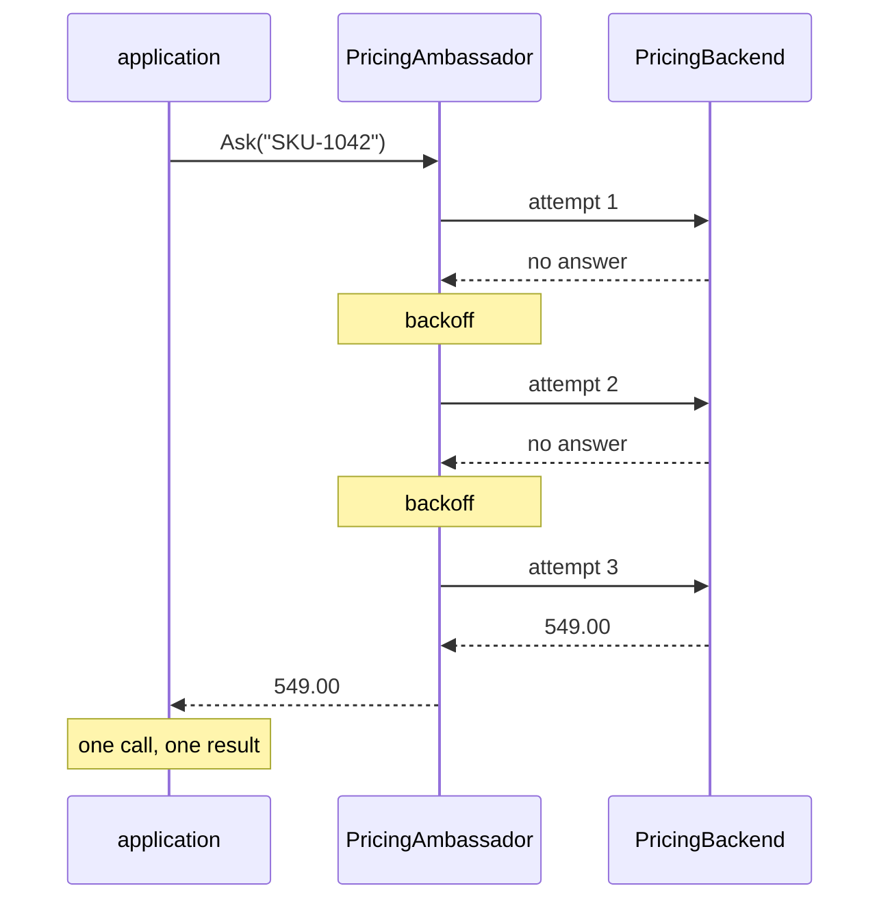

# Ambassador

**Edge and gateway** — what sits between clients and services

Create helper services that send network requests on behalf of a consumer service or application.

| | |
|---|---|
| Tier | 5 — Edge and gateway |
| Well-Architected pillars | Reliability, Security |
| Source | [Ambassador](https://learn.microsoft.com/en-us/azure/architecture/patterns/ambassador), retrieved 2026-08-16 |
| Runtime dependencies | none |

## The problem it solves

Every service needs retry, timeout and circuit breaking on its outbound calls — and every service
implements them differently.

The Java service uses one resilience library, the .NET service another, the Python service a
hand-rolled loop, and the Node service forgot. Their backoff curves differ, their timeouts differ,
and when the platform team decides that calls to the pricing service should retry three times with
jitter rather than five times flat, that is four codebases, four teams and four releases.

Worse, the oldest service is written in a language whose maintained resilience library was
abandoned, and nobody wants to touch it.

An ambassador moves that policy **out of the application entirely**. The application makes one call
to a local helper; the helper handles the network — retries, backoff, timeouts, and the telemetry
that goes with them. The demonstration in this folder shows the asymmetry directly: one call in,
three attempts out, and a result the application cannot distinguish from a first-time success.

## When to use it

* Several services, especially in different languages, need consistent outbound-call behaviour.
* Resilience policy should be tunable operationally rather than by redeploying applications.
* A legacy application cannot practically be given a modern client library.
* Outbound calls need consistent telemetry, tracing or mutual TLS that applications keep getting
  wrong.

## When not to use it

* **One service, one language.** A library is simpler, faster and has no extra process.
* **Latency is critical.** A local hop is small but not free, and it is on every call.
* **The policy needs application context** — "retry only if this order has not been paid" is domain
  logic and belongs in the application.
* **Nobody will operate it.** An ambassador is a component with its own failure modes; unowned, it
  becomes an unexplained source of latency.

## Architecture and components

| Participant | Role |
|---|---|
| `PricingAmbassador` | Holds the retry policy, the attempt limit and the backoff |
| `PricingBackend` | The remote service that sometimes does not answer |
| `PriceQuote` | The answer, identical whether it took one attempt or three |
| `IClock` / `ManualClock` | Time, so backoff is reasoned about rather than waited for |

**`AttemptsAbsorbed` is the demonstration.** One call from the application, three attempts on the
network, two the application neither made nor knew about.

**The application's ignorance is the product.** Because a retried result is byte-identical to a
first-time one, retry policy can be tuned, standardised across languages, or replaced entirely
without any application being redeployed.

**Retries are bounded.** A helper that retried indefinitely would hold the caller's thread for ever,
which is worse than the failure it was hiding.

**On its relationship to Sidecar.** An ambassador is conventionally *deployed as* a sidecar — same
host, same lifecycle, separate process — and that is not concealed here. Sidecar is the deployment
**shape**; this is one **job** that shape does. They are separate patterns because a sidecar may
collect metrics or supply configuration and never make an outbound call, and an ambassador's logic
is the same whether deployed alongside or as a shared proxy.

**What this is not.** [Retry](../Retry/README.md), in tier 1, is the policy itself — what to retry,
how often, with what backoff. This pattern is about *where that policy lives*: outside the
application, in a component the application does not configure. It is conventionally deployed as a
[Sidecar](../Sidecar/README.md), which is the shape rather than the job.

## Advantages and trade-offs

**What it buys.** One implementation of resilience policy instead of one per language. Policy that
changes operationally rather than by redeployment. Legacy applications given modern behaviour
without being modified. Consistent telemetry and tracing on every outbound call. And a natural place
for mutual TLS, so applications need not manage certificates.

**What it costs.** A process per application instance, with its own memory, its own failure modes and
its own upgrade cycle. A local network hop on every call. Debugging that spans two components, where
a timeout could belong to either. Application context that is unavailable to the helper, so
policy cannot depend on domain state. And a helper that is now on the critical path of everything
the application does.

## Implementation considerations

* **Bound every retry**, and make the limit visible. Unbounded retry is a slow outage.
* **Give the ambassador a timeout shorter than the caller's**, so the caller is not waiting on a
  helper that is waiting on a network.
* **Add jitter to backoff.** Synchronised retries from many instances are how a struggling service
  is finished off — see [Retry](../Retry/README.md).
* **Add a circuit breaker for a backend that is properly down**, so attempts stop rather than
  continuing on every call — see [Circuit Breaker](../CircuitBreaker/README.md).
* **Report what the ambassador did.** The application cannot see the retries, so the helper's
  telemetry is the only record that they happened; without it, latency becomes inexplicable.
* **Version and roll out the ambassador carefully.** It is deployed alongside every application
  instance, so a bad version is a fleet-wide problem.
* **Keep domain logic out.** If the policy needs to know what an order is, it belongs in the
  application.

## Real-world cloud scenarios

* A service mesh sidecar handling retries, timeouts and mutual TLS for every pod.
* A legacy application given modern resilience without code changes.
* Polyglot estates needing one consistent outbound policy.
* Applications calling a third-party API whose reliability requires care nobody wants to write four
  times.

## In Azure

The implementation here is a bounded loop in a class.

In Azure this is most often a **service-mesh sidecar** — Linkerd or Istio on **AKS**, or the built-in
mesh in **Azure Container Apps** — handling retries, timeouts, mutual TLS and telemetry for every
outbound call without the application knowing. **Dapr**, available as an AKS add-on and natively in
Container Apps, is this pattern as a product: the application calls a local Dapr sidecar over HTTP
and Dapr applies resilience policy defined in configuration. Where the ambassador is shared rather
than co-located, **Azure API Management** in an egress role plays the same part.

**What this model does not show.** There is no process boundary — the ambassador is a class in the
application's own process, so nothing shows the separate lifecycle, the extra memory, or the local
hop that a real sidecar costs. There is no network, so timeouts cannot occur and a failure is a
clean `null` rather than a hang. There is no jitter, no circuit breaker and no connection pooling.
There is no mutual TLS or certificate management, which in practice is a large part of why the
pattern is adopted. And the backoff is recorded rather than waited, so nothing shows the latency the
application actually experiences.

## What the tests assert

The tests are about what the ambassador guarantees rather than how it is currently written, and the
asymmetry between calls and attempts is asserted as a count.

They cover a healthy backend answering first time with no backoff accumulated; a backend that fails
once being retried, with the backoff recorded; the ambassador giving up after **exactly** the
attempt limit rather than continuing; one application call against three network attempts, with the
difference stated as the benefit; a retried result being **byte-identical** to a first-time one,
which is what makes the application's ignorance real; and a dead backend producing nothing for the
application while the ambassador can still say why.
