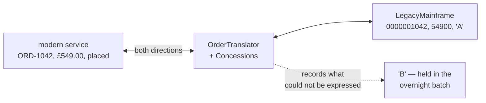

# Anti-Corruption Layer

**Edge and gateway** — what sits between clients and services

Implement a façade or adapter layer between a modern application and a legacy system.

| | |
|---|---|
| Tier | 5 — Edge and gateway |
| Well-Architected pillars | Operational Excellence |
| Source | [Anti-Corruption Layer](https://learn.microsoft.com/en-us/azure/architecture/patterns/anti-corruption-layer), retrieved 2026-08-16 |
| Runtime dependencies | none |

## The problem it solves

The legacy system's model spreads into the new one, one reasonable shortcut at a time.

The mainframe stores order numbers as ten zero-padded digits, amounts in pence, dates as `yyyyMMdd`
strings, and statuses as single letters. The new service needs orders from it. The quickest thing is
to accept its shape — just here, just for now — and within a year `AMTPENCE` appears in a REST
response, a front-end is parsing `20260818`, and somebody has written `if (status == "B")` in a
component that has no business knowing what "B" means.

At that point the legacy model **is** the new model, and replacing the mainframe means replacing
everything that grew around its assumptions. That is how a two-year migration becomes a five-year
one.

An anti-corruption layer is a boundary that translates, both ways, and lets nothing through
untranslated. The demonstration shows the two sides of it: padded numbers, pence and status codes on
one side; references, pounds and words on the other.

## When to use it

* A modern system must integrate with one whose model you cannot change.
* That model is awkward enough that adopting it would distort the new design.
* The legacy system may be replaced eventually, and you want the coupling in one place.
* Two systems genuinely disagree about what the same entity means.

## When not to use it

* **The models already agree.** A layer that renames three fields is ceremony.
* **The legacy system is being switched off next month.** Tolerate it and delete both.
* **The translation needs business decisions nobody will own.** Where the two models disagree
  irreconcilably, the layer becomes a place where domain rules hide.
* **You control both sides.** Then fix the model rather than translating around it for ever.

## Architecture and components

| Participant | Role |
|---|---|
| `LegacyOrderRecord` | The mainframe's shape: padded, abbreviated, in pence |
| `LegacyMainframe` | The system that is not going to change |
| `OrderTranslator` | The boundary — **and it records what it could not express** |
| `ModernOrder` | The new model, **shaped by nothing the mainframe knows** |

**It translates both ways, deliberately.** A layer that only translates inward leaves every write
path reaching around it, and within a year the modern code is padding order numbers itself. Both
directions or neither.

**Where the models do not align, the layer decides — and writes the decision down.** The mainframe's
"held in the overnight batch" has no modern equivalent, so it becomes `placed` and the concession is
recorded. **A translation with no concessions is either trivial or lying**, and that list is the
honest artefact of the pattern.

**Units are the quietest defect.** Pence crossing a boundary as pounds produces a system where
everything runs and every number is wrong by a factor of a hundred.

**What this is not.** Strangler Fig is a migration *strategy* — routing that shifts feature by
feature until the legacy system is empty. This is a *boundary*, and it may stand for a decade with
no migration planned. The two are commonly used together and neither requires the other.

## Advantages and trade-offs

**What it buys.** A modern model that owes the legacy system nothing, so it can be designed for the
domain rather than around an old schema. All the coupling in one place, which is also the only place
that changes when the legacy system is replaced. A written record of every point where the two
models disagree. And a migration that stays a two-year project rather than becoming a five-year one.

**What it costs.** A layer to build, test and maintain, which adds nothing a user can see. Latency,
where the translation is remote. Two models to keep in mind. And a strong pull for business logic to
accumulate inside it, because the layer is the only component that understands both sides — at which
point it becomes a third system nobody owns.

## Implementation considerations

* **Translate in both directions from the start.** Inbound-only layers are how legacy shapes escape.
* **Let nothing through untranslated**, including in errors and logs. A modern log line quoting
  `STATCD` has leaked the model.
* **Record concessions explicitly.** Every dropped nuance, defaulted field and lossy mapping should
  be visible; an empty concessions list on a real integration means somebody has not looked.
* **Keep business rules out.** The layer decides how to *say* something in the other model, not what
  the business should do.
* **Own it deliberately.** It sits between two teams and belongs to one of them, or it belongs to
  nobody.
* **Test it against real legacy data**, not against your idea of the legacy format — including the
  records that predate the current conventions, because they exist.
* **Plan its death.** When the legacy system goes, the layer should go with it; a layer that
  outlives its legacy system has become part of the domain by accident.

## Real-world cloud scenarios

* A modern API over a mainframe, an AS/400, or a decade-old ERP.
* Integrating an acquired company's systems without adopting their model.
* Wrapping a third-party service whose API shape you would not have chosen.
* The boundary between a legacy monolith and the services being carved out of it — usually
  alongside Strangler Fig.

## In Azure

The implementation here is a class with two mapping methods.

In Azure the layer is commonly an **Azure Function** or **Container App** presenting a modern API
over a legacy one; **Logic Apps** with its enterprise connectors where the legacy system speaks a
protocol nobody wants to implement; **Azure API Management** policies for a translation thin enough
to be declarative; and **Azure Data Factory** where the translation is bulk rather than
request-scoped. Where the legacy system is on-premises, the layer typically sits behind a **VPN or
ExpressRoute** connection and is the only thing that knows the legacy system exists.

**What this model does not show.** Both systems are in one process, so there is no network, no
latency, no partial failure and no legacy system that is down for its overnight batch — which is
when most real integrations discover their assumptions. There is no schema evolution on either side.
The legacy data is clean and consistent, where real legacy data has decades of accumulated
exceptions. And there is no bulk path, only single records.

## What the tests assert

The tests are about what the boundary guarantees rather than how it is currently written, and the
most important of them is negative.

They cover a legacy record becoming a modern order with a readable reference, a customer id and a
real date; a modern order becoming a legacy record with padding, pence and a status code, because
the boundary works **both ways**; pence converted to pounds, which is the quietest defect a boundary
can leak; a legacy status the modern model has no concept of being mapped **and the concession
recorded**; and — the negative one — **no legacy representation surviving the crossing at all**,
which is what separates a boundary from a mapping function that happens to rename things.
