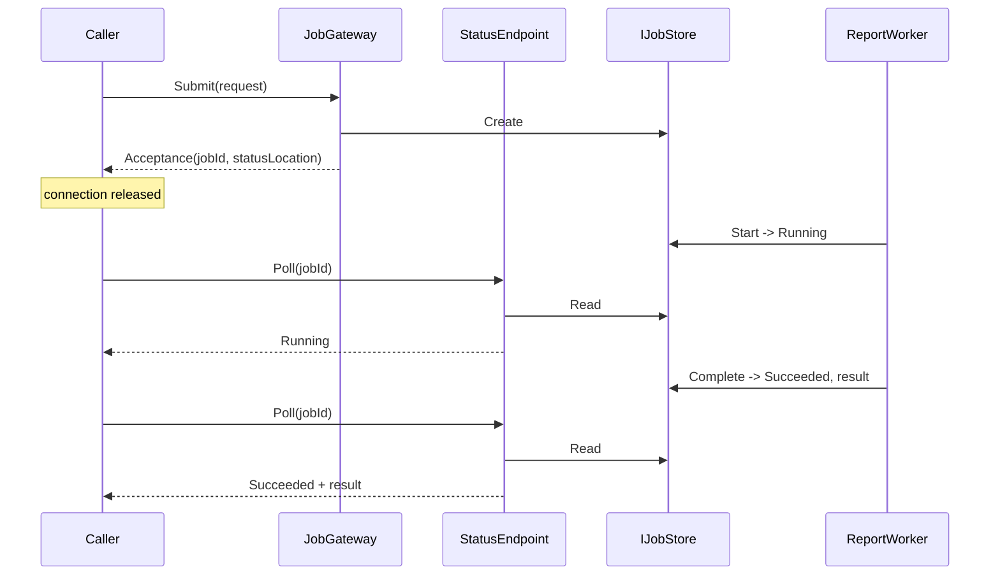

# Asynchronous Request-Reply

**Messaging** — decoupling senders from receivers

Decouple back-end processing from a front-end host. This pattern is useful when back-end processing
must be asynchronous, but the front end requires a clear and timely response.

| | |
|---|---|
| Tier | 2 — Messaging |
| Well-Architected pillars | Performance Efficiency |
| Source | [Asynchronous Request-Reply](https://learn.microsoft.com/en-us/azure/architecture/patterns/async-request-reply), retrieved 2026-08-16 |
| Runtime dependencies | none |

## The problem it solves

Some work takes minutes, and the caller is a browser.

A quarterly report, a video transcode, a bulk import: none finishes inside a request. Yet the caller
needs an answer *now* — not the result, but confirmation that the request was understood and
accepted, and a way to find the result later.

Holding the connection open is what people try first, and everything in the path defeats it.
Browsers time out. Load balancers cut idle connections, typically at four minutes. A gateway
retries, and now the work is running twice. Meanwhile the server holds a request thread per waiting
caller, which is capacity that could have served real traffic — this is the thread-pool starvation
Bulkhead exists to contain, arrived at deliberately.

The other reflex is fire-and-forget: accept the work and return nothing. The request survives, and
the caller has no way to ever learn the outcome. Failures become invisible.

This pattern is the middle. Accept the work, return a **handle** immediately, and let the caller ask
about it. The connection is released in milliseconds; the answer is reachable when it exists.

## When to use it

* Work takes longer than a request may reasonably be held open.
* The caller is a browser, a mobile client, or anything behind a gateway with a timeout.
* The caller needs confirmation of acceptance, and eventually the outcome.
* Back-end capacity should be decoupled from front-end concurrency.

## When not to use it

* **The work is fast.** A synchronous call is simpler and needs no status store.
* **The caller never needs the outcome.** Then fire-and-forget onto a queue is enough —
  [Queue-Based Load Leveling](../QueueBasedLoadLeveling/README.md) without the status side.
* **Push is available and better.** WebSockets, SignalR or a webhook remove the polling entirely,
  when the client can hold a connection or receive a callback.
* **Job state has nowhere durable to live.** Without it, a restart loses every in-flight job and no
  caller can ever learn what happened.

## Architecture and components

| Participant | Role |
|---|---|
| `JobGateway` | Accepts the request and hands back a handle |
| `Acceptance` | The job identifier and where to ask about it |
| `StatusEndpoint` | Answers "where has my job got to?" |
| `IJobStore` | Where state lives between the request and the poll |
| `ReportWorker` | The back end, driven explicitly so transitions are observable |
| `JobStatus` | `Pending`, `Running`, `Succeeded`, `Failed`, **`NotFound`** |

**`NotFound` is deliberately not `Pending`.** Reporting pending for a job that does not exist — a
typo, an expired identifier, a different instance's job — leaves the caller polling for ever for
work that will never happen. It is the single most useful distinction in the status vocabulary.

**Failure is reachable through the same channel as success.** A caller that can only discover
success waits for ever whenever anything goes wrong.

**The status location contains the identifier.** A caller given only "accepted" has no way to find
the answer, which is the one thing the exchange exists to provide.

## Advantages and trade-offs

**What it buys.** The front end stays responsive regardless of how long the work takes. Request
threads are released immediately, so front-end capacity is decoupled from back-end duration. Timeouts
and gateway limits stop being a design constraint. And the outcome — including failure — is
discoverable.

**What it costs.** A status store, which must be durable and must outlive the work. More moving
parts: a gateway, a worker, an endpoint, and state shared between them. Polling traffic, which is
load proportional to callers rather than to work. And a client that is now more complicated —
submit, poll, back off, handle four terminal states.

**Polling is the least elegant part**, and it is the price of not requiring the client to hold a
connection. Where a client *can* hold one, push is better.

## Implementation considerations

* **Return `202 Accepted` with a `Location` header** over HTTP, and honour `Retry-After` so clients
  are told how often to poll rather than guessing.
* **Make status durable**, and retain it beyond the work's completion — a caller may poll long
  after.
* **Distinguish "not found" from "pending".** The most valuable line in the status contract.
* **Give the result its own location**, rather than embedding a large payload in a status response;
  see Claim Check for the same reasoning.
* **Make submission idempotent**, keyed on a client-supplied request identifier. A retried submit
  should return the existing job, not start a second one.
* **Expire jobs deliberately**, and say what a poll for an expired job returns.
* **Prefer push where it is available.** Webhooks or SignalR remove the polling; keep polling as the
  fallback.

## Real-world cloud scenarios

* A report or export that takes minutes and is offered as a download when ready.
* Video or image processing after upload.
* A bulk import whose progress the caller watches.
* A long-running provisioning operation — most Azure control-plane APIs work exactly this way.

## In Azure

The implementation here is three objects and a dictionary. There is no HTTP, no queue, and no worker
process.

In Azure this is typically an **HTTP-triggered Azure Function** accepting the request and writing to
a **Service Bus queue** or **Storage queue**, a **queue-triggered Function** doing the work, and job
state in **Table Storage** or **Cosmos DB**. **Durable Functions** implement the whole exchange
directly — its HTTP starter returns a payload of management URLs, which is precisely `Acceptance`
with more fields. Azure's own long-running control-plane operations follow the same convention, and
**Azure SignalR Service** is what you reach for to replace polling with push.

**What this model does not show.** There is no HTTP, so `202 Accepted`, the `Location` header,
`Retry-After` and status codes are all absent — and they are the pattern's actual interface. There is
no queue between the gateway and the worker, so the work is not really decoupled from the request;
the worker is driven explicitly by the demonstration. Nothing is durable, so a restart loses every
job. There is no polling client, no back-off and no expiry. And submission is not idempotent, so a
retried request would start a second job.

## What the tests assert

The tests are about what the exchange guarantees rather than how it is currently written.

They cover acceptance returning a usable handle, with the identifier present in the status location;
`Pending` before work starts and `Running` once it has, which are different facts a progress
indicator needs to tell apart; the result being reachable on success; **the failure being reachable
through the same channel**, because a caller that can only discover success waits for ever
otherwise; an unknown job reporting **`NotFound` rather than `Pending`**, which is what stops a
caller polling for ever for work that does not exist; and the worker **refusing an identifier
nothing ever submitted**, which is what stops a typo minting a job and turning `NotFound` into
`Running`.
