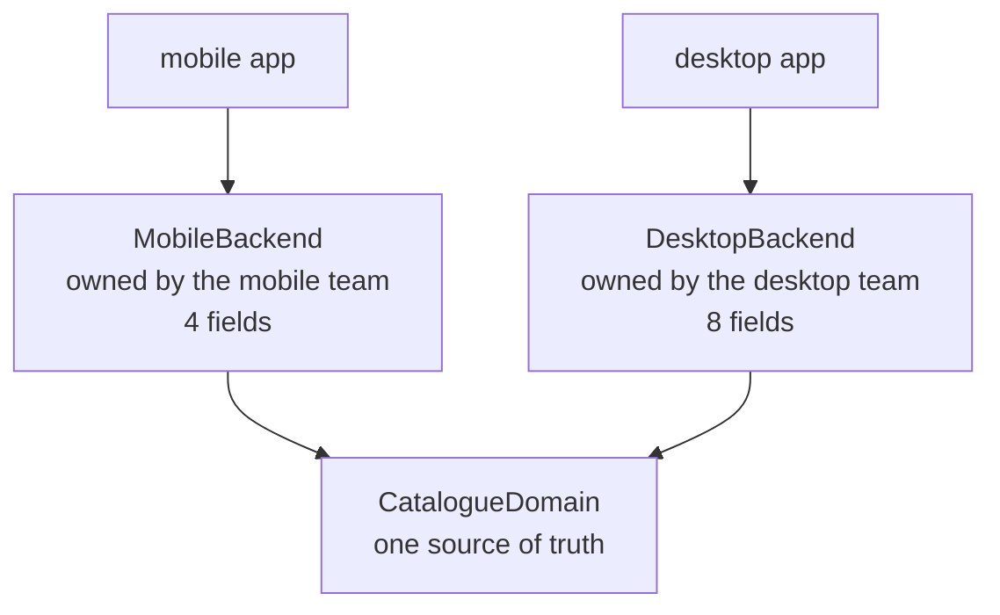

# Backends for Frontends

**Edge and gateway** — what sits between clients and services

Create separate backend services for specific frontend applications or interfaces.

| | |
|---|---|
| Tier | 5 — Edge and gateway |
| Well-Architected pillars | Reliability, Security, Performance Efficiency |
| Source | [Backends for Frontends](https://learn.microsoft.com/en-us/azure/architecture/patterns/backends-for-frontends), retrieved 2026-08-16 |
| Runtime dependencies | none |

## The problem it solves

One backend serving two clients ends up serving neither, and the reason is organisational as much
as technical.

A phone rendering a product list wants a short name, a price and one thumbnail. A desktop product
page wants the full name, prose, every image, reviews, dimensions and warranty. Serve both from one
endpoint and there are three outcomes, all bad: the response carries everything and the phone
over-fetches on a mobile network; the response carries the intersection and the desktop page makes
extra calls; or the endpoint grows flags — `?verbose=true`, `?fields=`, `?view=mobile` — and becomes
a small query language nobody designed.

The deeper cost is the negotiation. **A change the mobile team needs is a change to a component the
desktop team also depends on**, owned by neither, so every layout tweak is a three-team
conversation and a shared release.

A backend per frontend removes that. Each client team owns the backend that serves it; both read one
shared domain; and the truncation length that suits a new list layout is a decision the mobile team
makes on a Tuesday. The demonstration shows exactly that — a mobile change that leaves the desktop
shape untouched.

## When to use it

* Two or more clients need materially different shapes from the same data.
* Different teams own those clients and are slowed by sharing one backend.
* A client has constraints the others do not — payload size, latency, an old app version still in
  the wild.
* A shared endpoint has already sprouted view flags.

## When not to use it

* **The clients want the same thing.** Two backends serving identical shapes is duplication with a
  pattern name.
* **One team owns everything.** The coupling costs little, and one backend is less to run.
* **The differences are trivial.** A field or two apart does not justify a second deployable.
* **Nobody will own them.** A backend per frontend needs the client team to own it; owned by a
  platform team, it is the shared endpoint again with more moving parts.
* **The count would explode.** Six clients means six backends to build, deploy, patch and monitor.

## Architecture and components

| Participant | Role |
|---|---|
| `CatalogueDomain` | The one source of product truth — **neither backend owns it** |
| `Product` | The domain's shape: what the business thinks in |
| `MobileBackend` / `MobileView` | Four fields, a truncated name, one image |
| `DesktopBackend` / `DesktopView` | Eight fields, everything the page can show |

**There is no single endpoint, and that is the point.** Gateway Routing, Aggregation and Offloading
all put one thing in front of many; this puts several things in front of one domain, because the
clients differ enough that one front is a compromise.

**Both backends read one domain.** That is what separates the pattern from two teams quietly
building two catalogues that drift — the backends shape a response, they do not own the data.

**Changing one cannot affect the other**, and that is the justification rather than a side effect.
Two backends serving identical shapes would be duplication; two that move independently are what
removes the negotiation.

**What this is not.** [Gateway Aggregation](../GatewayAggregation/README.md) combines several
services into one response for whatever client asks; this is about *which* client is asking.
[Gateway Routing](../GatewayRouting/README.md) forwards to one service behind one endpoint.
[Gateway Offloading](../GatewayOffloading/README.md) moves cross-cutting work to the edge — and
remains useful here, in front of both backends.

## Advantages and trade-offs

**What it buys.** Responses shaped for the client that receives them, so no over-fetching and no
extra round trips. Client teams that ship without negotiating. Failure isolation — a bad mobile
deployment cannot take the desktop site down. And freedom to optimise per client: caching, payload
format, even protocol.

**What it costs.** **Duplication of the assembly logic**, since both backends fetch and shape the
same product. More deployables to run, monitor, patch and secure. A real risk of drift, where one
backend acquires business rules the other lacks — which is how a backend for a frontend becomes a
second domain. And a count that grows with clients.

## Implementation considerations

* **Keep business rules in the domain, not in the backends.** A backend shapes and composes; the
  moment it decides what a discount is, there are two answers in the system.
* **Let the client team own its backend**, including its deployment. Ownership elsewhere reproduces
  the problem the pattern exists to remove.
* **Extract genuinely shared logic into a library**, not into one backend that the other calls.
  Backends calling backends rebuilds the coupling.
* **Accept the duplication that remains.** Some repeated shaping code is the price, and
  de-duplicating it too eagerly recreates the shared component.
* **Group by client need, not by device.** Two clients with the same needs share a backend even if
  one is a phone; the axis is what the interface requires.
* **Put cross-cutting concerns in front of both**, via
  [Gateway Offloading](../GatewayOffloading/README.md), rather than implementing
  authentication twice.

## Real-world cloud scenarios

* A mobile app and a web application over the same commerce domain.
* A public partner API alongside an internal admin interface.
* A smart-TV client whose payload and navigation differ sharply from a browser's.
* A legacy client kept on an old response shape while a new one moves on.

## In Azure

The implementation here is two classes over a third.

In Azure each backend is typically its own **App Service**, **Container App** or **Function App**,
deployed by the team that owns its client, with **Azure Front Door** or **API Management** in front
of all of them for TLS, WAF and a single public hostname — that front door being Gateway Offloading,
which composes with this rather than competing. The shared domain sits behind them as its own
services, and **Azure Container Apps revisions** are a common way to keep an old client's backend
alive while a new one ships.

**What this model does not show.** The backends are classes in one process, so there is no separate
deployment, no independent scaling and no failure isolation — which is a substantial part of the
pattern's value. There is no network, so the over-fetching cost the mobile shape avoids is described
rather than measured in bytes. There is no authentication, and therefore nothing showing the
cross-cutting concerns that should sit in front of both. And there are two clients rather than six,
so the proliferation problem cannot appear.

## What the tests assert

The tests are about what the arrangement guarantees rather than how it is currently written.

They cover the mobile client receiving a **truncated name, one image and four fields**; the desktop
client receiving the full name, every image, every review and eight fields; **one domain queried by
both**, with a single product held and no second catalogue; a mobile change producing a different
mobile shape while the desktop shape is **byte-identical to before**, which is the independence
stated as a test; and an unknown product reporting nothing from either backend.
