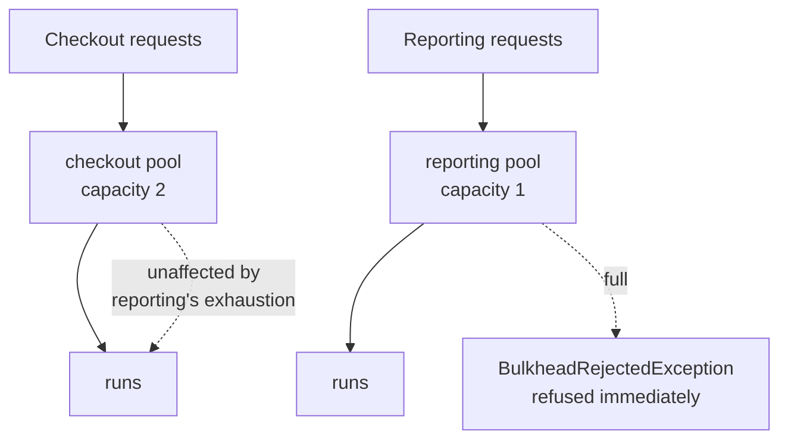

# Bulkhead

**Resilience** — keeping a service working when its dependencies are not

Isolate elements of an application into pools so that if one fails, the others continue to function.

| | |
|---|---|
| Tier | 1 — Resilience |
| Well-Architected pillars | Reliability, Security, Performance Efficiency |
| Source | [Bulkhead](https://learn.microsoft.com/en-us/azure/architecture/patterns/bulkhead), retrieved 2026-08-16 |
| Runtime dependencies | none |

## The problem it solves

A process has one pool of the things it needs to work: threads, connections, memory, sockets. By
default every piece of work draws from the same pool, first come first served.

That is fine until one dependency gets slow. Reporting queries that took 200ms start taking 30
seconds; requests waiting on them hold their threads for the whole 30 seconds; and because those
threads came from the shared pool, checkout — which does not use the reporting database at all and
is working perfectly — cannot get a thread either.

**One slow dependency has taken down functionality that does not depend on it.** Nothing crashed,
nothing threw, and every graph shows a healthy application with a queue it cannot drain.

[Retry](../Retry/README.md) makes this worse: retries hold their resources for the whole retry
budget. A [circuit breaker](../CircuitBreaker/README.md) helps, but only once it has decided the
dependency is down — the resources are consumed while it is deciding.

A bulkhead removes the shared pool. Reporting gets its own allocation, and when it is exhausted the
next reporting request is refused **immediately**, while checkout's allocation sits untouched. The
failure is contained to the compartment that caused it.

## When to use it

* One process serves work of genuinely different importance — a checkout path and a reporting path.
* Some work depends on something slow, unreliable, or outside your control.
* Resource exhaustion is a realistic failure mode: thread-pool starvation, connection-pool
  exhaustion, socket limits.
* You would rather refuse some work quickly than degrade everything slowly.
* A tenant or client should not be able to consume the whole service.

## When not to use it

* **Everything is equally important, and shares the same dependencies.** Partitioning identical work
  reduces usable capacity without isolating anything.
* **The work is already isolated** — separate processes, containers or services have a bulkhead by
  construction, and adding a second one inside is ceremony.
* **Utilisation matters more than isolation.** Fixed partitions strand capacity: reporting's idle
  slots cannot help checkout even under a spike.
* **The workload is tiny.** With a handful of concurrent operations, partitioning them is
  arithmetic, not resilience.
* **Rejection is unacceptable.** A bulkhead trades availability of *some* work for availability of
  the rest. Where nothing may be refused, queue it instead.

## Architecture and components

| Participant | Role |
|---|---|
| `BulkheadPolicy` | Holds one pool per partition and admits or refuses work |
| `BulkheadRejectedException` | Refusal — the partition is full, or unknown |
| `AcquireSlot` | Takes a slot and hands back a handle to release it |
| `ExecuteAsync` | Runs work inside a partition, releasing the slot whatever happens |

Three details carry the design.

**`Wait(0)`, never a blocking wait.** Take a slot if one is free, refuse instantly if not. Blocking
would convert exhaustion into the queue the bulkhead exists to prevent.

**`using`, not release-after-await.** Releasing on the success path only leaks a slot per failure,
shrinking the pool until the partition is dead. That is the bug this pattern most often ships with,
and there is a test whose only job is to catch it.

**An unknown partition is refused.** Admitting it would make a typo silently unbounded, removing
exactly the isolation the bulkhead provides. Failing closed is the point.

## Advantages and trade-offs

**What it buys.** Failures stay in their compartment. Important work keeps running while unimportant
work is refused. Refusal is instant rather than a timeout. And the failure mode becomes one you
chose, in advance, rather than one determined by which requests happened to arrive first.

**What it costs.** Stranded capacity — idle slots in one partition cannot help another, so total
throughput is lower than an unpartitioned pool at the same size. More configuration, and every
capacity is a number somebody has to justify. Rejections that a shared pool would have served. And
the partitions themselves are a design commitment: work that does not fit the partitioning is
awkward to place.

**The honest trade is utilisation for predictability.** You give up peak throughput to buy a system
whose behaviour under overload you can state in advance.

## Implementation considerations

* **Partition by failure domain, not by convenience.** The question is "what fails together?" — work
  sharing a dependency belongs in one compartment.
* **Release in a `finally`,** or with `using`. Nothing else is reliable.
* **Refuse fast, and say why.** A rejection carrying the partition name is diagnosable; a bare
  timeout is not.
* **Size from measurement.** Partition capacities set by guesswork either strand capacity or fail to
  isolate.
* **Watch rejection rates per partition.** A partition rejecting constantly is either undersized or
  protecting you from something worth looking at.
* **Compose with Circuit Breaker and Retry.** The bulkhead bounds the damage while the breaker
  decides, and bounds what retries can consume.

## Real-world cloud scenarios

* A web application serving checkout and reporting from one host, where reporting queries a
  warehouse that is periodically slow.
* A service calling several third-party APIs, one of which is unreliable.
* A multi-tenant worker where no tenant may consume the whole consumer pool.
* A gateway with separate connection pools per downstream, so one failing backend cannot exhaust the
  gateway's sockets.

## In Azure

The implementation here is in-process semaphores. There is no host, no thread pool under pressure
and no real contention.

In .NET and Azure the pattern appears as **Polly**'s bulkhead-isolation strategy, usually beside its
retry and circuit-breaker strategies in one pipeline; as separate **`HttpClient`** instances with
their own `SocketsHttpHandler` connection limits per downstream; as separate **queues and consumer
groups** per workload; and — the strongest form — as genuine process isolation: separate App
Service plans, Container Apps, or AKS deployments with their own resource limits, where the
bulkhead is enforced by the platform rather than by your code.

**What this model does not show.** Nothing here is actually concurrent: slots are acquired and held
deliberately, so exhaustion is constructed rather than raced, and no test exercises real contention.
Nothing is starved — there is no thread pool under pressure, so the failure this pattern prevents is
described rather than demonstrated. There is no queueing with a bounded wait, which most real
bulkheads offer as a middle ground between admit and refuse. There is no timeout, no cancellation,
and no metrics. And partitions are fixed at construction, where a real system may want them to
adapt.

## What the tests assert

The tests are about what the bulkhead guarantees rather than how it is currently written.

They cover work running while a partition has capacity; refusal once it is full; the slot being
returned after success; **the slot being returned after a failure**, which is the leak that kills
partitions one exception at a time; isolation, where one partition is exhausted and another still
serves; and an unknown partition being refused rather than admitted.

Exhaustion is created by acquiring and holding slots explicitly, never by racing tasks, so no test
here depends on the scheduler.
