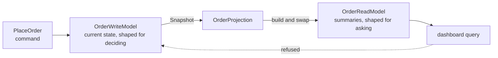

# CQRS

**Data management** — storing and reading data at scale

Separate operations that read data from those that update data by using distinct interfaces.

| | |
|---|---|
| Tier | 3 — Data management |
| Well-Architected pillars | Performance Efficiency |
| Source | [CQRS](https://learn.microsoft.com/en-us/azure/architecture/patterns/cqrs), retrieved 2026-08-16 |
| Runtime dependencies | none |

## The problem it solves

One model serving both writes and reads ends up serving neither well.

Writing wants normalised data, invariants and validation: can this order be placed? Reading wants
the answer already assembled: what has this customer spent? A single model is pulled both ways —
the order entity grows a customer-total field for the dashboard, the dashboard grows joins to
recover what normalisation split, and the code that decides whether a command is legal is now
tangled with the code that renders a page.

The loads differ too. Reads usually outnumber writes by orders of magnitude, and they contend for
the same rows, the same locks and the same machine.

CQRS separates the two: **commands go through a model shaped for deciding, queries through a model
shaped for asking**, with a projection moving one to the other. Each side can then be modelled,
optimised and scaled for the job it actually does.

## When to use it

* Read and write workloads differ sharply in shape, volume or scaling needs.
* The write side is genuinely complex — real invariants, real validation — and the read side is
  mostly presentation.
* Reads contend with writes for locks or throughput on the same store.
* Several read shapes are wanted over one authoritative model.
* Read and write sides are owned or deployed by different teams.

## When not to use it

* **The domain is simple.** CRUD over one model is less code, less latency and fewer failure
  modes. CQRS applied to a simple domain is pure overhead.
* **Reads must be immediately consistent with writes.** The read model is stale until the
  projection runs, and that window is intrinsic.
* **The read shape is the write shape.** If the projection is a copy, it is machinery earning
  nothing.
* **Nobody owns the projection.** An unmonitored projection that stops leaves a dashboard
  confidently serving last week — the worst failure this pattern offers.
* **The whole application, uniformly.** CQRS belongs to the bounded contexts that need it; applied
  everywhere it doubles the models for the sake of consistency of style.

## Architecture and components

| Participant | Role |
|---|---|
| `PlaceOrder` | A command, named for intent rather than for data shape |
| `OrderWriteModel` | Current state and its invariants — **and it refuses queries** |
| `OrderProjection` | Moves what was written into the shape that is asked for |
| `OrderReadModel` | Denormalised summaries; only the projection writes here |
| `OrderSummary` | A shape the write model does not hold at all |

**The write model is a mutable store, not an event log.** CQRS separates reading from writing and
says nothing about keeping history — that is [Event Sourcing](../EventSourcing/README.md), a
neighbouring pattern that CQRS is often paired with and does not require. Conflating them is the most common misreading of both, so
this folder implements each independently.

**The write model refuses dashboard questions by throwing.** The erosion of CQRS is always the
same: one convenient read path added to the write model, then another, until the split survives
only in the architecture diagram. The refusal makes the boundary code rather than convention.

## Advantages and trade-offs

**What it buys.** Two models each shaped for one job, so neither compromises for the other. Read
and write sides that scale independently, which matters most when they differ by orders of
magnitude. Read shapes that can be added without touching the write model. And a write model whose
code is about invariants alone, which is the code most worth keeping simple.

**What it costs.** **Eventual consistency**, which the tests assert directly: the read model is
stale from the moment a command lands until the projection next runs. Two models to maintain, and
a projection between them that is a component with its own failure modes — one that stops silently
serves stale data indefinitely. More moving parts, more deployment, more to reason about. And a
user interface that must cope with a write it just made not yet being visible.

## Implementation considerations

* **Apply it to a bounded context, not to an application.** The parts of a system that need CQRS
  are usually a minority of it.
* **Monitor the projection's lag, and surface it.** An unmonitored projection that stops is
  indistinguishable from a quiet system, which is the failure mode that costs the most trust.
* **Design the interface for the staleness.** Show the user their own write optimistically, or say
  when the figure was last built — do not pretend the window is not there.
* **Decide what a replayed or duplicated projection run must do.** Making the projection
  idempotent, as a full rebuild is, removes an entire class of problem — see
  [Idempotent Consumer](../IdempotentConsumer/README.md).
* **Let the read model be genuinely disposable.** It is derived data; it should be rebuildable
  from the write model at any time, which is also the repair procedure.
* **Do not add read paths to the write model.** That single convenience is how the pattern dies.
* **Event Sourcing is a separate decision.** Pair them when history is genuinely wanted, not
  because the two are usually named together.

## Real-world cloud scenarios

* An e-commerce checkout: orders written transactionally, dashboards and reports served from
  projections.
* A booking system where availability is queried constantly and reserved rarely.
* A collaborative editor: a small authoritative document model, several derived views.
* Any system where reporting load would otherwise contend with the transactional store.

## In Azure

The implementation here is two classes and a method between them.

In Azure the split is typically **Azure SQL** or **Cosmos DB** for the write model with a separate
Cosmos DB container, **Azure Cache for Redis** or a search index for the read model; the
projection is an **Azure Function** triggered by the **Cosmos DB change feed** or by **Service
Bus** messages the write side publishes; and **Azure AI Search** is a common read model in its own
right for query shapes no database serves well.

**What this model does not show.** The projection is run by hand and synchronously, so nothing
exercises the projection failing, falling behind, running twice or processing out of order — which
is where the pattern's real operational cost lives. The two models share a process, so there is no
network between them and no independent scaling to observe. There is no lag metric. And commands
are executed directly rather than dispatched, so there is no command bus, no queue and no retry.

## What the tests assert

The tests are about what the split guarantees rather than how it is currently written.

They cover a command landing in the write model; the read model still answering nothing after it,
which is the eventual consistency stated as a test rather than a caveat; the projection making the
figure current; the read model serving a per-customer total that exists nowhere in the write
model, which is the point of a second shape; and the write model refusing a query outright, which
is the boundary as code.
