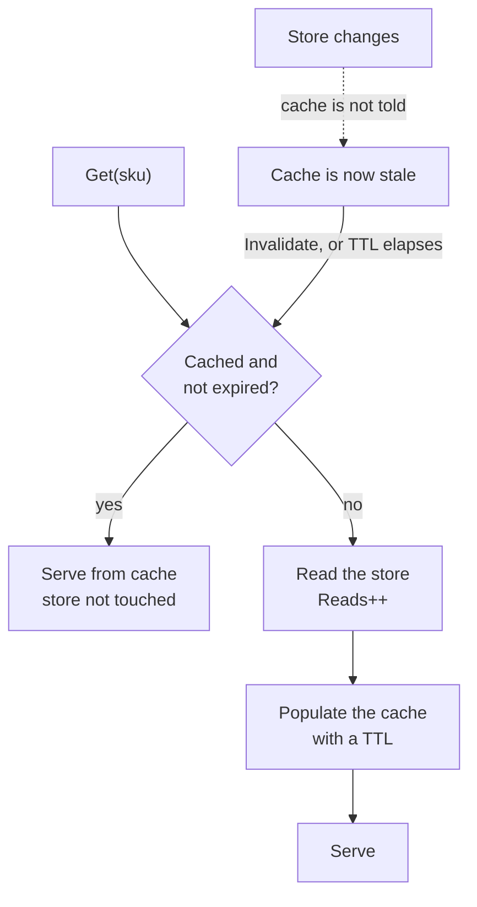

# Cache-Aside

**Data management** — storing and reading data at scale

Load data on demand into a cache from a data store.

| | |
|---|---|
| Tier | 3 — Data management |
| Well-Architected pillars | Reliability, Performance Efficiency |
| Source | [Cache-Aside](https://learn.microsoft.com/en-us/azure/architecture/patterns/cache-aside), retrieved 2026-08-16 |
| Runtime dependencies | none |

## The problem it solves

Most data is read far more often than it is written, and reads are the expensive part.

A product catalogue changes a few times a day and is read on every page view. A configuration
record changes monthly and is consulted on every request. In each case the database serves the same
answer over and over, and that repetition is where the latency, the connection pressure and the bill
come from.

The demonstration in this folder shows the shape of it directly: ten reads of one product hit the
store **ten times** without a cache and **once** with one. Nine reads never leave the process.

Caching is the obvious answer and the naive versions are worse than none. A cache the application
reads *through* becomes a dependency — if it is down, so are you. A cache populated eagerly at
startup holds data nobody asked for and misses what they did. A cache with no expiry serves a value
that was correct last Tuesday, indefinitely.

Cache-aside is the disciplined version. The cache sits **aside** the store, not in front of it. The
application knows how to load a value, so a cache failure degrades to a slow read rather than an
outage. Entries arrive because somebody asked for them, and leave when they can no longer be
trusted.

## When to use it

* Data is read much more often than it is written.
* The same items are requested repeatedly — there is a hot subset.
* Slightly stale data is acceptable for the length of the time-to-live.
* Reads are genuinely expensive: a remote database, a slow query, a metered API.

## When not to use it

* **Every read must be current.** A balance shown before a transfer, a stock level at the moment of
  sale. The staleness window is the pattern; if you cannot accept it, do not adopt it.
* **Reads are uniformly distributed.** With no hot subset the hit rate is low and the cache is
  overhead with extra failure modes.
* **Data changes as often as it is read.** Every read is a miss plus a write, which is slower than
  no cache at all.
* **The store is already fast and local.** Caching an in-memory lookup adds a layer to keep correct
  for nothing.

## Architecture and components

| Participant | Role |
|---|---|
| `CacheAsideRepository` | Reads through the cache, fills on a miss, expires on a TTL |
| `ProductStore` | The backing store — **and it counts its reads** |
| `IClock` / `ManualClock` | Where the current time comes from, so expiry is assertable |
| `Product` | The cached value |

**`ProductStore.Reads` is the demonstration.** In memory a store read costs nothing, so a cache that
merely returns faster proves nothing — a reader sees a dictionary lookup and takes the benefit on
trust. Counting turns the saving into a number the tests can assert.

**Absence is not cached.** A miss on a value that does not exist leaves nothing behind. Caching
absence is a legitimate and different decision — it stops a hot missing key hammering the store —
and conflating the two is how a cache starts serving "not found" for a record that now exists.

## Advantages and trade-offs

**What it buys.** Read load collapses to the miss rate. Latency drops for the hot subset. The
database is protected from repetitive traffic. And the cache is not on the critical path for
correctness — if it fails, reads are slow rather than wrong.

**What it costs.** **Staleness**, always, for up to the time-to-live — the demonstration shows a
price change the cache does not see. Memory, and an eviction policy to go with it. A second thing to
operate. And a cache that is populated per instance means N instances warm N caches independently,
so the hit rate at low traffic is worse than the arithmetic suggests.

**The trade is freshness for load**, and the time-to-live is where you set the exchange rate.

## Implementation considerations

* **Invalidate on write, and accept that you will miss some.** Invalidation narrows the window from
  the TTL to almost nothing — but only for writes that go through code that remembers to do it. A
  TTL is the backstop for everything else, which is why both exist.
* **Never let a cache failure fail a read.** Treat a cache error as a miss.
* **Set the TTL from how wrong you can afford to be**, not from how long you would like the data to
  last.
* **Decide about caching absence** explicitly.
* **Watch the hit rate.** A low one means the pattern is not earning its place; a high one that
  suddenly drops usually means a deployment cleared every instance's cache at once.
* **Beware the stampede.** When a hot entry expires, every concurrent reader misses at once and they
  all hit the store together.

## Real-world cloud scenarios

* Product or content catalogues behind a web front end.
* User profile or entitlement lookups on every request.
* Reference data — currencies, tax rates, feature flags.
* Responses from a rate-limited or metered third-party API.

## In Azure

The implementation here is a `Dictionary` with expiry times and a hand-advanced clock.

In Azure the cache is **Azure Cache for Redis** where it must be shared across instances, or
**`IMemoryCache`** where per-instance is acceptable and cheaper. **`IDistributedCache`** is the
abstraction over the former. Content delivery networks apply the same idea at the edge, with the
same staleness question and the same invalidation problem.

**What this model does not show.** The cache is per-process, so nothing exercises the distributed
case — which is where the pattern gets hard: N instances hold N copies with independent expiry, and
invalidating one does not invalidate the others. Nothing is concurrent, so the **stampede** on
expiry of a hot key cannot occur here. There is no eviction policy and no memory bound, so nothing
is ever evicted under pressure. There is no cache failure, so the "treat an error as a miss"
discipline is described rather than exercised. And write-through, write-behind and refresh-ahead —
the alternatives this pattern is chosen over — are absent.

## What the tests assert

The tests are about what the repository guarantees rather than how it is currently written, and they
assert **counts of store reads** rather than timings, because in memory timings measure noise.

They cover a miss reaching the store; **three reads costing one store read**, which is the benefit
stated as a number; an expired entry reaching the store again; a **stale value being served** after
the store changed, which is the cost stated as a test rather than a caveat; and invalidation
restoring correctness at the price of another read.
