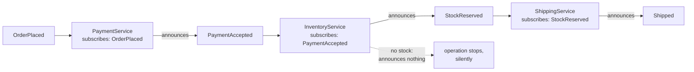

# Choreography

**Coordination** — agreeing on outcomes across services

Let individual services decide when and how a business operation is processed, instead of depending
on a central orchestrator.

| | |
|---|---|
| Tier | 4 — Coordination |
| Well-Architected pillars | Operational Excellence, Performance Efficiency |
| Source | [Choreography](https://learn.microsoft.com/en-us/azure/architecture/patterns/choreography), retrieved 2026-08-16 |
| Runtime dependencies | none |

## The problem it solves

An orchestrator that knows every step becomes the thing every change goes through.

A coordinator driving payment, inventory and shipping has to know all three exist, in what order,
and what each of them means. Add a fraud check and the coordinator changes. Add loyalty points and
the coordinator changes. Three teams owning three services find that every one of their features
requires an edit to a component owned by a fourth — and that component is on the critical path of
every order, so its availability is the ceiling on everyone's.

Choreography removes it. Each service **announces what it did** and subscribes to the announcements
it cares about; the sequence is an emergent property of who listens to what, rather than a thing
written down anywhere. Adding a fraud check means deploying a service that subscribes to
`PaymentAccepted`. Nobody else changes.

The demonstration in this folder runs the same order fulfilment that the Saga pattern coordinates,
with nothing coordinating it — and then asks each service what happened to the order, which none of
them can answer.

## When to use it

* Services are owned by different teams, and a shared coordinator is a bottleneck to changing them.
* Steps are genuinely independent reactions rather than a sequence somebody designed.
* New participants should be addable without touching existing ones.
* The operation's flow changes often, and the orchestrator would be edited constantly.

## When not to use it

* **You will need to answer "what is the state of this order?"** Nothing holds it, and
  reconstructing it means querying every service — which is the cost this pattern trades for
  autonomy.
* **The sequence is complex, conditional or genuinely ordered.** Business logic distributed across
  subscriptions is far harder to read than the same logic in one place.
* **Compensation is needed.** Undoing a choreographed operation means every service knowing how to
  react to a failure it did not observe.
* **The team is small and owns everything.** The coupling an orchestrator creates costs nothing
  when one team owns all the services, and the readability is worth a lot.

## Architecture and components

| Participant | Role |
|---|---|
| `OrderEvent` | A fact that happened — never a command naming its recipient |
| `EventJournal` | Transport. **It holds no sequence and decides nothing** |
| `PaymentService`, `InventoryService`, `ShippingService` | Each subscribes to one event and decides for itself |

**There is no coordinator type, deliberately.** The sequence exists only as the chain of who
subscribes to what; no class can be pointed at and called "the workflow".

**Events state facts; commands name recipients.** `OrderPlaced` asks nothing of anybody and is why
the publisher can stay ignorant of who cares. A `ReserveStock` command would carry the sequence
inside it, which is orchestration wearing an event's clothes.

**A service that declines announces nothing**, and the operation stops — with no error anywhere,
because nobody was waiting. The demonstration shows a customer charged for an order that stops at
inventory.

**What this is not.** Saga is this same operation with a coordinator holding the sequence and a log
making it durable — the two are implemented separately here so the comparison is available.
Compensating Transaction is the undo. Scheduler Agent Supervisor is what notices a step that never
answered, which is exactly what nothing here does.

## Advantages and trade-offs

**What it buys.** No central component every change must pass through, and none on every request's
critical path. Services that can be added, changed and deployed independently. Loose coupling that
is real rather than nominal — a publisher genuinely does not know its subscribers. And no single
point of failure in the coordination itself.

**What it costs.** **Nothing knows the overall state**, which the tests assert directly. The
sequence is not written down anywhere, so understanding it means reading every subscription. A
silent stop, as above, with no component positioned to notice. Compensation that is genuinely hard.
And cycles that are easy to create by accident — two services each reacting to the other's
announcement.

## Implementation considerations

* **Publish events, not commands.** The moment an event names who should act, the sequence has moved
  back into the publisher.
* **Accept that state must be assembled**, and decide where. A read model subscribing to the same
  events and holding the whole picture is the usual answer — which is CQRS, and is a *query* concern
  rather than a coordinator sneaking back in.
* **Make handlers idempotent.** At-least-once delivery is the norm, and a duplicated
  `PaymentAccepted` must not reserve stock twice — see Idempotent Consumer.
* **Watch for cycles**, which no type system will catch: a service reacting to an event its own
  announcement causes will loop for ever.
* **Give the operation a timeout somewhere**, or a silent stop is permanent. This is where
  Scheduler Agent Supervisor's watcher earns its place beside choreography.
* **Version events carefully.** They are a contract between teams that do not coordinate releases,
  which makes them harder to change than an interface between components that do.
* **Choose per bounded context.** Choreography inside a team's own services and orchestration
  across team boundaries — or the reverse — are both defensible; applying one everywhere is not.

## Real-world cloud scenarios

* Order fulfilment across independently owned payment, inventory and shipping services.
* A user signing up, with welcome email, provisioning and analytics all reacting.
* Content publishing where indexing, thumbnailing and notification are separate reactions.
* Any platform where teams must add participants without a shared release.

## In Azure

The implementation here is a dictionary of handlers called synchronously.

In Azure the transport is typically **Azure Event Grid** for lightweight fan-out of discrete events,
**Service Bus topics** where each subscriber needs its own durable subscription and dead-lettering,
or **Event Hubs** for high-volume streams. Handlers are commonly **Azure Functions** with an Event
Grid or Service Bus trigger. **Durable Functions** is the orchestrated alternative — the point at
which you have chosen Saga instead.

**What this model does not show.** Publication is synchronous and in-process, so an event cannot be
delayed, lost, duplicated or delivered out of order — and every one of those is normal on a real
broker. There is no retry and no dead-letter queue. A handler that throws would propagate straight
back to the publisher, which no broker does. There is no timeout, so the silent stop is permanent
with nothing watching. And the journal's complete ordered history is scaffolding for inspection: a
real broker gives each subscriber its own stream and no single view of everything.

## What the tests assert

The tests are about what choreography guarantees rather than how it is currently written — and,
unusually, they assert the **cost** as directly as the benefit.

They cover the operation completing with **nothing driving it**; each service reacting only to the
one event it cares about, which is what a mis-subscription silently breaks; the events being
recorded in publication order; the operation **stopping silently** when a service declines, with the
customer already charged and no error raised anywhere; and **no component knowing the overall
state** — payment cannot say whether it shipped, shipping cannot say whether it was paid, and no
service saw more than its own step.
