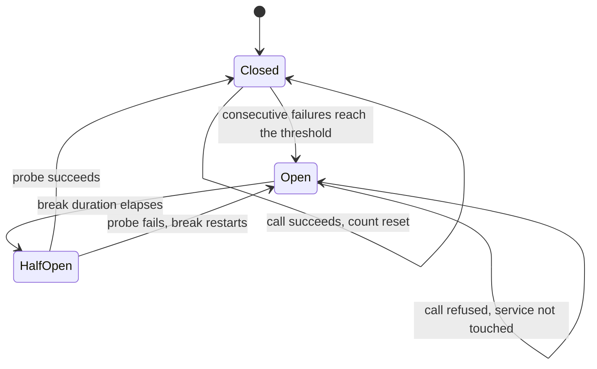

# Circuit Breaker

**Resilience** — keeping a service working when its dependencies are not

Handle faults that might take a variable amount of time to fix when an application connects to a
remote service or resource.

| | |
|---|---|
| Tier | 1 — Resilience |
| Well-Architected pillars | Reliability, Performance Efficiency |
| Source | [Circuit Breaker](https://learn.microsoft.com/en-us/azure/architecture/patterns/circuit-breaker), retrieved 2026-08-16 |
| Runtime dependencies | none |

## The problem it solves

[Retry](../Retry/README.md) handles a dependency that fails for a moment. It handles a dependency
that is *down* very badly.

When a service is genuinely unavailable, every caller retries, every retry waits, and every waiting
caller holds a request thread, a connection and whatever else it acquired before the call. The
dependency is now receiving more load than it was when it fell over, from callers that are
themselves becoming unresponsive. A partial outage becomes a total one, and the retries are what
spread it.

The information nobody has is that the dependency is down. Each call discovers it independently,
pays the full timeout to do so, and forgets it immediately.

A breaker remembers. After enough consecutive failures it stops calling and starts refusing —
instantly, and for everybody sharing it. It costs one fast failure instead of a slow one, and it
takes the load off a service that needs it.

## When to use it

* The dependency is remote, and its failures can persist for a while rather than a moment.
* Failing fast is genuinely better for the caller than waiting — there is a fallback, a cached
  answer, or a clear error the user can act on.
* Many calls share the dependency, so what one call learns is worth telling the others.
* The call is expensive to attempt: a long timeout, a scarce connection, a held transaction.

## When not to use it

* **The failure is local.** A breaker in front of an in-memory operation protects nothing and hides
  bugs.
* **There is no meaningful fallback.** Failing fast is only an improvement if the caller can do
  something with the failure. Returning an error in four milliseconds instead of thirty seconds is
  still an error.
* **The dependency's failures are genuinely momentary.** Retry alone is simpler, and a breaker that
  never opens is a state machine you are maintaining for nothing.
* **Each caller has a private dependency.** The breaker's value is shared knowledge; with one
  caller per dependency there is nothing to share.
* **Access is already serialised through a queue.** Buffering has absorbed the problem the breaker
  was going to solve.

## Architecture and components

| Participant | Role |
|---|---|
| `CircuitBreakerPolicy` | Holds the state, counts failures, decides whether a call is attempted |
| `CircuitState` | `Closed`, `Open`, `HalfOpen` |
| `IClock` / `ManualClock` | Where the current time comes from, so the break duration is assertable |
| `DependencyFailureException` | The only failure the breaker counts |
| `CircuitOpenException` | Thrown *instead of* calling, when the circuit is open |
| `IInventoryService` | The remote dependency being protected |

Two design points are worth reading the code for.

**Only `DependencyFailureException` counts.** A breaker that counted every exception would open on a
validation bug in the caller's own code — cutting off a healthy dependency because the caller had a
defect, which is a worse outage than the one being prevented.

**Reading `State` can change it.** An open circuit whose break duration has elapsed becomes
half-open at the moment somebody looks. The alternative is a background timer, which makes the
breaker's behaviour depend on a thread nobody asked for.

## Advantages and trade-offs

**What it buys.** Failures become fast and cheap. The struggling dependency gets a chance to
recover instead of being held under. Callers stop holding scarce resources through long timeouts.
Recovery is automatic, and needs nobody to notice or intervene.

**What it costs.** State, and shared state at that — every caller sharing an instance shares its
verdict. Calls are refused that might have succeeded, because the breaker is extrapolating from the
last few. Two more numbers to choose badly. And a half-open probe is a deliberate sacrifice: one
caller pays a real failure to find out on everyone's behalf.

**The honest trade** is availability for latency, and only where the caller can use a fast failure.

## Implementation considerations

* **Consecutive failures, not total.** A count that never resets opens eventually on any service,
  however healthy.
* **One probe, not a flood.** Half-open must let exactly one call through; letting all waiting
  callers probe at once re-creates the stampede.
* **Restart the break on a failed probe.** Otherwise a still-broken dependency is probed on every
  subsequent call.
* **Share the instance.** A breaker per call site learns nothing.
* **Pair it with Retry** — retry the blip, break on the outage. The catalogue names this pairing
  explicitly.
* **Make the state observable.** An operator seeing "circuit open for 4 minutes" diagnoses in
  seconds what an error-rate graph takes much longer to explain.

## Real-world cloud scenarios

* A checkout service calling an inventory service that has lost its database connection.
* A front end calling a partner API during that partner's outage.
* A worker calling a model-serving endpoint that is scaling from zero and rejecting calls.
* A service reaching a regional dependency during a failover, where the "variable amount of time"
  is minutes, not milliseconds.

## In Azure

The implementation here models the dependency in process. There is no SDK, no network, and no cloud
account, so it can be read and run from a clean clone with only the .NET SDK.

In Azure this is normally not hand-written. It appears as **[Polly](https://www.pollydocs.org/)**'s
circuit-breaker strategy, usually in the same resilience pipeline as its retry strategy and wired
into `IHttpClientFactory`; as the outlier detection and ejection in **Azure API Management** or an
ingress controller; and as the health-based ejection built into most service meshes.

**What this model does not show.** The clock is advanced by hand, so nothing here exercises real
elapsed time. Nothing exercises **concurrency**, which is where real breakers are hard: this
implementation is not thread-safe, and a production breaker shared by many callers needs the
failure count and the state transition to be atomic, or several callers will probe at once in
half-open — the exact stampede the state exists to prevent. Nor does it show per-endpoint breakers,
metrics, or the operator experience of a circuit that opens under partial failure. Treat the
concurrency characteristics of a real deployment as unmeasured here.

## What the tests assert

The tests are about what the breaker guarantees rather than how it is currently written, so they
survive a reimplementation.

They cover pass-through while closed; opening once consecutive failures reach the threshold;
refusing while open **without invoking the dependency**, which is asserted by counting calls rather
than by inspecting state; the transition to half-open once the break duration has elapsed; a
successful probe closing the circuit and resetting the count; a failed probe reopening it and
restarting the break from the probe rather than from the original failure; and a success clearing
the count before the threshold, so intermittent failures never accumulate into an opening.

Each test drives a `ManualClock`, so the break duration passes when the test says it does.
