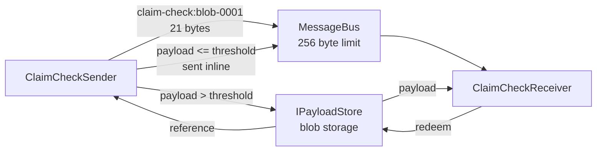

# Claim Check

**Messaging** — decoupling senders from receivers

Split a large message into a claim check and a payload to avoid overwhelming a message bus.

| | |
|---|---|
| Tier | 2 — Messaging |
| Well-Architected pillars | Reliability, Security, Cost Optimization, Performance Efficiency |
| Source | [Claim Check](https://learn.microsoft.com/en-us/azure/architecture/patterns/claim-check), retrieved 2026-08-16 |
| Runtime dependencies | none |

## The problem it solves

Every message bus has a maximum message size, and it is smaller than you think: Azure Storage
queues 64KB, Service Bus 256KB on its standard tier, Event Grid 1MB. The limit is not a
configuration setting you can raise on the day it bites.

So a workflow that runs happily for a year on typical documents fails the first time somebody
uploads a large scan or a customer with ten thousand order lines. The failure arrives as a rejected
send in production, and the message that provoked it is usually the one that mattered most.

Even below the limit, large messages are expensive. They are slower to transmit, they consume broker
throughput that other messages needed, and they are copied to every subscriber on a topic whether or
not that subscriber cares about the payload.

The claim check separates the two concerns. The payload goes to storage, which is built for
arbitrary size and costs a fraction as much per byte. A small reference — the check — travels on the
bus. The receiver redeems it.

The demonstration in this folder shows the direct send being **refused** before it shows the claim
check working, because that refusal is the entire reason the pattern exists.

## When to use it

* Payloads can exceed, or approach, the broker's message limit.
* Payloads are large enough that transmitting them repeatedly is costly.
* A topic fans out to subscribers, most of which do not need the payload itself.
* The payload already lives in storage — a blob, a document — and the message is really about it.

## When not to use it

* **Payloads are comfortably small.** A store round trip costs latency and money; a short note
  should not pay for one. This implementation sends below the threshold inline for exactly that
  reason.
* **The receiver always needs the payload immediately**, and the extra fetch is on a latency-critical
  path.
* **The store's availability is worse than the bus's.** You have added a dependency to every read.
* **Lifetimes cannot be reconciled.** If the payload may vanish before the message is consumed, the
  pattern converts a size problem into a correctness problem — see below.

## Architecture and components

| Participant | Role |
|---|---|
| `MessageBus` | Carries messages, and **refuses** anything over its limit |
| `IPayloadStore` | Where large payloads live |
| `ClaimCheckSender` | Decides inline or checked, and stores when needed |
| `ClaimCheckReceiver` | Redeems a check transparently |
| `ClaimCheckToken` | The marker that distinguishes a check from a payload |
| `PayloadUnavailableException` | What a redeemed-but-missing payload raises |

**The bus enforces a real limit.** Without that, the pattern is indirection whose purpose is
invisible, because in process nothing is ever too big for anything.

**The receiver does not need to know which it is getting.** That is what keeps the pattern from
leaking into every consumer's code.

**Below the threshold, the payload travels inline.** The store is not consulted at all — the same
cost reasoning that motivates the pattern, applied in the other direction.

## Advantages and trade-offs

**What it buys.** Payloads of any size become deliverable over a bus that would refuse them. Broker
throughput and cost drop sharply, since the bus carries references rather than bytes. Fan-out gets
cheaper still — one stored payload, N small messages. And storage is far cheaper per byte than a
broker.

**What it costs.** Two systems where there was one, so two things to provision, secure and monitor.
An extra round trip on every checked message. A new failure mode: the message arrives and the
payload does not. And **lifetime coupling**, which is the sharp edge — the message and its payload
now expire independently, and nothing coordinates them.

## Implementation considerations

* **Make the payload outlive the message.** Retention must exceed the broker's maximum message
  lifetime plus every retry and dead-letter window, or a redelivery weeks later finds nothing.
* **Fail loudly on a missing payload.** Returning an empty document that looks like a successful
  read is far worse than an exception.
* **Set a threshold, and send small payloads inline.** Not everything needs the round trip.
* **Decide who deletes the payload, and when.** Consumer-deletes breaks fan-out — the second
  subscriber finds nothing. A retention policy on the store is usually the right answer.
* **Secure the store as carefully as the bus.** The check is a capability: anyone holding it can
  fetch the payload. See Valet Key for scoping that access properly.
* **Keep enough in the message to route on**, so consumers can filter without fetching.

## Real-world cloud scenarios

* Document processing where scans and PDFs far exceed any broker's limit.
* Image or video pipelines passing media between stages.
* Bulk import messages carrying thousands of rows.
* Event fan-out where one large payload is relevant to only one of several subscribers.

## In Azure

The implementation here is a `Queue` and a `Dictionary`, in one process.

In Azure the payload goes to **Azure Blob Storage** and the check is a blob URI; the bus is **Azure
Service Bus** or **Event Grid**. Where the payload is already a blob, **Event Grid's blob-created
events** are a claim check by construction — the event carries a URI and nothing else. **Azure
Logic Apps** has the pattern built in for large messages. And a **shared access signature** on the
blob is how the check is turned into scoped, expiring access rather than a bare reference.

**What this model does not show.** Nothing is durable and nothing is remote, so the extra round trip
that motivates the inline threshold has no measurable cost here. There is no retention policy,
expiry or lifecycle management — `CollectAll` stands in for one, which is why the hazard is
demonstrable at all. There is no authorisation on the store, so the check is a bare reference rather
than a scoped credential. There is no cleanup path and no fan-out, so the "who deletes it" question
cannot arise. And payload size is measured in UTF-8 bytes of a string rather than as a stream, so
nothing here is genuinely large.

## What the tests assert

The tests are about what the pattern guarantees rather than how it is currently written.

They cover the constraint itself — a bus that genuinely **refuses** an oversized message, without
which the rest is meaningless; a large payload travelling as a small token while the payload goes to
the store; the receiver getting back **exactly** what was sent; a small payload travelling inline
with the store untouched; and a redeemed check whose payload has been collected failing clearly
rather than yielding an empty result.
