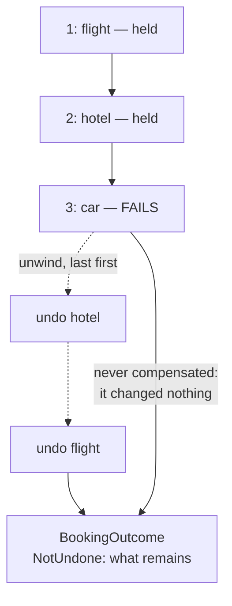

# Compensating Transaction

**Coordination** — agreeing on outcomes across services

Undo the work performed by a sequence of steps that collectively form an eventually consistent
operation.

| | |
|---|---|
| Tier | 4 — Coordination |
| Well-Architected pillars | Reliability |
| Source | [Compensating Transaction](https://learn.microsoft.com/en-us/azure/architecture/patterns/compensating-transaction), retrieved 2026-08-16 |
| Runtime dependencies | none |

## The problem it solves

An operation that spans several services has no transaction to roll back.

Booking a trip means holding a flight, a hotel and a car — three systems, three separate
commitments, each already visible to somebody else the moment it succeeds. When the car fails,
there is no coordinator to tell the flight system to forget it happened: that booking is real,
another traveller can no longer take that seat, and a confirmation email may already be in an
inbox.

The instinct is to reach for a distributed transaction. Two-phase commit does exist, and it
requires every participant to hold locks until every other participant is ready — which is why
cloud services almost universally decline to offer it. The alternative is to accept that each step
commits independently and to define, for each one, **the new action that counters it**.

That is a compensating transaction: not an undo, but a deliberate second operation that brings the
world back toward where it started. The demonstration in this folder runs the interesting case —
the one where the car fails and the earlier steps must be countered.

## When to use it

* An operation spans services that commit independently, with no shared transaction.
* Each step has a meaningful counter-action: cancel, refund, release, revoke.
* Eventual consistency is acceptable, and a window of partial completion is tolerable.
* The business already has these counter-actions, because humans have always needed them.

## When not to use it

* **A real transaction is available.** Within one database, use it — it is stronger and cheaper.
* **The steps have no counter-action.** An email sent, a message delivered, a physical item
  shipped. The pattern can still be used, but the model must report what it cannot undo rather
  than pretend.
* **Partial completion is unacceptable even briefly.** Compensation is not atomic; there is always
  a window where some steps are done and others are being undone.
* **Compensation is as likely to fail as the original.** Then the failure path needs its own
  failure path, and the design should be reconsidered before it is deepened.

## Architecture and components

| Participant | Role |
|---|---|
| `BookingStep` | A step and the action that counters it — or no counter at all |
| `TripBooking` | Runs the steps, and unwinds the completed ones **last first** |
| `StepRecord` | What happened, in order — the do and the undo alike |
| `BookingOutcome` | What failed, and **what could not be undone** |

**Compensation runs in reverse order.** Later steps generally depend on earlier ones, so releasing
the earlier resource first can leave the later counter-action with nothing to act on. The tests
assert the order rather than the end state, because in a model this small every order leaves the
same end state — and in a real system they do not.

**The step that failed is not compensated.** It changed nothing, so countering it would be a second,
unrelated change to the world.

**What this pattern is not.** It is about the undo, and it is indifferent to who ran the steps.
[Saga](../Saga/README.md) is what makes a sequence and its compensations survive the coordinator
restarting; [Scheduler Agent Supervisor](../SchedulerAgentSupervisor/README.md) is what notices a
step that never answered at all; [Choreography](../Choreography/README.md) is what happens when no
component is driving the sequence in the first place.

## Advantages and trade-offs

**What it buys.** A defined path back from partial failure, without distributed locks. Steps that
commit immediately, so no service waits on another's readiness. Counter-actions that usually already
exist, because businesses have always had to cancel things. And an honest account of what the system
did, which is more than a silent rollback offers.

**What it costs.** **Compensation is a new action and can itself fail** — the model reports it
rather than swallowing it. Some steps cannot be countered at all. There is a real window in which
the operation is half done. Order matters and must be reasoned about. And every step now needs two
implementations, both tested, the second of which runs only on the unhappy path and therefore rots
quietly.

## Implementation considerations

* **Write the compensation with the step**, not later. A step whose counter-action is "to be
  designed" is a step whose failure path does not exist.
* **Make compensations idempotent.** They are retried more often than the steps they counter, and a
  cancel applied twice must not become a second cancellation of something else.
* **Expect compensation to fail, and report it.** The caller needs to know what remains, and a
  human usually has to finish the job.
* **Name the steps that cannot be compensated**, in code as this model does. They are where an
  operator's attention will be needed.
* **Compensate in reverse order** unless there is a specific reason not to, and write down the
  reason where there is.
* **Consider whether the step can be deferred instead.** The cheapest compensation is the one for
  work that had not been committed yet — reordering so the irreversible step is last removes the
  problem rather than handling it.

## Real-world cloud scenarios

* Travel booking across airline, hotel and car-hire systems.
* An order that reserves stock, charges a card and schedules a courier.
* Provisioning that creates a database, a key vault entry and a DNS record.
* Any workflow where a human's "cancel" button must undo several services' work.

## In Azure

The implementation here is a list of steps and a loop that runs backwards.

In Azure this is usually **Azure Durable Functions**, whose orchestrator can catch a failure and
call the counter-activities in reverse; **Azure Logic Apps**, which has compensation as a modelled
concept in its scopes; and, where the steps are message-driven, **Service Bus** with a compensation
message per step. The state that says which steps completed lives in Durable Functions' history
table or, hand-rolled, in Cosmos DB.

**What this model does not show.** Every step is a function call in one process, so nothing fails
midway through a step, nothing times out, and no compensation is ever lost in flight. There is no
retry of a failed compensation, which a real implementation would attempt before giving up. There
is no durable record, so a crash between steps would lose everything the workflow knew — which is
precisely the gap Saga exists to close. And the partial-completion window is instantaneous rather
than measured in seconds or minutes.

## What the tests assert

The tests are about what the workflow guarantees rather than how it is currently written, and they
assert **order** rather than end state.

They cover every step running when none fail; completed steps being countered **last first**, which
is the guarantee a forward-order unwind silently breaks; the failed step not being countered,
because it changed nothing; a compensation that itself failed being reported rather than swallowed;
a step that **cannot** be countered being reported the same way; and the full ordered history of
dos and undos being recorded.
