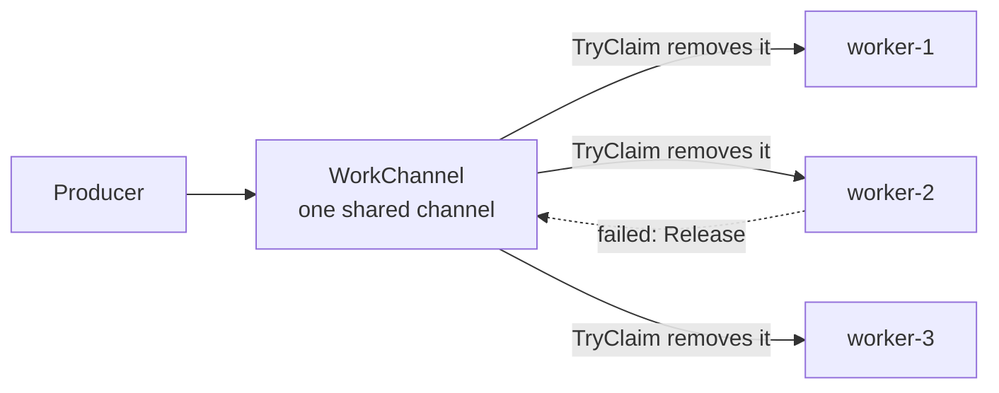

# Competing Consumers

**Messaging** — decoupling senders from receivers

Enable multiple concurrent consumers to process messages that they receive on the same messaging
channel.

| | |
|---|---|
| Tier | 2 — Messaging |
| Well-Architected pillars | Reliability, Cost Optimization, Performance Efficiency |
| Source | [Competing Consumers](https://learn.microsoft.com/en-us/azure/architecture/patterns/competing-consumers), retrieved 2026-08-16 |
| Runtime dependencies | none |

## The problem it solves

A queue smooths a spike, but it drains at exactly one consumer's rate. When the backlog is hours
deep, the answer is not a bigger buffer — it is more consumers.

The naive way to get them is to partition the work up front: worker one takes images A–H, worker two
takes I–P. It fails immediately in practice. The partitions are never evenly sized, so some workers
idle while others are hours behind. Adding a worker means re-partitioning and redeploying everybody.
And a worker that dies takes its partition with it — that work simply stops, and nothing else picks
it up.

Competing consumers removes the assignment entirely. Every worker pulls from the same channel, and
whichever is free next takes the next message. Load balances itself because a fast worker
simply asks again sooner. Adding a worker needs no coordination at all. And a worker that dies
holding a message releases it back, so somebody else finishes the job.

**The guarantee is that each message is handled by exactly one consumer.** That is what separates
this from **Publisher-Subscriber**, where every subscriber gets
every message.

## When to use it

* The work is parallelisable — messages do not depend on one another.
* The backlog is large enough that one consumer cannot keep up.
* Throughput needs to scale up and down with demand.
* Workers are unreliable, and work must survive one of them dying.

## When not to use it

* **Every consumer needs every message.** That is Publisher-Subscriber, and using this pattern
  instead means only one listener learns something they all needed to know.
* **Order matters across the whole channel.** Competing consumers destroy global ordering by
  design — that is what parallelism means. Where order matters within a subset, see
  **Sequential Convoy**.
* **The work is not idempotent** and nothing de-duplicates. At-least-once delivery means a released
  message is delivered again; see **Idempotent Consumer**.
* **The bottleneck is downstream.** Ten workers hammering one database that was already saturated
  makes it worse, not faster.
* **Messages are rare.** Idle consumers polling an empty channel cost money and achieve nothing.

## Architecture and components

| Participant | Role |
|---|---|
| `WorkChannel` | The shared channel; claiming removes an item so nobody else can take it |
| `Consumer` | An interchangeable worker that claims, processes, and completes or releases |
| `WorkItem` | The unit of work |

Two details matter more than they look.

**Claiming removes the item.** If claiming merely *read* it, two consumers could take the same
message and the pattern's one guarantee would be gone. A real broker does this with a visibility
timeout: the message is hidden rather than deleted, so a consumer that dies mid-work does not take
it with them.

**Releasing is not optional.** A claimed item that is neither completed nor released has been
silently lost — nothing in the system will report it missing. The released item goes to the *back*
of the channel, so a repeatedly failing message does not block everything behind it.

## Advantages and trade-offs

**What it buys.** Throughput that scales with consumer count, demonstrably — the tests assert a
twelve-message backlog takes twelve rounds with one consumer and four with three. Self-balancing
load, with no partitioning to maintain. Elasticity: add or remove workers with no coordination.
And resilience, because no work is bound to a worker that might die.

**What it costs.** Global ordering, entirely. Duplicate delivery, because a released or timed-out
message is delivered again — which makes idempotent processing a requirement rather than a nicety.
Contention on the channel itself at high consumer counts. And a real risk of simply moving the
bottleneck downstream.

## Implementation considerations

* **Make handlers idempotent.** This is not advice; at-least-once delivery guarantees you will see
  duplicates.
* **Set the visibility timeout above the slowest realistic processing time.** Too short and a
  message is redelivered while still being worked on, so it *is* processed twice.
* **Release on failure, explicitly.** Or rely on the timeout — but know which you are doing.
* **Cap the delivery count and dead-letter.** One poison message can otherwise circulate for ever.
* **Scale on queue depth**, not CPU. Depth is the signal that says whether consumers are keeping up.
* **Watch for downstream saturation** before adding workers.

## Real-world cloud scenarios

* Thumbnail or transcoding workers draining an upload queue after a bulk import.
* Order processors sharing an intake queue, scaled up during a sale.
* Email or notification senders working through a fan-out.
* Data-enrichment workers pulling from an ingestion stream.

## In Azure

The implementation here is one in-process queue and three objects. Nothing is durable, nothing is
concurrent, and the pump is a loop.

In Azure the channel is **Azure Service Bus** (queues, with sessions when partial ordering is
needed), **Azure Storage queues** for simple high-volume work, or **Event Hubs** for streams. The
consumers are typically **Azure Functions** with a queue trigger — where the scaling is automatic —
or **Container Apps** and **AKS** with KEDA scaling on queue depth.

**What this model does not show.** Consumers are pumped in a fixed rotation on one thread, so
nothing here is actually concurrent — the distribution guarantee is demonstrated, the race is not.
There is no visibility timeout, so the case that makes real implementations hard, a consumer dying
*mid-message*, cannot occur. There is no delivery count and no dead-letter queue, so a poison
message would circulate for ever. Nothing is durable. And no consumer ever contends with another for
the same item, which is the failure the removal-on-claim design exists to prevent. Treat the
concurrent behaviour as unmeasured here.

## What the tests assert

The tests are about what the channel guarantees rather than how it is currently written.

They cover the central guarantee — six messages, three consumers, six handled and **six distinct**;
work reaching every consumer rather than one taking everything; a failed claim being **released back
to the channel** and completed by somebody else; an empty channel reporting nothing to claim rather
than blocking; and the throughput claim itself, measured in rounds rather than wall-clock so it is
deterministic — twelve rounds with one consumer, four with three.

Consumers are pumped explicitly. What is asserted is the distribution guarantee, not the scheduler.
