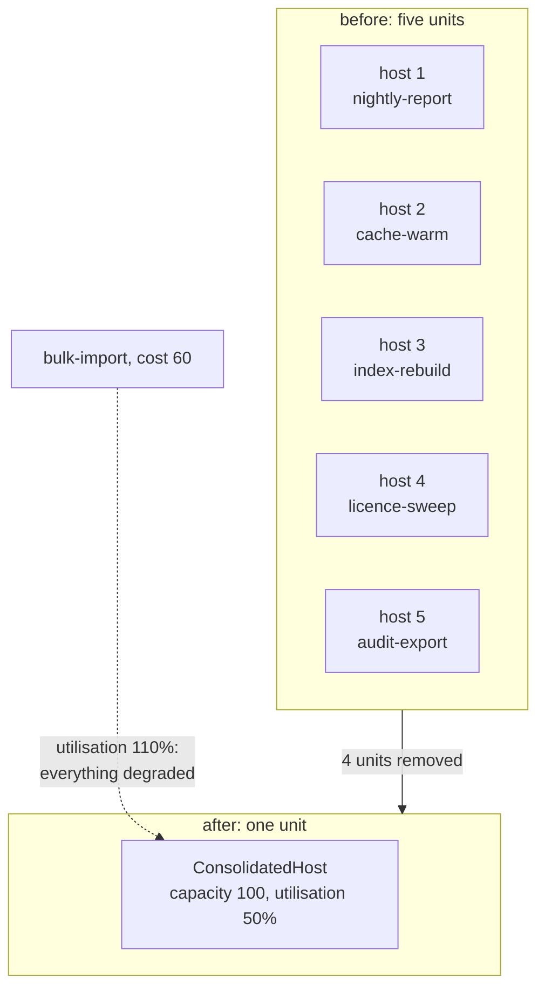

# Compute Resource Consolidation

**Deployment and topology** — where components run

Consolidate multiple tasks or operations into a single computational unit.

| | |
|---|---|
| Tier | 6 — Deployment and topology |
| Well-Architected pillars | Cost Optimization, Operational Excellence, Performance Efficiency |
| Source | [Compute Resource Consolidation](https://learn.microsoft.com/en-us/azure/architecture/patterns/compute-resource-consolidation), retrieved 2026-08-16 |
| Runtime dependencies | none |

## The problem it solves

Five small jobs on five machines, each idle for most of the day and paid for all of it.

A nightly report, a cache warm, an index rebuild, a licence sweep, an audit export. Each is a few
minutes of work. Each got a virtual machine of its own, because that was the safe answer at the time
and nobody ever consolidated them. The bill is five machines; the work is twenty minutes.

The waste is not only money. Five machines is five operating systems to patch, five sets of
monitoring, five deployment pipelines and five things to be woken up about — for jobs that between
them do less work than one machine could absorb without noticing.

Consolidation puts them on one computational unit. The demonstration counts it: five units become
one, four removed, utilisation at fifty per cent — with room to spare and the tasks themselves
unchanged by the move.

## When to use it

* Many small tasks each occupy a unit that is mostly idle.
* Their resource needs are modest and their peaks do not coincide.
* They have similar security, availability and lifecycle requirements.
* The operational cost of many units is material — patching, monitoring, paying.

## When not to use it

* **Tasks have different security or compliance requirements.** Consolidation puts them in the same
  blast radius, and that is a decision a compliance boundary may forbid.
* **One task can saturate the unit.** It will, and everything else becomes its victim.
* **Peaks coincide.** Averages consolidate well; simultaneous peaks do not.
* **Independent scaling is needed.** Consolidated tasks scale together, whether they want to or not.
* **A failure must not be shared.** One unit means one restart, one crash, one bad deployment
  affecting everything on it.

## Architecture and components

| Participant | Role |
|---|---|
| `ConsolidatedHost` | One unit running many tasks — **and it reports its own utilisation** |
| `ScheduledTask` | A small periodic job, unchanged by which host runs it |
| `ResourceUsage` | Units before, units after, **units removed**, utilisation |

**`UnitsRemoved` is the demonstration.** Five tasks that each had a host now share one: four units
that no longer have to exist, be patched, or be paid for.

**Sharing capacity means sharing fate**, and the tests assert it. A sixth task claiming sixty per
cent does not fail — it makes the other five slower, including the four that have nothing to do with
it. That is the price of the units removed.

**Nothing is dropped for not fitting.** A host that shed work it could not accommodate would look
efficient and be losing the nightly report.

**This pattern argues the opposite of its tier-mates**, and that is worth stating plainly.
Deployment Stamps and Geode both say *deploy more copies* — for blast radius and for reach. This one
says *deploy fewer units* — for cost density. They are not in conflict: they answer different
questions, and a system can sensibly do both at different granularities.

**What this is not.** [Deployment Stamps](../DeploymentStamps/README.md) separates by tenant for
isolation; [Geode](../Geode/README.md) replicates for reach. [Bulkhead](../Bulkhead/README.md), in
tier 1, isolates *within* a process so one workload cannot exhaust another — which is precisely the
mitigation for the noisy-neighbour cost this pattern introduces.

## Advantages and trade-offs

**What it buys.** Far fewer units to pay for, patch, monitor and deploy. Higher utilisation of what
remains. A smaller operational surface, which is often worth more than the money. And a shorter list
of things that can page somebody.

**What it costs.** **Shared fate** — one greedy task degrades its neighbours, one crash takes them
all, one bad deployment affects everything on the unit. Coupled scaling and coupled lifecycles.
A shared security boundary, which may be unacceptable. And a capacity-planning problem that did not
exist when each task had its own machine.

## Implementation considerations

* **Group by compatible requirements**, not by convenience: similar security posture, similar
  availability expectations, similar release cadence.
* **Watch utilisation and act before it saturates.** Fifty per cent is comfortable; ninety is a
  decision you have already made badly.
* **Check that peaks do not coincide** before consolidating. Two tasks averaging ten per cent that
  both peak at midnight are not a ten per cent pair.
* **Bound each task's resources within the unit** — a [Bulkhead](../Bulkhead/README.md) — so one
  cannot consume everything. Without it, this pattern's main risk is unmitigated.
* **Keep the tasks independently deployable if you can.** Consolidating runtime does not require
  consolidating release cycles, and coupling them makes every change riskier.
* **Reconsider periodically.** Consolidation decisions rot: a task that was small two years ago may
  now be the reason everything else is slow.
* **Do not consolidate across a compliance boundary** to save money. That trade is not yours to
  make.

## Real-world cloud scenarios

* Many small scheduled jobs on one App Service plan or one Functions consumption plan.
* Several microservices sharing an AKS node pool rather than each having its own cluster.
* Batch tasks moved from individual virtual machines onto a shared worker.
* Development and test workloads consolidated where production is not.

## In Azure

The implementation here is a list of tasks and an arithmetic check.

In Azure this is an **App Service plan** hosting several applications; **Azure Functions** where many
functions share one plan; **AKS node pools** where many pods share nodes, with requests and limits as
the per-task bound; and **Azure Container Apps** where several apps share an environment. Azure's own
guidance pairs it with resource limits precisely because unbounded consolidation produces the noisy
neighbour this folder demonstrates.

**What this model does not show.** *There is no compute.* Tasks are objects and "capacity" is an
integer, so utilisation is arithmetic rather than measurement — nothing is actually slower, and
"degraded" is a label rather than an effect. There is no scheduling, so coinciding peaks cannot be
demonstrated. There is no crash, so shared failure is described rather than shown. There are no
resource limits, so the Bulkhead mitigation is named and never exercised. And there is no billing,
which is the pattern's primary motivation and is entirely absent.

## What the tests assert

The tests are about what consolidation guarantees rather than how it is currently written, and the
cost is asserted as directly as the benefit.

They cover every task running on **one** unit; five units becoming one with **four removed**; every
task that the separate hosts ran still running, because a host that dropped what did not fit would
look efficient while losing work; **one greedy task degrading all five of its neighbours**, which is
shared fate stated as a test; and the host reporting its own utilisation at fifty per cent, then at
a hundred and ten.
