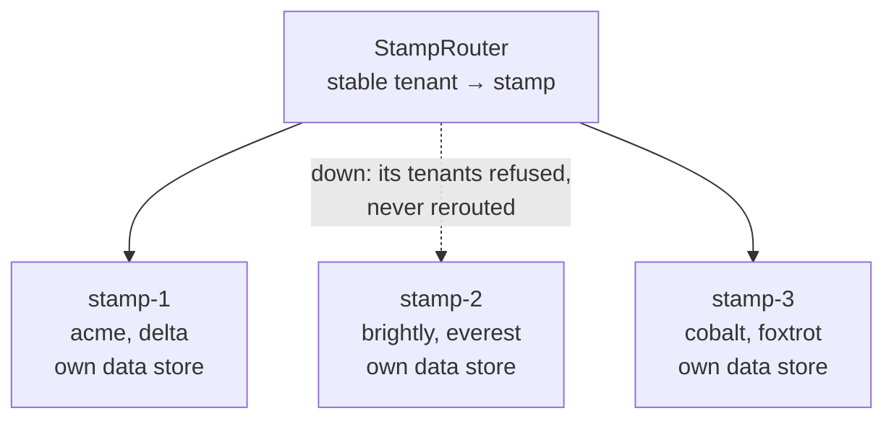

# Deployment Stamps

**Deployment and topology** — where components run

Deploy multiple independent copies of application components, including data stores.

| | |
|---|---|
| Tier | 6 — Deployment and topology |
| Well-Architected pillars | Operational Excellence, Performance Efficiency |
| Source | [Deployment Stamps](https://learn.microsoft.com/en-us/azure/architecture/patterns/deployment-stamp), retrieved 2026-08-16 |
| Runtime dependencies | none |

## The problem it solves

One deployment serving every customer means every customer shares every failure.

A multi-tenant application on one set of infrastructure has a single database, a single cache and a
single queue. A bad migration, a poisoned cache entry, a tenant whose import saturates the write
throughput — each of those is an incident for **everybody**. And growth has only one direction:
make the database bigger, until it cannot get bigger.

Deployment stamps replace that with several complete, independent copies. Each stamp has its own
compute **and its own data store**, each tenant lives in exactly one, and no stamp knows another
exists. A stamp failing costs its own tenants and nobody else — the demonstration shows two tenants
refused and four who never learn anything happened. Growth comes from adding stamps rather than
enlarging one.

## When to use it

* A multi-tenant application where one tenant's problem must not become everyone's.
* Scale that has outgrown, or will outgrow, what one data store can carry.
* Tenants with genuinely different requirements — data residency, compliance, release cadence.
* Deployments that should be rehearsed on a subset before reaching everybody.

## When not to use it

* **A single tenant, or very few.** The machinery costs more than the isolation is worth.
* **Tenants must see each other's data.** Cross-stamp queries are expensive by construction and
  usually mean the boundary is wrong.
* **Nobody will operate several deployments.** Every stamp needs deploying, monitoring, patching and
  paying for; three stamps is three times the operational surface.
* **Tenant sizes vary wildly.** One tenant that fills a stamp alone breaks the model's economics.

## Architecture and components

| Participant | Role |
|---|---|
| `StampRouter` | The stable tenant-to-stamp assignment — **and it counts who a failure spares** |
| `Stamp` | A complete copy, **including its own data store**, knowing of no other |
| `TenantRequest` | One tenant's work |
| `StampHealth` | Healthy or Down — and Down is local |

**`TenantsUnaffectedBy` is the demonstration.** Six tenants over three stamps means a failure costs
two and spares four, and the ratio improves as stamps are added. That is the pattern's whole
argument, and it is a number rather than a claim.

**The home is stable, deliberately.** A tenant's data lives in its stamp's store, so a tenant that
drifted between stamps would find a different world each time. Stability is what makes the isolation
mean anything.

**A request for a tenant whose stamp is down is refused, not rerouted.** Another stamp holds none of
that tenant's data, so failing over would answer with somebody else's world — worse than an honest
refusal.

**What this is not.** Geode is the opposite arrangement: every node holds the same data and **any**
node serves **any** request, buying ubiquity at the cost of replication lag. Stamps buy isolation at
the cost of being unable to serve a tenant from anywhere. Sharding partitions a data store *within*
one application; a stamp is a whole application, store included. Backends for Frontends splits by
client rather than by tenant.

## Advantages and trade-offs

**What it buys.** A blast radius bounded by one stamp. Scale by addition rather than by enlargement,
which has no ceiling in the same way. Staged deployment — a release reaches one stamp before all of
them. Tenant-level placement for residency or compliance. And a noisy tenant whose noise is confined
to its neighbours in one stamp.

**What it costs.** **Several deployments to operate**, each needing monitoring, patching and money.
Cross-stamp operations that range from expensive to impossible. Tenant placement and, eventually,
tenant migration — which means moving a data store, and is a project rather than a task. Capacity
that is stranded per stamp rather than pooled. And a router that must be right, because a tenant
sent to the wrong stamp sees an empty world.

## Implementation considerations

* **Keep the assignment stable and durable.** It is the one piece of state that spans stamps, and
  losing it loses every tenant's home.
* **Let stamps share nothing.** A shared database "just for reporting" reintroduces the coupling the
  pattern removed, and it will be the thing that fails for everybody.
* **Fill the emptiest stamp**, and define what "full" means before a stamp reaches it.
* **Plan tenant migration before you need it.** It is moving a data store while a customer uses it,
  and doing it once badly makes the next one political.
* **Deploy stamp by stamp**, so a bad release is caught on one.
* **Answer cross-stamp questions outside the stamps** — a separate reporting store fed
  asynchronously — rather than by letting stamps talk to each other.
* **Automate stamp creation completely.** A stamp that takes a week of manual work is a stamp nobody
  will add when they should.

## Real-world cloud scenarios

* Multi-tenant SaaS with tenants grouped into scale units.
* Regional deployments where a tenant's data must remain in its jurisdiction.
* Tiered service where premium tenants get their own stamp.
* Any platform that has reached the limit of one database and cannot shard within the application.

## In Azure

The implementation here is three objects with their own lists.

In Azure a stamp is typically a **resource group** deployed from one **Bicep** or **Terraform**
template — its own App Service or AKS cluster, its own Azure SQL or Cosmos DB, its own storage — with
**Azure Front Door** or **Traffic Manager** in front holding the tenant-to-stamp routing. The
**Deployment Stamps reference architecture** on Microsoft Learn is this pattern with the templates
attached, and **Azure Deployment Environments** is a way to make stamp creation repeatable.

**What this model does not show.** *There is no deployment.* Stamps are objects in one process, so
nothing shows the operational cost that is the pattern's main trade — three deployments to patch,
monitor and pay for. There is no data store, so "its own data store" is a statement rather than a
demonstration, and cross-stamp queries cannot be shown to be expensive because there is nothing to
query. There is no tenant migration, which is the pattern's hardest operation. There is no staged
rollout. And the router's assignment is in memory, where in production losing it would lose every
tenant's home.

## What the tests assert

The tests are about what the arrangement guarantees rather than how it is currently written, and the
stable home is asserted first because everything else rests on it.

They cover a tenant reaching its own stamp; **the same tenant reaching the same stamp fifty times**,
which is what a per-request assignment silently breaks; tenants on other stamps still being served
when one fails; **four of six tenants counted as unaffected**, which is the pattern's argument as a
number; a tenant on a failed stamp being **refused rather than rerouted**, because elsewhere holds
none of its data; and a fourth stamp being added with **every existing tenant staying exactly where
it was**.
