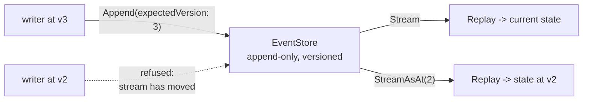

# Event Sourcing

**Data management** — storing and reading data at scale

Use an append-only store to record a full series of events that describe actions taken on data in
a domain.

| | |
|---|---|
| Tier | 3 — Data management |
| Well-Architected pillars | Reliability, Performance Efficiency |
| Source | [Event Sourcing](https://learn.microsoft.com/en-us/azure/architecture/patterns/event-sourcing), retrieved 2026-08-16 |
| Runtime dependencies | none |

## The problem it solves

A store that keeps only current state answers one question well and destroys the rest.

The balance is 455. How did it get there? Which of two concurrent updates won? What did the
account look like when the decision was made? A row that is updated in place cannot say — the
previous value was overwritten, and every question about how the present came about is
unanswerable by construction. Audit tables and change logs are the usual retrofit: a second,
partial history maintained beside the real one, trusted until the first time they disagree.

Event sourcing inverts it. **The events are the record**, appended and never changed, and current
state is what they add up to. The balance is not stored; it is derived. History is not kept
alongside the data — history *is* the data.

The demonstration in this folder replays the same stream to every version it has ever had, from
one store that only ever appends.

## When to use it

* The history matters as much as the present: finance, audit, compliance, anything regulated.
* "How did this happen?" is a question the business asks, and answering it from logs is a
  reconstruction rather than a fact.
* Intent matters, not just outcome — *withdrawn* and *corrected* mean different things to a reader
  even when the arithmetic matches.
* Concurrent writers need conflict detection that says what conflicted, not just that something
  did.
* Several derived views are wanted over one authoritative sequence, including views invented later.

## When not to use it

* **The domain is simple CRUD.** Storing state directly is less code, less latency and a debugging
  story every developer already knows.
* **Nobody will ever ask about the past.** Then the history is pure cost.
* **Queries need arbitrary shapes now.** An event store answers "what happened to this stream"
  well and "which accounts are overdrawn" not at all — that needs projections, which is a second
  system.
* **The team has not met it before and the deadline is short.** Versioning events, replay
  performance and unfamiliar debugging are real, and they arrive later than the decision does.
* **Data must be deletable on request.** Append-only and erasure are in direct tension; the
  workarounds are real but must be designed in from the start.

## Architecture and components

| Participant | Role |
|---|---|
| `AccountEvent` | Something that happened, in the past tense because it already has |
| `EventStore` | The append-only streams — **nothing here updates or deletes** |
| `AccountAggregate` | State derived by replay; never a second source of truth |

**The store refuses an append whose expected version has moved.** Without that check two writers
who both read version two would both append version three, and the decision one of them made
against state that no longer held would be lost with no trace — the single loss an event store
exists to prevent.

**There is no read model here, deliberately.** Separating reads from writes is CQRS, a
neighbouring pattern that event sourcing is often paired with and does not require. The two are
implemented independently in this repository so a reader can tell which one did what.

## Advantages and trade-offs

**What it buys.** A complete, ordered history that is the data rather than a copy of it. Any past
state reconstructible by replaying a prefix. Intent preserved, not just outcome. Optimistic
concurrency that reports exactly what conflicted. New derived views buildable over events already
recorded — including views nobody had thought of when the events were written. And an append-only
write path, which is the cheapest and most scalable thing a store can offer.

**What it costs.** **Queries across streams are not what this is.** Replay grows with stream
length, so long streams need snapshots. Events are a permanent contract: every version ever
written must stay replayable, forever. Deletion is genuinely hard, which matters under privacy
law. And the debugging model is unfamiliar — the state is right or the events are, and telling
which is a new skill for most teams.

## Implementation considerations

* **Name events in the past tense, for intent.** `Withdrawn` and `Corrected` may be arithmetically
  identical and mean entirely different things to a reader.
* **Never mutate a stored event.** A mistake is corrected by appending a compensating event, which
  is also how the mistake stays visible — see Compensating Transaction.
* **Version events from the first one.** Every event ever written must remain replayable; an
  upcaster that maps old shapes forward is far cheaper than a migration of history.
* **Snapshot long streams** — state at version N plus the events after it — and treat snapshots as
  disposable derived data, rebuildable from the events.
* **Use expected version for concurrency** rather than locks. Refusing a stale append is the
  store's job and it is cheap.
* **Plan for erasure before the first event.** Crypto-shredding — encrypting personal data per
  subject and destroying the key — keeps the stream intact while making its contents unreadable.
* **Pair with CQRS when queries need shapes replay cannot serve**, as a separate, deliberate
  decision.

## Real-world cloud scenarios

* Ledgers and payments, where the sequence of transactions *is* the account.
* Order lifecycles: placed, paid, packed, shipped, returned — each meaningful in its own right.
* Regulated domains where an auditor asks what was known, and when.
* Collaborative editing and version control, where the operations are the document's history.

## In Azure

The implementation here is a list per account in memory.

In Azure the same shape is usually a **Cosmos DB** container partitioned by stream id, whose
**change feed** is how projections are fed; **Event Hubs** for very high-volume streams with a
retention window, archived to storage for permanence; **Azure Table Storage** with the stream id
as partition key and the version as row key, whose entity-exists check gives optimistic
concurrency directly; and **Event Grid** or **Service Bus** for distributing events to the
services that build views from them.

**What this model does not show.** The store is in memory in one process, so nothing exercises
durability, contention beyond a single-threaded version check, or partitioning by stream. There
are no snapshots, so replay cost never bites. There is no event versioning and no upcasting, which
is the pattern's largest long-term cost. There is no projection or subscription, so nothing
consumes the stream. And there is no erasure story.

## What the tests assert

The tests are about what the store guarantees rather than how it is currently written.

They cover an event being appended and the stream's version moving with it; current state derived
by replay rather than stored; **every event surviving a later state change**, which is what a
store that overwrote would destroy while still answering the balance correctly; an earlier state
reconstructed from a prefix of the same stream; a stale expected version being refused, which is
the concurrency guarantee; and an empty stream replaying to initial state, so an unknown account
needs no special case.
