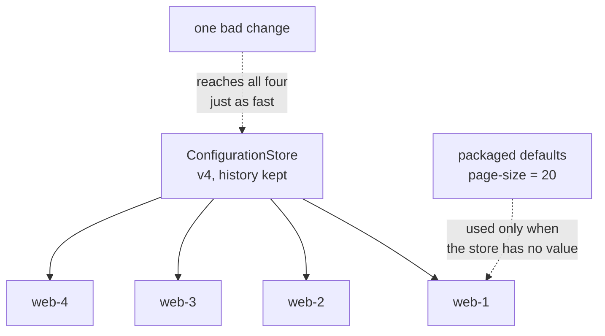

# External Configuration Store

**Deployment and topology** — where components run

Move configuration information out of an application deployment package to a centralized location.

| | |
|---|---|
| Tier | 6 — Deployment and topology |
| Well-Architected pillars | Operational Excellence |
| Source | [External Configuration Store](https://learn.microsoft.com/en-us/azure/architecture/patterns/external-configuration-store), retrieved 2026-08-16 |
| Runtime dependencies | none |

## The problem it solves

Changing one value means redeploying everything.

A feature flag lives in the application's own settings file. Turning it on means editing the file,
building, testing, deploying, and restarting every instance — for a change that is one word. So the
flag stays off, or it goes on during a release window three weeks away, and in the meantime somebody
edits the file on one machine by hand and the fleet is quietly inconsistent.

The related problem is that nobody can say what the settings *are*. Four instances, four copies of a
file, four opportunities for drift, and no version anybody can name.

An external store holds configuration in one place that every instance reads. A change happens once
and takes effect everywhere, with no deployment and no restart — the demonstration counts the
restarts that did not have to happen.

## When to use it

* Settings must change without a deployment — feature flags, thresholds, endpoints.
* Several instances or services share configuration and must not drift.
* Configuration changes need an audit trail and a version.
* Secrets and connection strings should not sit in deployment packages.

## When not to use it

* **The setting never changes without a code change.** Something that only moves when the code does
  belongs with the code.
* **A store outage cannot be tolerated at startup** and no packaged defaults exist — that combination
  turns a configuration outage into a total one.
* **The value is needed on a hot path with no caching.** Reading a remote store per request is a
  latency problem the pattern does not solve on its own.
* **Nobody owns the change process.** A store makes changing production trivial for anyone with
  access, which is the point and the risk.

## Architecture and components

| Participant | Role |
|---|---|
| `ConfigurationStore` | Configuration outside every package — **versioned, with a history** |
| `ApplicationInstance` | **Reads the store rather than remembering startup**, with packaged fallbacks |
| `SettingChange` | One change and the version it produced |

**`RestartsAvoided` is the demonstration.** Four instances that would each have needed a restart, and
none did.

**Instances read rather than remember.** A value cached at startup is a value that needs a restart to
change, which is the arrangement being replaced. The version each instance reports is how drift
becomes visible — an instance on an older version has stopped refreshing.

**A bad setting reaches everything just as fast**, and the tests assert it. Speed of propagation is
not a property that applies only to correct changes, which is why configuration deserves review,
staged rollout and a way back.

**Packaged defaults are kept deliberately.** An application that cannot start without reaching the
store has made a configuration outage into a total outage.

**What this is not.** Deployment Stamps and Geode are about where components run; this is about where
their settings live, and it composes with both — one store per stamp, or one per region, are the
usual arrangements.

## Advantages and trade-offs

**What it buys.** Changes without deployment, which turns a three-week wait into a minute. One place
to see what the settings actually are. A version and an audit trail, which configuration usually
lacks entirely. Consistency across instances by construction. And secrets kept out of deployment
packages.

**What it costs.** **A dependency on the store**, which needs its own availability story and packaged
fallbacks. Changes that are trivially easy, including the wrong ones — the same mechanism, the same
speed, the whole fleet. Latency or caching on every read. And a new access-control surface, because
whoever can change the store can change production.

## Implementation considerations

* **Keep packaged defaults for everything the application needs to start**, so a store outage
  degrades rather than prevents.
* **Version the store and have instances report the version they are running.** Drift is otherwise
  invisible until behaviour diverges.
* **Cache with a bounded refresh**, not indefinitely. Reading remotely per request is a latency
  problem; caching for ever recreates the restart requirement.
* **Review configuration changes like code**, because they reach production faster than code does.
* **Roll changes out in stages** where the store supports it — one instance, then one stamp, then
  everything.
* **Keep secrets in a secret store**, not in the general configuration store. They want different
  access control, different rotation and different auditing.
* **Make rollback a first-class operation.** The history is what makes it possible; a store without
  one leaves "what was it before?" unanswerable during an incident.

## Real-world cloud scenarios

* Feature flags toggled without a release.
* Connection strings and endpoints that differ per environment.
* Throttling thresholds and timeouts tuned during an incident.
* Shared settings across many services that must agree.

## In Azure

The implementation here is a dictionary with a version counter.

In Azure this is **Azure App Configuration**, which adds labels for environments, point-in-time
snapshots, and a feature-flag model with staged rollout; **Azure Key Vault** for the secrets that
should not sit alongside general settings, referenced from App Configuration rather than duplicated;
and the **Azure App Service configuration** blade for the simpler case, at the cost of the change
being per-app rather than shared. The .NET configuration provider model refreshes from these on a
sentinel key, which is the caching-with-bounded-refresh advice above made concrete.

**What this model does not show.** The store is an object in the same process, so there is **no
network** — no latency per read, no store outage, and therefore no test of the packaged-default path
under failure, which is the fallback's actual purpose. There is no caching and no refresh interval,
so an instance is always instantly current and configuration drift cannot occur. There are no labels
or environments. There is no access control, which is a substantial part of the pattern's real
operational weight. And there are no secrets.

## What the tests assert

The tests are about what the store guarantees rather than how it is currently written, and the cost
is asserted as plainly as the benefit.

They cover a setting served from the store rather than the package; a single change reaching **all
four instances**; **four restarts avoided**, with every instance's restart count still zero; a bad
value reaching all four **exactly as fast**, which is the trade stated as a test; every instance
reporting the same configuration version, which is how drift would become visible; and a packaged
default used when the store holds no value, with nothing returned when neither does.
