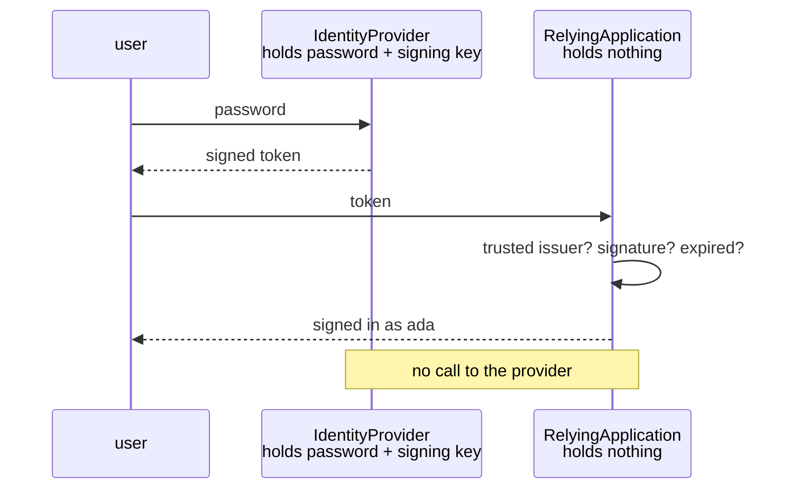

# Federated Identity

**Deployment and topology** — where components run

Delegate authentication to an external identity provider.

| | |
|---|---|
| Tier | 6 — Deployment and topology |
| Well-Architected pillars | Reliability, Security, Performance Efficiency |
| Source | [Federated Identity](https://learn.microsoft.com/en-us/azure/architecture/patterns/federated-identity), retrieved 2026-08-16 |
| Runtime dependencies | none |

## The problem it solves

Every application that stores passwords is a password breach waiting for its turn.

An application with its own user table needs hashing done correctly, a reset flow that cannot be
abused, lockout that resists enumeration, multi-factor, session management, and an answer for the
day the table leaks. Each is a specialist problem, each is easy to get subtly wrong, and getting one
wrong is a headline rather than a bug.

Multiply that by every application an organisation runs, and the same mistakes are made
independently several times over — while a user maintains a different password for each.

Federated identity delegates all of it. One provider authenticates; applications receive a **token**
they can check for themselves. The demonstration shows what each component holds: the provider has
the password and the signing key, and the application has **nothing worth stealing**.

## When to use it

* Users should sign in once and reach several applications.
* Authentication is not your product, and doing it well is a specialism.
* Corporate, social or partner identities should be usable directly.
* Multi-factor, conditional access or compliance requirements exceed what you would build.

## When not to use it

* **There is no identity to federate with**, and building a provider is more work than the
  application.
* **The provider cannot be trusted or is unavailable at sign-in.** Trust is transitive here: whoever
  controls the provider controls access.
* **Authorisation is expected to come with it.** A token says *who*; what they may do is still the
  application's decision.
* **The token cannot be validated offline.** An application calling the provider per request has
  taken its availability onto every request path.

## Architecture and components

| Participant | Role |
|---|---|
| `IdentityProvider` | **The only component that sees a password** — and it signs tokens |
| `IdentityToken` | Who, vouched by whom, until when, with a checkable signature |
| `RelyingApplication` | **Holds no credential**, and validates entirely locally |

**The asymmetry is asserted, not described.** The provider's `SecretsHeld` is non-empty and the
application's is empty. An application with its own password table has not federated anything.

**Validation is local.** The application checks the issuer it trusts, the signature against a
verification key, and the expiry against its own clock — with no call to the provider. That is why
the provider's availability is a sign-in concern rather than a per-request one.

**Expiry is not optional.** A token with no expiry check is a credential that never stops working,
which is the one thing a password at least gets rotated for.

**A verification key is not a secret.** Holding it lets an application check tokens and not mint
them. *In this model it equals the signing key, because the signature is a string comparison rather
than real cryptography* — a real provider publishes an asymmetric public key, and that difference is
the whole basis of the claim above.

**What this is not.** [Gatekeeper](../Gatekeeper/README.md) also splits a system so the exposed
half holds nothing worth stealing, and its subject is network reachability; this one's is
authentication. [Valet Key](../ValetKey/README.md) hands out a scoped, expiring key to a
**resource**; a token here asserts **who somebody is** and leaves authorisation to the
application.

## Advantages and trade-offs

**What it buys.** No passwords in the application, so no password breach in the application. Sign-on
across many applications from one identity. Multi-factor, conditional access and lockout that
somebody else builds and maintains. Corporate and social identities usable directly. And offline
validation, so authentication does not add a hop per request.

**What it costs.** **A dependency on the provider at sign-in**, and an outage there is an outage for
everything that trusts it. Transitive trust — whoever controls the provider controls access to every
application. Token lifetime as a real trade: short means frequent re-authentication, long means a
stolen token works for longer. Revocation that is genuinely hard, because offline validation means
nobody is asking whether the token is still good. And protocols that are easy to implement almost
correctly.

## Implementation considerations

* **Validate offline, and validate everything**: issuer, audience, signature, expiry, and the
  algorithm itself. An implementation that accepts an unsigned token because the header said so is a
  known class of failure.
* **Keep token lifetimes short and pair them with refresh.** That is the practical answer to
  revocation being hard.
* **Do not treat a token as authorisation.** It says who; the application decides what they may do.
* **Rotate signing keys, and fetch them from the provider's key endpoint** rather than pinning one
  for ever — rotation should not be an outage.
* **Decide what happens when the provider is unavailable.** Existing sessions usually continue and
  new sign-ins stop, which is worth stating explicitly rather than discovering.
* **Use a library, not a hand-rolled parser.** These protocols are specified precisely and
  implemented badly with great regularity.
* **Log refusals by distinct reason.** "Invalid token" tells an operator nothing; wrong issuer,
  wrong signature and expired need three different responses.

## Real-world cloud scenarios

* Corporate sign-in to internal applications via a directory.
* Consumer applications accepting social identities.
* Business-to-business access where partners bring their own identity provider.
* Any service that would otherwise build its own user table.

## In Azure

The implementation here is a string comparison standing in for a signature.

In Azure the provider is **Microsoft Entra ID** — formerly Azure AD — issuing OpenID Connect tokens
that applications validate offline against its published keys; **Microsoft Entra External ID** covers
consumer and partner identities; and **Azure App Service Easy Auth** performs the validation in front
of an application so its code sees only a verified identity. Conditional access, multi-factor and
sign-in risk policies are the provider's, applied without any application changing.

**What this model does not show.** The signature is a string comparison with a **symmetric** key, so
the central claim — that a verification key checks tokens and cannot mint them — is approximated
rather than demonstrated. There is no network and no protocol: no redirects, no authorisation code
exchange, no discovery document and no key rotation. **The provider stores its enrolled passwords
in plain text** and compares them directly — the very practice the problem statement says
applications get wrong, kept only because this model's subject is the trust protocol rather than
credential storage; a real provider holds salted, stretched hashes and nothing recoverable. There
is no refresh token, so the lifetime trade is described and never exercised. There is no
revocation. And there is no multi-factor, conditional access or session management, which is most
of what a real provider is bought for.

## What the tests assert

The tests are about what the arrangement guarantees rather than how it is currently written, and one
of them asserts structure rather than behaviour.

They cover a token the provider issued being accepted; a forged signature refused; a token valid when
issued being refused an hour later, which is expiry as a test rather than a claim; **the provider
holding secrets while the application holds none**, which is the whole pattern stated as an
assertion; the user read from the token with **no call back to the provider**; and each refusal
carrying a distinct reason, because wrong issuer and expired want different responses.
