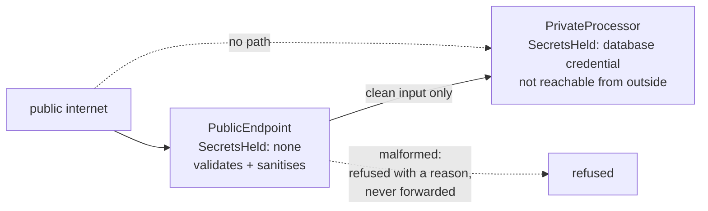

# Gatekeeper

**Edge and gateway** — what sits between clients and services

Protect applications and services by using a dedicated host instance to validate and sanitize
requests before forwarding them to private back ends.

| | |
|---|---|
| Tier | 5 — Edge and gateway |
| Well-Architected pillars | Security, Performance Efficiency |
| Source | [Gatekeeper](https://learn.microsoft.com/en-us/azure/architecture/patterns/gatekeeper), retrieved 2026-08-16 |
| Runtime dependencies | none |

## The problem it solves

The component exposed to the internet is the one that will be compromised, and it is holding the
database credential.

A public endpoint that validates a submission and then writes it to a database needs that
database's connection string in its own configuration. Whatever gets into that process — a
deserialisation flaw, a dependency with a backdoor, a path traversal that reads its environment —
gets the credential, and from there everything the credential can reach. The blast radius of a
front-end compromise is the whole data estate.

A gatekeeper splits the roles. **The exposed half holds nothing worth stealing**: no credential, no
connection, no key. It validates, it sanitises, and it hands clean input to a private component that
is not reachable from outside. An attacker who fully compromises the gatekeeper gains the ability to
submit well-formed claim forms.

The demonstration in this folder shows the two numbers that matter: what each half holds, and how
many hostile submissions reached the private side — zero.

## When to use it

* A public endpoint would otherwise hold credentials for private systems.
* Input arrives from outside your trust boundary and must be validated before anything acts on it.
* The consequences of a front-end compromise are severe enough to justify a second component.
* Regulation or policy requires a validated, sanitised boundary before data reaches a store.

## When not to use it

* **The back end cannot be made unreachable.** The pattern's guarantee rests on that; without it,
  the gatekeeper is a validating proxy and the private side is exposed anyway.
* **There is nothing worth protecting.** A public read-only service with no credentials gains a hop
  and no safety.
* **Latency will not tolerate the extra hop.** Two components in the path cost more than one.
* **The validation needs the private side's data to decide.** A gatekeeper that queries the
  protected store has acquired a credential, and the asymmetry is gone.

## Architecture and components

| Participant | Role |
|---|---|
| `PublicEndpoint` | The exposed half — **and it holds no secret at all** |
| `PrivateProcessor` | Holds the credential, does the work, is not reachable from outside |
| `Submission` / `ValidationOutcome` | What arrived, and what was decided plus why |

**The asymmetry is the pattern.** `SecretsHeld` is empty on the exposed component and non-empty on
the private one, and both are asserted. A validating proxy that shares the back end's credentials
makes no claim about blast radius; this does.

**A refused submission never reaches the private side**, and that count is the guarantee — not that
bad input is reported, but that it is never processed.

**Validation and sanitising are different jobs.** Validation decides yes or no. Sanitising changes
what crosses the boundary, so the private side never has to be defensive about input the gatekeeper
already handled. Elements are removed **whole** here — tag, content and closing tag — because
stripping only the angle brackets leaves the script body behind as text, which is the
half-sanitising that makes a private side believe it is safe when it is not.

**Distinct refusal reasons**, because "rejected" tells an operator nothing about whether this is an
attack, a client bug or a limit set too low.

**What this is not.** Gateway Offloading also refuses at the edge, and its subject is duplicated
code: its services are perfectly reachable and simply have less in them. Here reachability *is* the
subject. Gateway Routing decides which service; Gateway Aggregation calls several; neither makes a
claim about what an attacker gets. Valet Key is the opposite trade — there the client is given
direct, scoped access to storage on purpose.

## Advantages and trade-offs

**What it buys.** A bounded blast radius: compromising the exposed component yields no credential and
no reachability. One validated, sanitised boundary rather than defensive code everywhere. A private
side that can be simple because its input is already trustworthy. And a clear place to put rate
limiting, request-size limits and schema checks.

**What it costs.** Two components to build, deploy and monitor instead of one. An extra hop of
latency. A **hard dependency on the private side being genuinely unreachable** — network policy,
private endpoints, mutual TLS — which is infrastructure work outside the code. And a temptation for
the gatekeeper to acquire just one credential "for validation", which dissolves the whole guarantee.

## Implementation considerations

* **Make unreachability real and verify it.** Private endpoints or network policy, tested by trying
  to reach the private side from outside. The guarantee is only as good as that test.
* **Give the gatekeeper no credentials at all** — not a read-only one, not a scoped one. The moment
  it holds a secret, a compromise yields a secret.
* **Sanitise as well as validate**, and remove elements whole rather than stripping delimiters.
* **Keep the gatekeeper's own dependency surface small.** Its value is that compromising it is
  worthless; every library it pulls in is another way to compromise it.
* **Fail closed.** An unrecognised submission is refused, not forwarded for the private side to judge.
* **Report refusals by reason, and alert on the shape of them.** A spike in one reason is a signal;
  a flat "rejected" count is not.
* **Do not let the private side trust its caller blindly on identity** — the gatekeeper vouches for
  the *shape* of input, not for who sent it.

## Real-world cloud scenarios

* A public submission or upload endpoint in front of a private processing service.
* An internet-facing API in front of a database that is on a private network only.
* A partner integration endpoint validating payloads before they reach internal systems.
* Any service where regulation requires a validated boundary before data is persisted.

## In Azure

The implementation here is two classes, one of which was never given a credential.

In Azure the gatekeeper is typically an **App Service** or **Container App** with no data-plane
permissions, in front of a private processing service reachable only through **VNet integration** and
**private endpoints**; **Azure API Management** in internal mode plays the same role for APIs; and
the private side's credential lives in **Key Vault**, accessed through a **managed identity that the
gatekeeper does not have**. **Storage queues** are a common intermediary, so the gatekeeper writes a
message and the private side reads it — meaning the two never connect at all.

**What this model does not show.** There is no network, so "not reachable from outside" is a property
of the object graph rather than of network policy — which in production is the entire mechanism and
the thing most likely to be got wrong. There is no managed identity, no Key Vault and no real
credential. There is no rate limiting and no request-size limit at the transport level. The
sanitiser is deliberately crude and would not survive a real attacker. And the two components share a
process, so a compromise of one is a compromise of both, which is precisely what the pattern exists
to prevent.

## What the tests assert

The tests are about what the boundary guarantees rather than how it is currently written, and two of
them assert structure rather than behaviour.

They cover a valid submission reaching the private processor; a malformed reference being refused;
**three hostile or malformed submissions with the private side never running once**, which is the
pattern's actual guarantee; the exposed component holding **no secrets while the private one holds
one**, which is the blast-radius claim stated as an assertion; markup removed **whole** before it
crosses the boundary; and each refusal carrying a distinct, specific reason.
