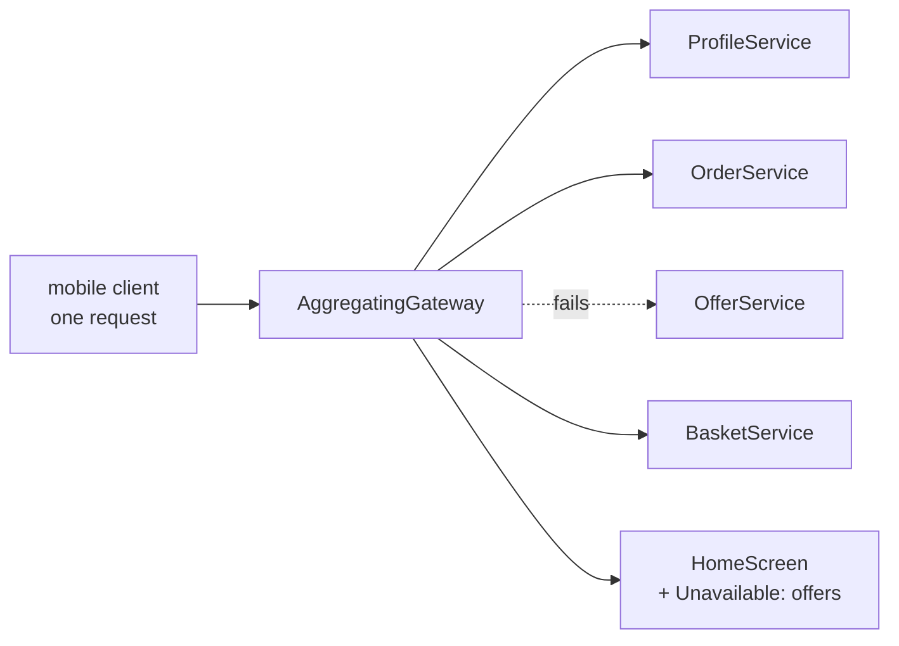

# Gateway Aggregation

**Edge and gateway** — what sits between clients and services

Use a gateway to aggregate multiple individual requests into a single request.

| | |
|---|---|
| Tier | 5 — Edge and gateway |
| Well-Architected pillars | Reliability, Security, Operational Excellence, Performance Efficiency |
| Source | [Gateway Aggregation](https://learn.microsoft.com/en-us/azure/architecture/patterns/gateway-aggregation), retrieved 2026-08-16 |
| Runtime dependencies | none |

## The problem it solves

A screen needs four services, and the client is on a bad connection.

The mobile home screen shows a name, recent orders, offers and a basket count. Four services own
those, so a client that calls them directly makes four requests — four DNS lookups, four TLS
handshakes, four round trips of latency, four sets of retries when the train goes into a tunnel.
On a data-centre network that is nothing. On a mobile network it is the difference between a screen
that appears and a spinner.

Worse, the client now knows which four services exist, so splitting one of them is a client release.

A gateway makes the four calls **on the fast side of the slow link** and returns one response. The
demonstration in this folder counts it: four backend calls, one client round trip, three the client
did not make.

The saving is not computational. The same four calls happen; they happen somewhere cheap.

## When to use it

* Clients are remote or on high-latency links — mobile especially.
* A single screen or operation needs several services.
* Chattiness is the cost, not the work itself.
* Clients should not have to know how many services back a view.

## When not to use it

* **The client is close to the services.** Server-to-server on the same network gains little and
  pays a hop.
* **The calls are genuinely independent and the client can parallelise.** A browser issuing four
  concurrent requests over one HTTP/2 connection has already solved most of this.
* **One backend is slow.** Aggregation makes the response as slow as the slowest call unless the
  gateway is careful — see below.
* **Different clients need different combinations.** That is Backends for Frontends, and forcing it
  into one aggregating endpoint produces a response every client over-fetches.

## Architecture and components

| Participant | Role |
|---|---|
| `AggregatingGateway` | Makes the calls, assembles the screen — **and counts what the client was spared** |
| `HomeScreen` | One response, including **which backends did not answer** |
| `ProfileService`, `OrderService`, `OfferService`, `BasketService` | Four services that know nothing of each other |

**`RoundTripsSaved` is the demonstration.** In process four method calls cost the same as one, so
the pattern's value can only be shown as a count of the calls the client did not make.

**A failing optional backend degrades the screen rather than losing it**, and the failure is
**named** in the response. Silently returning an empty offers list tells the client this customer
has no offers, which is a different statement and a false one.

**One failure is not partial.** No profile means no screen, and the remaining backends are not
asked — there is nothing for them to answer about.

**What this is not.** Gateway Routing forwards one request to one service; this knows exactly which
four to call and calls all of them. Gateway Offloading does work the services would each otherwise
implement; this does no part of their work. Gatekeeper exists to make back ends unreachable.
Backends for Frontends would give mobile and desktop clients different backends rather than one
aggregating endpoint.

## Advantages and trade-offs

**What it buys.** Far fewer round trips over the link where they are expensive. Clients that do not
know how many services back a view, so services can be split without a client release. One place to
implement partial-failure behaviour rather than four in every client. And a smaller payload, since
the gateway can return only what the screen needs.

**What it costs.** **The response is as slow as the slowest backend** unless calls are made
concurrently and bounded by timeouts. A component that must know which services a screen needs,
which couples it to the screens. Partial-failure semantics that must be designed, not defaulted. And
a gateway that can become a dumping ground for view-shaping logic that belongs to a client team —
which is the pressure Backends for Frontends resolves.

## Implementation considerations

* **Call backends concurrently**, not in sequence. Sequential aggregation makes the response the
  *sum* of the latencies rather than the maximum.
* **Give every backend call a timeout**, shorter than the client's. One slow service must not hold
  the whole screen.
* **Decide required versus optional per backend**, explicitly. Profile is required here; offers are
  not. Defaulting everything to required makes the screen as reliable as the least reliable service.
* **Report what failed** in the response. A client that can distinguish "no offers" from "offers
  unavailable" can retry, cache or show a placeholder.
* **Consider a circuit breaker per backend** so a service that is down stops being called on every
  request — see Circuit Breaker.
* **Cache what tolerates it.** Offers change slowly; profiles change rarely; baskets change
  constantly.
* **Resist per-client shapes.** When two clients want materially different responses, the answer is
  two backends, not one endpoint with flags.

## Real-world cloud scenarios

* A mobile home screen assembled from profile, orders, recommendations and notifications.
* A product page needing details, pricing, stock, reviews and shipping estimates.
* A dashboard where each widget is owned by a different team.
* Any public API presenting a coherent resource that several services actually own.

## In Azure

The implementation here is four method calls inside one class.

In Azure this is commonly **Azure API Management**, whose policies can compose several backend calls
into one response without custom code; a purpose-built aggregation service on **Azure Functions** or
**Container Apps** where the composition needs real logic; **Azure Front Door** in front of either
for global entry; and **Durable Functions** fan-out/fan-in where the aggregation is long-running
rather than request-scoped.

**What this model does not show.** The calls are sequential method calls with no network: no
latency, so the sum-versus-maximum problem cannot appear; no timeouts; no concurrency. There is no
circuit breaker, so a permanently failing backend is called on every request. There is no caching.
Payload size is not modelled, so the second benefit — returning only what the screen needs — is
described rather than demonstrated. And the failure injected is a clean exception, where a real
backend more often hangs.

## What the tests assert

The tests are about what the gateway guarantees rather than how it is currently written, and the
benefit is asserted **as a count** rather than as a timing.

They cover a screen answered in **one** client round trip; every backend the screen needs actually
being called; the screen still rendering with profile, orders and basket intact when the offers
service fails, which is what an all-or-nothing aggregation silently breaks; the failed backend being
**named** rather than omitted; four backend calls against one round trip, with the difference stated
as the saving; and an unknown customer producing no screen **without the other backends being
asked**.
