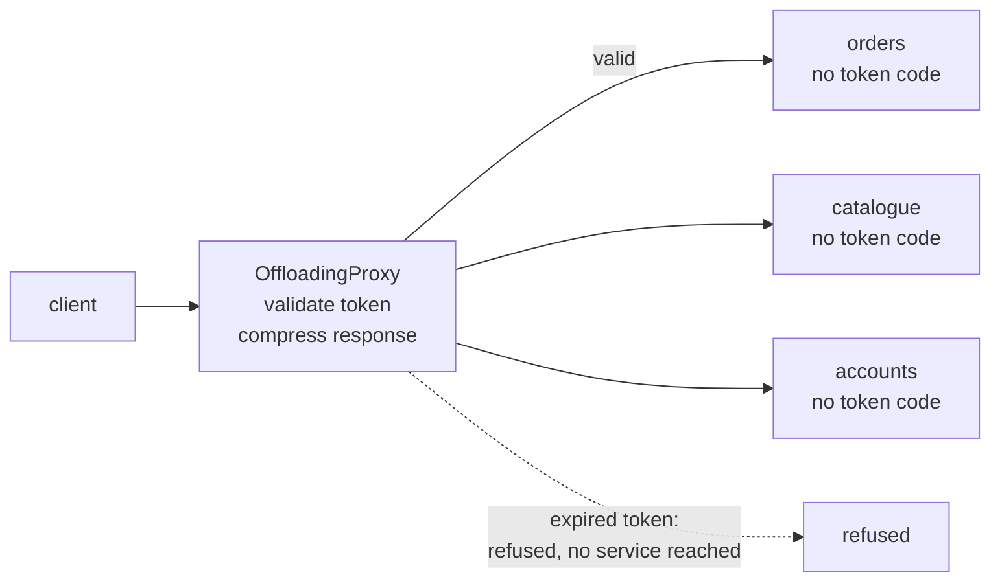

# Gateway Offloading

**Edge and gateway** — what sits between clients and services

Offload shared or specialized service functionality to a gateway proxy.

| | |
|---|---|
| Tier | 5 — Edge and gateway |
| Well-Architected pillars | Reliability, Security, Cost Optimization, Operational Excellence, Performance Efficiency |
| Source | [Gateway Offloading](https://learn.microsoft.com/en-us/azure/architecture/patterns/gateway-offloading), retrieved 2026-08-16 |
| Runtime dependencies | none |

## The problem it solves

Nine services each implement the same six things, slightly differently.

TLS termination, response compression, token validation, request logging, rate limiting, CORS
headers. None of it is any service's business, and every service needs it — so it gets written nine
times, in three languages, by six teams, at different times. Then a token format changes and it has
to be patched in nine places. Eight of them ship on Tuesday.

That is the real cost, and it is not runtime cost. It is **code that exists in more places than it
needs to**, drifting apart, each copy a place where a security fix can be missed.

Offloading moves the shared work to the edge, where it is implemented once. The demonstration in
this folder counts what disappears: two concerns across three services would be six
implementations; done once at the proxy it is two, so four do not have to exist.

## When to use it

* Several services need identical cross-cutting behaviour.
* That behaviour is specialised — TLS, compression, WAF rules — and is done better by dedicated
  infrastructure than by application code.
* Consistency matters: a security header that is missing from one service out of nine is missing.
* Services are written in different languages, so sharing a library is not available.

## When not to use it

* **The behaviour is service-specific.** Domain authorisation — *may this user cancel this order?* —
  belongs to the service that knows what an order is.
* **There is one service.** Nothing to share.
* **The edge would need to understand the request body** to do it. That work is not cross-cutting;
  it only looks it.
* **The services must be safe when called directly.** Offloading assumes traffic arrives via the
  edge; if internal callers can bypass it, the protection is optional — and if that matters, the
  pattern you want is Gatekeeper.

## Architecture and components

| Participant | Role |
|---|---|
| `OffloadingProxy` | Does the shared work once — **and counts the implementations avoided** |
| `ApplicationService` | Does its own work, and **contains none of the shared code** |
| `EdgeRequest` / `EdgeResult` | What arrives, and what the client gets back |

**`ImplementationsAvoided` is the demonstration.** The saving is not per request — in process the
code costs nothing to run either way. It is implementations that do not exist, and therefore cannot
drift or be patched in eight places out of nine.

**The services genuinely contain none of it**, and that is the test worth having. Called directly
with no token at all, `ApplicationService` answers — because validating tokens is not its job and it
does not know how. A service that refused there would have kept the code the proxy is supposed to
have taken, and the proxy would be a hop rather than a saving.

**Compression happens at the edge because that is what knows the transport.** A service compressing
its own responses is guessing on behalf of a client it never talks to.

**What this is not.** Gatekeeper also refuses at the edge, and its subject is entirely different:
there the back end is unreachable and holds a credential the edge does not, so a compromised edge
yields nothing. Here the services are perfectly reachable and simply have less code in them. Gateway
Routing decides *which* service; this does work on the way. Gateway Aggregation calls several
services; this forwards to one.

## Advantages and trade-offs

**What it buys.** One implementation instead of one per service, so a fix is applied once. Consistent
behaviour across services written in different languages. Specialised work done by infrastructure
built for it — a WAF or a TLS terminator is better at its job than application code. Simpler
services, whose code is about their domain. And refused traffic that never reaches a service at all.

**What it costs.** A component on every request's path, so its availability is the system's. Services
that are **unprotected if reached directly**, which makes network controls part of the design rather
than an extra. A shared configuration several teams depend on. And a strong pull towards putting
more and more at the edge, until the gateway holds logic nobody can safely change.

## Implementation considerations

* **Offload what is genuinely cross-cutting**, and no more. Authentication — is this token valid? —
  belongs at the edge. Authorisation — may *this user* do *this* to *this order*? — does not.
* **Make bypass impossible, or accept it.** If services are reachable directly, offloaded protection
  is advisory. Network policy, private endpoints or mutual TLS close that; where the closure is the
  point, the pattern is Gatekeeper.
* **Pass the edge's findings downstream.** A validated identity should reach the service as a
  trusted header, so the service need not re-validate to know who is calling.
* **Do not let the edge parse bodies.** That is where gateways become applications.
* **Version edge behaviour deliberately.** A change at the edge changes every service's behaviour at
  once, which is the benefit and the blast radius in one sentence.
* **Monitor the edge separately** from the services. Requests refused there never appear in any
  service's telemetry, so a misconfiguration looks like silence.

## Real-world cloud scenarios

* TLS termination and certificate management for many services at once.
* JWT validation at the edge, with the verified identity passed on as a header.
* Response compression and caching for services that need not know about either.
* A web application firewall in front of everything public.
* Rate limiting applied consistently, rather than nine slightly different versions of it.

## In Azure

The implementation here is a method that checks a string and wraps another one.

In Azure this is **Azure Application Gateway** for TLS termination, WAF and rewriting; **Azure Front
Door** for the same globally, with caching and compression; **Azure API Management**, whose policy
engine is this pattern as a product — validate-jwt, rate-limit, set-header, cache-lookup applied to
whole product tiers at once; and, in Kubernetes, an **ingress controller** or a service-mesh sidecar
doing mutual TLS and policy for every pod.

**What this model does not show.** There is no TLS, no real compression and no real token — validation
is a string comparison. There is no network, so nothing shows that the services are reachable
directly and therefore unprotected when bypassed, which is the pattern's main operational risk. The
verified identity is not passed downstream. There is no rate limiting, no WAF and no caching. And
the proxy is a single object with no availability story, where in production it is the component
whose failure takes everything with it.

## What the tests assert

The tests are about what the proxy guarantees rather than how it is currently written, and one of
them is aimed at the services rather than the proxy.

They cover a valid token letting a request through to its service; an expired token **refused with
the service never reached**, so every service is spared both the code and the traffic; a response
compressed at the edge that the service returned plain; **the service answering when called directly
with no token at all**, which is what proves the code was actually offloaded rather than duplicated;
and the implementations avoided, counted — the benefit stated as code that does not exist.
