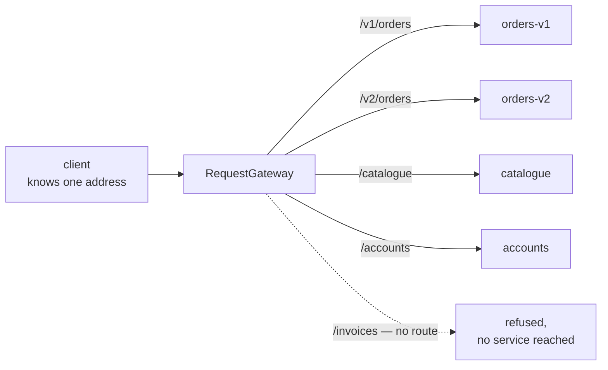

# Gateway Routing

**Edge and gateway** — what sits between clients and services

Route requests to multiple services by using a single endpoint.

| | |
|---|---|
| Tier | 5 — Edge and gateway |
| Well-Architected pillars | Reliability, Operational Excellence, Performance Efficiency |
| Source | [Gateway Routing](https://learn.microsoft.com/en-us/azure/architecture/patterns/gateway-routing), retrieved 2026-08-16 |
| Runtime dependencies | none |

## The problem it solves

Clients that know where every service lives cannot be separated from the services they call.

Split a monolith into orders, catalogue and accounts, and every client now needs three addresses.
Move a service, and every client changes. Version one of them, and every client must learn about
the new one. Deploy a fourth, and nothing can call it until the callers ship. The topology has
leaked into every consumer, and consumers are the hardest thing in the system to change — some of
them are mobile apps whose old versions run for years.

A routing gateway takes the addresses back. Clients see **one endpoint**; a routing table decides
which service handles each path; and the topology is known in exactly one place. Services can be
added, split, versioned, moved or replaced with no client learning that any of it happened — the
demonstration in this folder adds a service mid-run and calls it without redeploying anything.

## When to use it

* Several services must appear to clients as one API.
* Services are versioned, split or relocated over time, and clients cannot be redeployed in step.
* Clients are outside your control — mobile apps, partners, browsers with cached bundles.
* You want one place to see and change how requests reach services.

## When not to use it

* **There is one service.** A gateway in front of one back end is a hop that buys nothing.
* **Clients are internal and deploy together.** Direct addressing is simpler and one network hop
  cheaper.
* **The routing needs request bodies or business logic.** Route on paths, headers and versions;
  anything more and the gateway becomes an application that every team must change.
* **Latency is critical and the gateway adds a hop that matters.**

## Architecture and components

| Participant | Role |
|---|---|
| `ClientRequest` | What the client sent to the one endpoint |
| `RouteTable` | Prefix to service — **the only place that knows the topology** |
| `RequestGateway` | Answers one question: which service handles this? |
| `BackendService` | A service that **has no idea a gateway exists** |

**Longest prefix wins.** `/v2/orders` and `/orders` can coexist without registration order deciding
the outcome — order-dependent routing is a defect that stays hidden until somebody rearranges a
configuration file.

**An unmatched path is refused, not guessed at**, and the tests assert that no service saw it. A
gateway that falls through to something plausible converts a client typo into a real request against
the wrong service, and the resulting failure gets attributed to that service rather than to the
routing.

**What this is not.** [Gateway Aggregation](../GatewayAggregation/README.md) calls several
services and combines their answers; this forwards one request to one service.
[Gateway Offloading](../GatewayOffloading/README.md) moves cross-cutting work off the services; this
does none of their work at all. [Gatekeeper](../Gatekeeper/README.md) exists to make the back end
unreachable; these services are perfectly reachable and simply are not addressed directly.
[Backends for Frontends](../BackendsForFrontends/README.md) has no single endpoint, which is the
whole of its point.

## Advantages and trade-offs

**What it buys.** Clients decoupled from topology, which is what makes services safe to split,
move and version. One place to see how requests reach services. Versioning that costs a route
rather than a client release. And a natural home for the cross-cutting concerns that Gateway
Offloading formalises.

**What it costs.** A component on the path of every request, so its availability is the system's
availability and its latency is added to everything. A routing table that becomes a shared artefact
several teams must change. A single place to misconfigure, where one wrong prefix can send a
resource's traffic to the wrong service. And a tempting place to put logic that does not belong at
the edge.

## Implementation considerations

* **Route on paths, headers and versions — not on bodies.** A gateway that parses payloads to
  decide is an application, and it becomes every team's dependency.
* **Make longest-prefix matching explicit** so registration order cannot change behaviour.
* **Refuse unmatched paths.** A default backend hides typos and misconfigurations until they are
  somebody else's incident.
* **Keep the table in configuration, not code**, so a route change is not a deployment — and review
  it as carefully as code, because it is.
* **Run more than one gateway instance.** It is on every request's path.
* **Expose which service served a request** — a header is enough — or debugging routing becomes
  guesswork.

## Real-world cloud scenarios

* A public API over several internal microservices.
* Blue-green or canary routing, shifting a proportion of traffic to a new version.
* Consolidating several legacy applications behind one address during consolidation.
* Multi-region routing, with the same paths resolved to the nearest deployment.

## In Azure

The implementation here is a dictionary of prefixes and a longest-match lookup.

In Azure this is **Azure API Management** where the gateway also owns policy, products and
developer-facing documentation; **Azure Application Gateway** for path-based routing within a
region, with WAF available; **Azure Front Door** for global routing with health probes and failover;
and **Azure Container Apps** or **AKS ingress** where the routing table is Kubernetes ingress rules.

**What this model does not show.** There is no network: no latency, no connection pooling, no
timeouts, no partial failure — a "route" is a method call that always succeeds if it resolves. There
is no health probing, so a route to a dead service still resolves. There is no TLS, no
load-balancing across instances of one service, and no rate limiting. The routing table is code
rather than configuration, so a route change here is a deployment. And the gateway is a single
object, so nothing shows what happens when the gateway itself is unavailable — which is the risk
that matters most in production.

## What the tests assert

The tests are about what the gateway guarantees rather than how it is currently written.

They cover a request reaching the service that owns its path; a versioned path reaching a
**different** service while the first sees nothing; an unmatched path refused **with no service
handling it**, which is what a fall-through silently breaks; a lookalike path such as
`/cataloguesale` being **refused rather than routed by raw prefix**, while `/catalogue/items/42`
still resolves — prefixes own whole segments, not character runs; the gateway reporting the routes
it holds; and a service added mid-run being reachable by the same client call that failed a moment
earlier — the decoupling, stated as a test.
