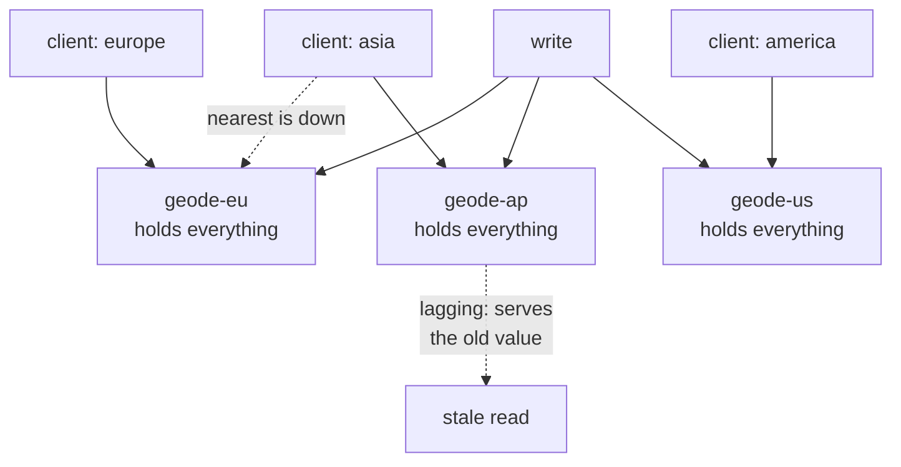

# Geode

**Deployment and topology** — where components run

Deploy back-end services across geographically distributed nodes. Each node can handle client
requests from any region.

| | |
|---|---|
| Tier | 6 — Deployment and topology |
| Well-Architected pillars | Reliability, Performance Efficiency |
| Source | [Geode](https://learn.microsoft.com/en-us/azure/architecture/patterns/geodes), retrieved 2026-08-16 |
| Runtime dependencies | none |

## The problem it solves

A service deployed in one region serves everybody else slowly, and fails everybody at once.

Users in Sydney calling a service in Dublin pay a quarter of a second before the service has done
anything. Adding a second region helps only if it can actually serve those users — and if each
region holds only its own data, a request from a travelling user, or from a region that is down,
has nowhere to go.

A geode network puts **the same data on every node**. A client is served by the nearest one; if that
node is lost, any other serves the identical request, because there is no such thing as *this
request's node*. Latency falls, and regional failure stops being a regional outage.

The demonstration shows both halves: the nearest node answering each client, another node answering
when that one is lost — and the price, a node serving an old value confidently after it stops
receiving replication.

## When to use it

* Users are spread across regions and latency matters to them.
* Any node must be able to serve any request, including after a regional failure.
* The data is mostly read, and can tolerate being briefly out of date.
* Availability requirements exceed what one region can offer.

## When not to use it

* **Reads must always be current.** Replication lag is intrinsic; a node that has not caught up
  serves the previous value.
* **The write rate is high and conflicting.** Global replication with concurrent writes needs
  conflict resolution, which is a design problem rather than a configuration one.
* **Data residency forbids it.** Replicating everything everywhere is exactly what jurisdictional
  rules often prohibit — which is a reason to reach for Deployment Stamps instead.
* **There is one region's worth of users.** The cost is real and the benefit is not.

## Architecture and components

| Participant | Role |
|---|---|
| `GeodeNetwork` | Routes to the nearest available node — **and counts how many could have served** |
| `GeodeNode` | One region's node, holding **the same data as every other** |
| `ClientLocation` | Where the client is asking from |
| `GeodeResponse` | The answer, and **which node produced it** |

**`NodesThatCouldServe` is the demonstration.** Three nodes could answer any of those requests; in a
stamped arrangement the number would be one, because no other copy would hold the data at all.

**Replication lag is asserted, not hidden.** A node that stops receiving writes serves the previous
value confidently, with nothing in the response to say so. A model where replication is instant
teaches the benefit and none of the cost.

**A lost node costs nothing.** Another serves the identical request — which is precisely what a
stamped arrangement cannot do, and the clearest way to see that these are opposites.

**What this is not.** Deployment Stamps is the opposite arrangement: each copy holds only its own
tenants' data, a request has exactly one home, and a failed stamp means its tenants are **refused**
rather than served elsewhere. Stamps buy isolation and cannot fail over; geodes buy ubiquity and
cannot avoid lag. Sharding partitions data within one deployment, which is neither.

## Advantages and trade-offs

**What it buys.** Low latency for users wherever they are. Regional failure that costs latency
rather than availability. Read capacity that scales by adding nodes. And no request that is stranded
because its home is unreachable.

**What it costs.** **Replication lag**, which the demonstration shows as a confidently wrong answer.
Write conflicts when two regions write the same thing, needing resolution you must design. Every
node holding everything, so storage is multiplied by the node count. Data residency that becomes
hard or impossible. And a system whose consistency behaviour is genuinely difficult to reason about.

## Implementation considerations

* **Decide the consistency model deliberately**, and write it down. "Eventually consistent" is a
  family of behaviours, not a decision.
* **Choose conflict resolution before you need it.** Last-writer-wins is a decision with data loss
  in it; anything better requires knowing what the data means.
* **Route reads to the nearest node and writes wherever the model requires** — many designs write to
  one region and replicate outward, which removes conflicts and adds write latency.
* **Surface staleness where it matters.** A response that can say how old it is turns a wrong answer
  into an explainable one.
* **Watch replication lag as a first-class metric.** A node that has silently stopped replicating is
  serving confident nonsense, and looks healthy by every other measure.
* **Do not replicate what must not leave a jurisdiction.** Split the data, or use stamps for the
  parts that cannot move.
* **Test with a node deliberately behind**, not only with a node down. The stale-read case is more
  common and much easier to miss.

## Real-world cloud scenarios

* A globally distributed API where every region serves every user.
* Read-heavy catalogue or configuration data needed everywhere.
* Gaming or collaboration backends where latency is the product.
* Services with availability requirements that exceed one region's.

## In Azure

The implementation here is three dictionaries kept in step by a loop.

In Azure this is most directly **Azure Cosmos DB** with multi-region writes, which is the pattern as
a managed service — replication, conflict resolution and regional failover included. **Azure Front
Door** routes clients to the nearest healthy region; **Azure App Service** or **AKS** deployments in
each region are the nodes; and **Azure SQL** active geo-replication gives a read-replica variant with
a single write region. The **Geode reference architecture** on Microsoft Learn assembles these.

**What this model does not show.** *There is no geography.* Nodes are objects in one process, so
there is no latency, no network partition and no real distance — the whole reason the pattern exists
is asserted rather than measured. Replication is a synchronous loop, so lag is simulated by a flag
rather than being a property of distance. There are no write conflicts, because writes are ordered
by construction; conflict resolution is therefore described and never exercised. There is no data
residency constraint. And nothing shows the storage multiplication that holding everything
everywhere implies.

## What the tests assert

The tests are shaped to make the contrast with Deployment Stamps impossible to miss: the same
request is asked of every node, and every node answers it.

They cover the nearest node serving a client; **the same request answered from every region**, with
three nodes counted as able to serve it; a write reaching every node; **a lagging node serving the
old value** while others serve the new one, which is the price stated as a test; another node
serving when the nearest is lost, where a stamp would have refused; and each response naming the
node that produced it.
