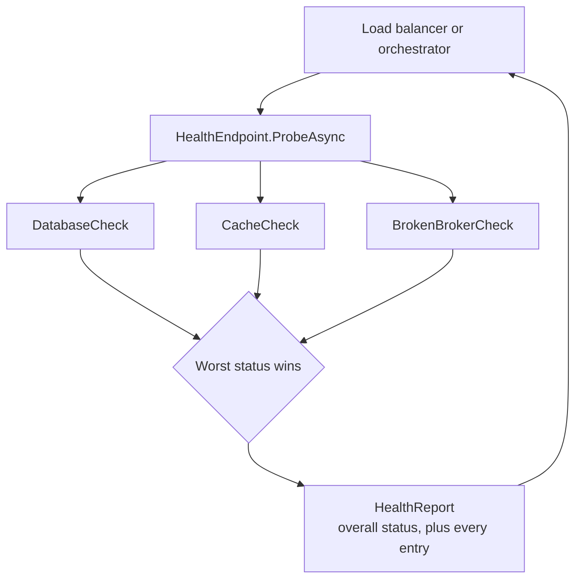

# Health Endpoint Monitoring

**Resilience** — keeping a service working when its dependencies are not

Implement functional checks in an application that external tools can access through exposed
endpoints at regular intervals.

| | |
|---|---|
| Tier | 1 — Resilience |
| Well-Architected pillars | Reliability, Operational Excellence, Performance Efficiency |
| Source | [Health Endpoint Monitoring](https://learn.microsoft.com/en-us/azure/architecture/patterns/health-endpoint-monitoring), retrieved 2026-08-16 |
| Runtime dependencies | none |

## The problem it solves

Something outside your application has to decide whether it is working: a load balancer choosing
where to send traffic, an orchestrator deciding whether to restart a container, a deployment
pipeline deciding whether to continue or roll back.

Everything those tools can observe from outside is misleading. A process that is running may be
deadlocked. A port that accepts connections may belong to a process that cannot reach its database.
An instance returning 200 for `/` may be serving a cached page while every write fails.

The application is the only thing that knows whether it can actually do its job — whether the
database answers, whether the cache is reachable, whether the queue it consumes from is connected.
A health endpoint is where it says so, in a form a machine can act on.

The subtlety is that this endpoint is also a piece of software, and it can be wrong in ways that are
worse than no endpoint at all. An endpoint that reports healthy because it checked nothing keeps a
broken instance in rotation.

## When to use it

* A load balancer, orchestrator or service mesh routes to your instances.
* Deployments are automated and need a signal to continue or roll back.
* The application has dependencies whose failure it can detect but a caller cannot.
* Degraded operation is meaningful — you can serve without the cache, but somebody should know.

## When not to use it

* **As a substitute for monitoring.** A health check answers "should I get traffic?", not "is
  anything wrong?". It is a routing signal, not observability.
* **To check things you do not control.** A check that fails because a third-party API is down will
  take *your* instance out of rotation for somebody else's outage, which is rarely what you want.
* **When it is expensive.** A probe running every five seconds across many instances is real
  load — a check that runs a heavy query is a self-inflicted denial of service.
* **For a batch job with no traffic to route.** Nothing is deciding anything; a heartbeat and
  logging are what you want.

## Architecture and components

| Participant | Role |
|---|---|
| `HealthEndpoint` | Runs every check, applies the rules, aggregates the report |
| `IHealthCheck` | One thing worth checking, with a name |
| `HealthCheckResult` | What a single check found |
| `HealthReport` / `HealthEntry` | The overall verdict, and every check that contributed |
| `IClock` / `ManualClock` | Where the current time comes from, so slowness is measured rather than declared |

Three rules do the work, and each exists because of a way real endpoints lie.

**The worst status wins.** An endpoint that averaged, or returned the first result, would call a
system healthy while a dependency was down.

**A check that throws is unhealthy, not fatal.** A broken check must never take the endpoint with
it. An endpoint returning 500 because its own probe code failed tells the load balancer nothing
about the application.

**Nothing to check is unhealthy.** A probe that examined nothing is not evidence of health.
Reporting healthy there is a green result over an empty measurement, and it is the failure an
operator would never catch.

## Advantages and trade-offs

**What it buys.** Traffic routed away from instances that cannot serve. Automated rollback with a
real signal behind it. A named list of what is unhappy, rather than a bare boolean. And the
distinction between *degraded* and *down*, which is what lets a system keep serving without the
cache instead of taking itself offline over it.

**What it costs.** Probes are load, multiplied by instances and by frequency. Checks are code that
must itself be correct and maintained. And the endpoint is an attack surface — exposing dependency
names, versions and failure detail to anyone who can reach it.

**The sharpest trade is depth.** A shallow check is cheap and can report healthy while the
application cannot serve a single request. A deep check is honest and can take your whole fleet out
of rotation the moment a shared dependency hiccups, converting a partial degradation into a total
outage. Neither extreme is right, which is why liveness and readiness are usually separated.

## Implementation considerations

* **Separate liveness from readiness.** Liveness answers "should I be restarted?" and must not
  depend on anything external, or a database blip restarts every instance you have. Readiness
  answers "should I get traffic?" and may check dependencies.
* **Do not fail on optional dependencies.** A cache being down is degraded, not unhealthy — unless
  you cannot serve without it.
* **Time out each check.** A probe that hangs is worse than one that fails, because the prober is
  left waiting rather than told.
* **Do not expose it publicly**, or expose a version with no detail. Dependency names and error
  messages are reconnaissance.
* **Keep it cheap.** Cache the result briefly if probes are frequent; a check that costs a real
  query per probe per instance adds up quickly.
* **Report every entry, not just the verdict.** "Unhealthy" sends an operator looking; "unhealthy,
  and it is redis" sends them to the right place.

## Real-world cloud scenarios

* An App Service or Container Apps instance removed from rotation while its SQL connection pool is
  exhausted.
* A Kubernetes pod restarted by a liveness probe after a deadlock.
* A deployment slot that never receives traffic because its warm-up check never passed.
* A multi-region front door failing over on a regional health signal.

## In Azure

The implementation here is a component returning a report. There is no HTTP, no hosting and no
prober.

In Azure this normally appears as **`Microsoft.Extensions.Diagnostics.HealthChecks`** — the
`IHealthCheck` interface here is deliberately shaped like it — surfaced at `/healthz` by
`MapHealthChecks`, with `AddHealthChecks().AddSqlServer(...).AddRedis(...)` supplying the checks.
Consuming it are **App Service health check**, **Application Gateway** and **Front Door** health
probes, **Container Apps** and **AKS** liveness and readiness probes, and **Traffic Manager** for
regional failover.

**What this model does not show.** There is no HTTP surface, so nothing here exercises status codes,
response shape, authentication on the endpoint, or what a prober does with a slow response. Checks
run **sequentially**, where a real endpoint runs them concurrently with a per-check timeout —
neither concurrency nor timeout is implemented here. There is no caching of results under frequent
probing, no liveness-versus-readiness split, and no prober at all: nothing calls this on an
interval. Treat the operational behaviour under real probing as unmeasured.

## What the tests assert

The tests are about what the endpoint guarantees rather than how it is currently written.

They cover a healthy aggregate; a degraded aggregate where one check is unhappy; **the worst status
winning even when the unhealthy check is last**, which is what distinguishes a fold over all results
from one that returns the first; a check that throws being reported as unhealthy with its message,
without the exception escaping the endpoint; a healthy-but-slow check being reported degraded, with
the delay modelled by advancing the clock inside the check so the duration is genuinely measured;
and an endpoint with no checks registered reporting unhealthy rather than healthy.
