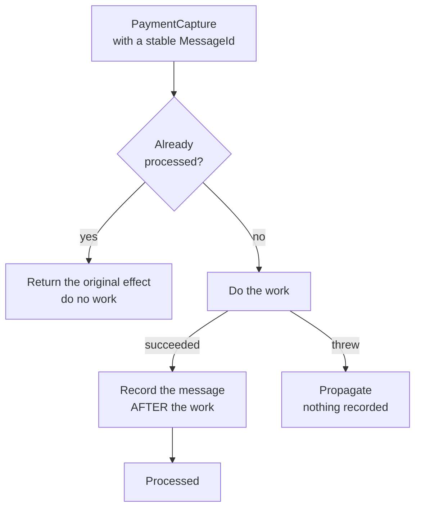

# Idempotent Consumer

**Messaging** — decoupling senders from receivers

Handle duplicate message delivery so that processing a message multiple times has the same effect
as processing it once.

| | |
|---|---|
| Tier | 2 — Messaging |
| Well-Architected pillars | Reliability |
| Source | [Idempotent Consumer](https://learn.microsoft.com/en-us/azure/architecture/patterns/idempotent-consumer), retrieved 2026-08-16 |
| Runtime dependencies | none |

## The problem it solves

**Exactly-once delivery does not exist.** That is not a limitation of any particular broker; it is a
property of unreliable networks, and no amount of configuration removes it.

The reason is simple. A consumer processes a message and sends an acknowledgement. The
acknowledgement is lost. The broker cannot distinguish "the work was done and the ack vanished" from
"the consumer died before doing anything", so it does the only safe thing and redelivers.

Every mechanism that improves reliability makes this likelier. Retry redelivers. Competing Consumers
redeliver on visibility timeout. A rolling deployment redelivers whatever was in flight. So a
consumer that is not idempotent does not have a rare bug — it has a bug that surfaces on exactly the
bad days when everything else is already going wrong.

The demonstration in this folder shows the cost directly: the same capture applied twice debits a
customer for double the amount, where the idempotent handler debits it once.

The pattern's answer is to make the *effect* idempotent even though the delivery is not. Remember
which messages have been fully processed, and recognise a repeat.

## When to use it

* Anywhere at-least-once delivery is in play — which is any real broker.
* The work has side effects that must not happen twice: money, emails, stock, provisioning.
* Retries are in use anywhere in the path.
* Consumers can crash mid-work, which they can.

## When not to use it

* **The operation is naturally idempotent.** Setting a value to `X`, or an upsert keyed by
  identifier, is already safe. Adding a de-duplication store is machinery earning nothing.
* **The broker de-duplicates for you** and its window covers your redelivery interval — Service Bus
  offers this, and it is bounded, so read the bound.
* **Duplicate effects are harmless.** Re-writing a cache entry, re-emitting a metric.
* **There is no stable message identifier.** De-duplication needs a key that survives redelivery;
  without one, the pattern has nothing to key on and something upstream must be fixed first.

## Architecture and components

| Participant | Role |
|---|---|
| `IdempotentHandler` | Checks the log, does the work, records it afterwards |
| `IProcessedMessageLog` | Remembers which message identifiers have been fully processed |
| `HandlingResult` | Processed or duplicate, plus the effect |
| `Ledger` | A real side effect, so the guarantee is observable rather than asserted |

**The order is the correctness argument, and it is the thing to read the code for.** Recording
*after* the work means a crash between the two causes a redelivery that is worked properly.
Recording *before* means the redelivery is suppressed as a duplicate and **the work never happens at
all** — a payment silently lost, with every log line saying success.

**A duplicate returns the original effect**, not an error. Returning an error would tell the sender
the capture failed, and it would retry for ever.

## Advantages and trade-offs

**What it buys.** Correctness under the delivery semantics you actually have rather than the ones
you wish you had. Retries become safe, which makes every other resilience pattern safe to adopt.
And the failure mode is bounded: worst case, a message is recognised and ignored.

**What it costs.** A store, on the hot path of every message, that must be at least as durable as
the work itself. Growth — the log accumulates for ever unless something prunes it, and pruning
reintroduces the window. And a genuine gap this implementation does not close: recording the message
and doing the work are two operations, so a crash between them still yields a double effect on
redelivery. Closing it needs both in one transaction, which is only possible when the work and the
log share a store.

## Implementation considerations

* **Record after the work, always.** The whole pattern turns on it.
* **Put the log in the same transaction as the work** where you can — same database, one commit.
  Where you cannot, accept the residual window and say so.
* **Use a unique constraint, not a read-then-write.** Two concurrent deliveries both read "not
  seen"; only a constraint makes the second one lose.
* **Key on a stable message identifier**, not on content — a legitimate second payment for the same
  amount is not a duplicate.
* **Prune the log deliberately.** Keep entries longer than the broker's maximum redelivery window,
  and know what that is.
* **Store the effect, not just the key**, so a duplicate can be answered identically.

## Real-world cloud scenarios

* Payment capture, where a redelivery must not charge twice.
* Order fulfilment, where a duplicate must not ship twice.
* Email or SMS dispatch, where the duplicate is visible to the customer.
* Resource provisioning, where a duplicate creates and bills for a second instance.

## In Azure

The implementation here is a `Dictionary` in one process. It is neither durable nor concurrent-safe.

In Azure the log is usually a table with a unique constraint on the message identifier — **Azure
SQL** or **Cosmos DB**, ideally the same store the work writes to so both land in one transaction.
**Azure Service Bus** offers built-in duplicate detection keyed on `MessageId` over a configurable
window, which handles the common case without any application code; its window is bounded, so it
complements rather than replaces this pattern. **Azure Functions** provide no de-duplication of
their own, which surprises people regularly.

**What this model does not show.** Nothing is durable, so a restart forgets every processed message
and every redelivery would be worked again. Nothing is concurrent, so the read-then-write race —
where two simultaneous deliveries both see "not seen" — cannot occur here, and it is the reason real
implementations need a unique constraint rather than a check. The log and the ledger are separate,
so the crash-between-work-and-record window is real and undemonstrated. There is no pruning, so
unbounded growth is invisible. And no broker is present, so redelivery is simulated by calling the
handler twice.

## What the tests assert

The tests are about what the handler guarantees rather than how it is currently written.

They cover a first-time message being processed; **a repeat leaving the ledger unchanged**, asserted
against a real side effect rather than a flag; the ordering rule — that work which threw is **not**
recorded, so the retry is worked rather than suppressed, which is the failure mode that silently
loses money; two different messages being independent; and a duplicate returning the original effect
rather than an error, so the sender stops retrying.
