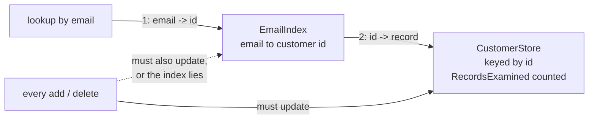

# Index Table

**Data management** — storing and reading data at scale

Create indexes over the fields in data stores that queries frequently reference.

| | |
|---|---|
| Tier | 3 — Data management |
| Well-Architected pillars | Reliability, Performance Efficiency |
| Source | [Index Table](https://learn.microsoft.com/en-us/azure/architecture/patterns/index-table), retrieved 2026-08-16 |
| Runtime dependencies | none |

## The problem it solves

Data is keyed on one field and queried by another.

Customers are stored by customer id, because that is how orders, sessions and support tickets refer
to them. "Which customer has this email?" is asked at every login — and the store can answer it
only by examining every record. The demonstration in this folder shows the arithmetic: twenty
email lookups over a hundred customers examine **two thousand records** answered by scanning, and
**one hundred and twenty** through an index built once.

Relational databases solve this with secondary indexes, maintained invisibly on every write. Many
cloud stores — key-value stores, document stores partitioned for scale — offer nothing of the
kind: the partition key is fast, and everything else is a scan.

An index table is that secondary index built **as data**: a second, small structure keyed on the
field queries ask by, holding the primary key of the record that owns it.

## When to use it

* The store is keyed for writing, and queries arrive by a different field.
* The store offers no native secondary index — or only on fields it chose.
* The same non-key field is queried often enough for a scan to hurt.
* Slightly stale index entries are tolerable, or index and data are updated together.

## When not to use it

* **The store already indexes that field natively.** Use its mechanism; it is maintained for free.
* **The field is queried rarely.** An occasional scan is cheaper than an index maintained forever.
* **The data changes far more often than it is queried.** Every write now writes twice.
* **The lookup must never be stale.** The index is updated alongside the data, not atomically with
  it, unless the store offers transactions across both.
* **Every query is ad hoc.** An index answers one question shape; a new table per question is a
  maintenance burden with no end.

## Architecture and components

| Participant | Role |
|---|---|
| `CustomerStore` | The primary store, keyed by id — **and it counts the records it examines** |
| `EmailIndex` | Email to primary key. The key, never a copy of the data |
| `Customer` | The record, owned by the store alone |

**`CustomerStore.RecordsExamined` is the demonstration.** In memory a scan over a handful of
records is free, so an index that merely answers faster proves nothing.

**The index holds the key, not the data.** A lookup is two keyed reads — email to id, id to
record — so the record is never duplicated, and the index cannot drift from what the store holds,
only from *whether* it holds it.

## Advantages and trade-offs

**What it buys.** Lookup cost by the indexed field becomes independent of store size. The store
keeps the shape writing wants. And the index is small — keys only — so it is cheap to hold and
cheap to rebuild.

**What it costs.** **Maintenance, forever**: every add and delete must update the index too, and
that duty falls on the application — the store does not know the index exists. A window between
data write and index write in which the index lies. Storage for the second structure. And one
table per question shape, each carrying the same duty.

**An index table is derived data and disposable.** Losing it costs a rebuild — one scan — never
data. The moment it holds anything the store does not, it stops being either.

## Implementation considerations

* **Update the index in the same operation as the data**, or as close as the store allows. The gap
  between the two writes is the window in which lookups lie.
* **Decide what a dangling entry means.** The implementation here treats an id the store no longer
  holds as not found, which makes a stale index safe rather than wrong.
* **Rebuild rather than repair.** The index is one scan away from correct; when its integrity is
  in doubt, rebuilding is cheaper than reasoning about it.
* **Keep it keys-only.** Copying fields into the index answers queries a shade faster and turns a
  missed update from a dangling pointer into wrong data — see Materialized View for the pattern
  that owns denormalised copies deliberately.
* **One table per question shape**, and retire the ones whose question is no longer asked.

## Real-world cloud scenarios

* Users stored by user id, looked up by email, username or phone number at sign-in.
* Orders partitioned by customer, queried by order number on the support desk.
* Devices keyed by device id, found by serial number during provisioning.
* Files stored by content hash, located by human-readable path.

## In Azure

The implementation here is a dictionary pointing into another dictionary.

In Azure the same shape appears as a second **Azure Table Storage** table whose partition key is
the queried field and whose row holds the primary key; **Cosmos DB** makes the pattern largely
unnecessary within a container — it indexes every path by default — but the cross-partition
version survives as a lookup container mapping a queried field to the partition key that avoids a
fan-out query; and **Azure Cache for Redis** hashes are a common home for hot lookups such as
email-to-user-id.

**What this model does not show.** The index and the data live in one process and are updated in
adjacent statements, so nothing exercises the window in which the data write has landed and the
index write has not — in a distributed store that window is real, and it is the pattern's
sharpest edge. There is no rebuild-while-serving story. There is no transactional pairing of the
two writes, which some stores offer and this model does not need. And the index never grows large
enough for its own partitioning to matter.

## What the tests assert

The tests are about what the index guarantees rather than how it is currently written, and they
assert **records examined** rather than timings.

They cover an indexed lookup examining exactly one record, which is the benefit as a number; a
scan examining every record, which is the baseline it is measured against; an added customer
findable once the index is told, and a deleted one gone once it is told — the maintenance duty
stated as calls the caller must make; and an unknown email reporting nothing while examining
nothing.
