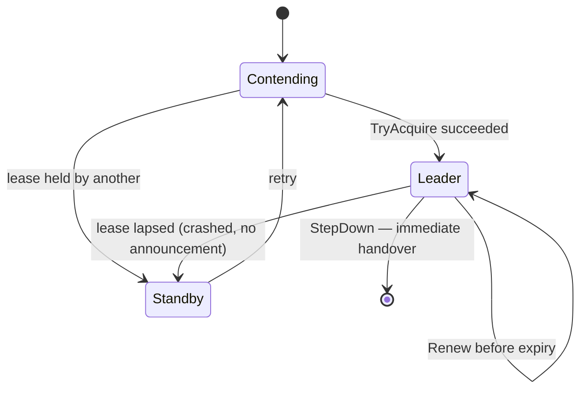

# Leader Election

**Coordination** — agreeing on outcomes across services

Coordinate actions in a distributed application by electing one instance as the leader. The leader
manages a collection of collaborating task instances.

| | |
|---|---|
| Tier | 4 — Coordination |
| Well-Architected pillars | Reliability |
| Source | [Leader Election](https://learn.microsoft.com/en-us/azure/architecture/patterns/leader-election), retrieved 2026-08-16 |
| Runtime dependencies | none |

## The problem it solves

An application runs as several identical instances, and one particular job must happen exactly
once.

Nightly billing. A queue that must be drained by a single consumer to preserve order. A cache that
should be rebuilt once rather than three times. Scale the application to three instances for
availability and every one of them wakes at midnight and starts billing — because they are
identical, which was the point.

Configuring one instance as special defeats the availability the replicas were for: when the
special one dies, the job stops happening and nothing notices. What is wanted is for the instances
to **agree among themselves**, continuously, so that exactly one is doing it and a replacement
appears when that one vanishes.

The mechanism is a lease: a single, shared, time-limited claim. One instance holds it; the others
do not and therefore stand down; the holder renews it while it lives. **The expiry is the load-bearing
part** — a crashed leader cannot announce that it crashed, so leadership has to end by itself.

## When to use it

* Several identical instances run, and some work must happen once.
* The work is not safely parallelisable — a scheduled job, an ordered consumer, a coordinator.
* An instance can disappear without notice, and a successor must take over automatically.
* A shared store exists that can hold a lease atomically.

## When not to use it

* **The work parallelises safely.** Then let every instance do its share; a leader is a bottleneck
  and a single point of failure reintroduced on purpose.
* **The platform already does it.** A scheduler that guarantees single execution, or a queue whose
  session locks give ordered single consumption, is doing this for you.
* **Correctness cannot tolerate two leaders even briefly.** Lease-based election is
  eventually-single: clock skew and a paused process can overlap holders. Where that is
  unacceptable, the work itself must be fenced — see below.
* **There is no atomic shared store.** Election needs one place that can arbitrate; without it,
  participants cannot agree.

## Architecture and components

| Participant | Role |
|---|---|
| `LeaseStore` | The single arbiter: at most one live lease, and it **expires by itself** |
| `Lease` | Who holds it, and until when |
| `ElectionParticipant` | One instance — leadership **derived from the store, never remembered** |

**Leadership is asked, not remembered.** A participant that stored "I am the leader" would go on
believing it after its lease lapsed, which is exactly how two leaders happen. Deriving it from the
store on every check is what makes expiry take effect without anyone being told.

**Renewal exists because the lease expires, and the lease expires because a leader may vanish
silently.** Those two facts generate the whole design.

**What this is not.** The other coordination patterns in this tier are about a multi-step operation
going wrong — the undo, the durable sequence, the step that never answered. This one is about
exclusivity: of several identical instances, exactly one does the thing that must happen once.

## Advantages and trade-offs

**What it buys.** Work that happens once without designating a special instance. Automatic
failover, with no human in the loop and no configuration change. Instances that stay identical,
which is what makes them replaceable. And an availability story that does not depend on any
particular process surviving.

**What it costs.** **A gap after a leader dies**, lasting until its lease lapses — shorter leases
narrow it and cost more renewal traffic. A shared store that everything depends on. Real risk of
two leaders under clock skew or a long pause, which is why critical work should be fenced rather
than merely gated. And a leader that is a bottleneck for whatever it alone does.

## Implementation considerations

* **Derive leadership from the store on every check**, never from a remembered flag.
* **Renew well inside the lease** — at roughly a third of it — so one slow renewal does not lose
  leadership unnecessarily.
* **Size the lease against the failover gap you can tolerate.** It is the maximum time the work is
  not being done.
* **Step down cleanly on shutdown.** A released lease hands over at once instead of leaving the
  cluster idle until expiry.
* **Fence the work where two leaders would be catastrophic.** Have the store issue a monotonically
  increasing token with the lease and have downstream systems reject anything stamped with an older
  one. A lease makes two leaders unlikely; fencing makes the second one harmless.
* **Handle losing leadership mid-job.** The lease can lapse while work is in flight; long jobs
  should re-check, and the check belongs beside the work rather than only at the start.
* **Prefer the platform's own mechanism** where one exists — it has already solved the parts above.

## Real-world cloud scenarios

* A scheduled job across replicas of a web application, where "run once" is the requirement.
* A single ordered consumer of a partition or queue.
* One instance responsible for cache warming, index rebuilds or housekeeping.
* The active supervisor in a [Scheduler Agent Supervisor](../SchedulerAgentSupervisor/README.md)
  deployment, so the watcher is not itself a single point of failure.

## In Azure

The implementation here is one nullable lease and a clock.

In Azure the classic mechanism is a **blob lease** on Azure Storage: a blob can be leased for
15–60 seconds, renewed, and released, and the lease is exactly the arbiter this pattern needs.
**Azure Cosmos DB** serves the same purpose via a lease container — which is how its own change-feed
processor distributes partitions. Where the workload is on **Kubernetes**, a `Lease` object in the
coordination API is the built-in equivalent, and **Service Bus session locks** remove the need for
election entirely when the goal was ordered single consumption.

**What this model does not show.** Everything is in one process with one clock, so there is no clock
skew, no network partition and no paused process — which are precisely the conditions under which
two leaders appear. There is no fencing token, so nothing protects work performed by a leader that
has silently lost its lease. Acquisition is stepped rather than concurrent, so nothing tests genuine
contention. And there is no renewal timer: renewal happens because the demonstration calls it.

## What the tests assert

The tests are about what the election guarantees rather than how it is currently written, and the
election is **stepped with an injected clock** — a test that starts threads and hopes proves
nothing about either outcome.

They cover exactly one leader emerging from three contenders; a second acquisition being **refused
while the lease is live**, which is the failure the pattern exists to prevent; a successor taking
over once the lease lapses, with the former leader no longer believing it leads; a renewing leader
keeping leadership past the original expiry; the exclusive work running **once across all three
instances**; and a clean step-down handing over immediately rather than leaving the cluster waiting.
