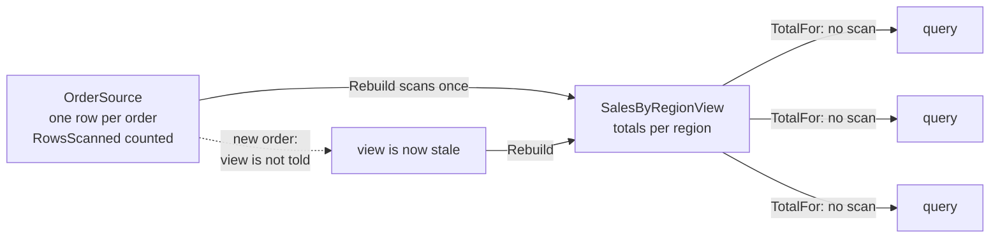

# Materialized View

**Data management** — storing and reading data at scale

Generate prepopulated views over the data in one or more data stores when the data is poorly
formatted for required query operations.

| | |
|---|---|
| Tier | 3 — Data management |
| Well-Architected pillars | Performance Efficiency |
| Source | [Materialized View](https://learn.microsoft.com/en-us/azure/architecture/patterns/materialized-view), retrieved 2026-08-16 |
| Runtime dependencies | none |

## The problem it solves

Data is stored in the shape that suits writing, and read in a shape that suits asking.

Orders are stored one row per order, because that is what placing an order produces. "What did the
north region sell this quarter?" needs every one of those rows read, filtered and summed — and it
needs it again for the next region, and again on every dashboard refresh.

The demonstration in this folder shows the arithmetic: twenty queries over five hundred orders scan
**ten thousand rows** answered live, and **five hundred** answered from a view built once. The
source is not badly designed; it is designed for a different job.

The usual reflexes make it worse. Denormalising the write model corrupts the thing that has to be
correct. An index helps a lookup and does nothing for an aggregation. Caching individual query
results helps only if the same query repeats exactly.

A materialised view computes the answer **once**, in the shape the question wants, and keeps it.

## When to use it

* Queries aggregate or join across many rows, repeatedly.
* The source's shape is right for writing and wrong for the question.
* The data is read far more often than it changes.
* An answer that is minutes old is acceptable.
* The query spans several stores, and joining them live is expensive or impossible.

## When not to use it

* **The answer must be current.** The view is stale between rebuilds, always.
* **The query is cheap.** A view over a small, fast table is machinery earning nothing.
* **Queries are unpredictable.** A view answers one question well; a view per ad-hoc question is a
  maintenance burden with no end.
* **Writes outpace reads.** Rebuilding more often than querying costs more than it saves.
* **It would become a source of truth.** A view is derived and disposable. The moment something
  writes directly to it, it stops being either.

## Architecture and components

| Participant | Role |
|---|---|
| `OrderSource` | The source of truth — **and it counts the rows it hands out** |
| `SalesByRegionView` | The precomputed answer, rebuilt on demand |
| `OrderRow` / `RegionTotal` | The write shape and the read shape |

**`OrderSource.RowsScanned` is the demonstration.** In memory an aggregation over a few rows is
free, so a view that merely answers faster proves nothing.

**Rebuild is total, not incremental.** It is simpler, it cannot drift from the source, and at this
size it is cheaper than tracking deltas. Incremental refresh is the right answer at a scale this
model does not reach, and it brings a real correctness burden — every delta must be applied exactly
once.

## Advantages and trade-offs

**What it buys.** Query cost becomes independent of source size. A shape the question actually wants,
rather than one it has to be translated into. Load moved off the source, which usually has writers
depending on it. And a way to answer questions that span stores which cannot be joined at all.

**What it costs.** **Staleness** between rebuilds, which the demonstration shows directly. Storage
for a second copy. Rebuild cost, which grows with the source. And a view per question, each of which
must be maintained as the question changes.

**A view is derived data and always disposable.** Losing it costs a rebuild, never data — which is
why it can be rebuilt freely, and why it must never become the only copy of anything.

## Implementation considerations

* **Rebuild on a schedule matched to tolerance for staleness**, not to convenience.
* **Consider event-driven rebuilds** where the source publishes changes — see [Publisher-Subscriber](../PublisherSubscriber/README.md).
  It narrows the window sharply and couples the view to the source's events.
* **Weigh incremental refresh carefully.** It is much cheaper at scale and much easier to get subtly
  wrong; a full rebuild that takes minutes is often better than a delta that is occasionally wrong.
* **Never write to the view directly.** The moment it holds something the source does not, it is no
  longer derived and no longer disposable.
* **Show the reader how old it is.** A dashboard that does not say when it was last built invites
  people to trust a figure from yesterday.
* **Build it so it can be dropped and recreated** without ceremony.

## Real-world cloud scenarios

* A sales dashboard aggregating orders by region, product and period.
* A leaderboard or ranking recomputed periodically.
* A search-facing document assembled from several normalised tables.
* A reporting table joining data that lives in separate services.

## In Azure

The implementation here is a dictionary rebuilt from a list.

In Azure the view is typically a **Cosmos DB** container or **Azure SQL** table populated by a
background process; **Azure SQL indexed views** materialise the same idea inside the database;
**Azure Synapse** and **Microsoft Fabric** materialise aggregations for analytics; and **Cosmos DB's
change feed** or an Event Grid subscription is how an event-driven rebuild is usually triggered.

**What this model does not show.** The rebuild is synchronous and instantaneous, so nothing exercises
what happens when a rebuild takes minutes — including whether queries see the old view or a partial
one, which is a real design decision. There is no incremental refresh. There is no scheduler and no
event trigger, so rebuilds happen only when the demonstration says. The view is in the same process
as its source, so nothing shows the multi-store case that motivates the pattern most strongly. And
there is no staleness indicator surfaced to a reader.

## What the tests assert

The tests are about what the view guarantees rather than how it is currently written, and they
assert **rows scanned** rather than timings.

They cover three queries scanning **nothing** after the build, which is the benefit as a number; a
live aggregation examining every row, which is the baseline it is measured against; the aggregation
itself being correct; **a new order absent from the view until a rebuild**, which is the cost stated
as a test rather than a caveat; and a region with no orders reporting nothing rather than zero.
