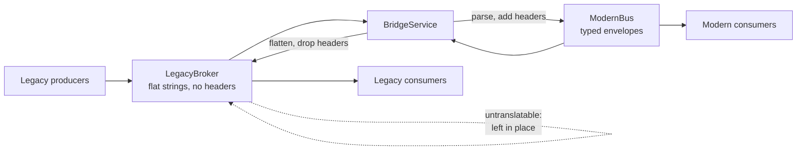

# Messaging Bridge

**Messaging** — decoupling senders from receivers

Build an intermediary to enable communication between messaging systems that are otherwise
incompatible.

| | |
|---|---|
| Tier | 2 — Messaging |
| Well-Architected pillars | Cost Optimization, Operational Excellence |
| Source | [Messaging Bridge](https://learn.microsoft.com/en-us/azure/architecture/patterns/messaging-bridge), retrieved 2026-08-16 |
| Runtime dependencies | none |

## The problem it solves

Organisations end up with more than one messaging system, and rarely on purpose.

An acquisition brings its own broker. A migration to the cloud runs for two years, during which the
on-premises queue and the new bus both carry live traffic. A team picks a technology that fits their
problem and is not the one everybody else uses. In each case there are two systems that need to
exchange messages and cannot: different wire formats, different metadata models, different
vocabularies.

The alternatives are worse than they look. **A big-bang cutover** requires every producer and
consumer to move on the same day, which for anything sizeable is not a migration plan but a hope.
**Dual publishing** — every producer writing to both systems — spreads the problem across every
producer, and they will not stay in step. **Waiting** means the migration never finishes.

A bridge lets both systems run at once and neither know about the other. Producers keep publishing
where they always did; consumers keep consuming where they always did; the bridge moves messages
across and translates as it goes. The migration becomes incremental, and it can be paused, reversed
or abandoned without a coordinated release.

## When to use it

* A migration between brokers must run incrementally rather than as a cutover.
* Two systems, from an acquisition or a merger, must interoperate.
* On-premises and cloud messaging need to coexist during a move.
* One team's broker choice must integrate with the rest of the estate without either side changing.

## When not to use it

* **As a permanent architecture.** A bridge is a migration tool. Left in place it becomes a
  single point of failure that everybody depends on and nobody owns.
* **The systems are compatible.** Two instances of one broker need federation, not translation, and
  most brokers offer it natively.
* **Translation would be lossy in a way that matters.** If the target cannot represent something the
  source guarantees, bridging silently degrades it — see the trade-offs below.
* **Ordering or transactions must span the bridge.** Neither survives a hop between systems.

## Architecture and components

| Participant | Role |
|---|---|
| `LegacyBroker` | The old system: flat `SUBJECT\|BODY` strings, no headers, no types |
| `ModernBus` | The new system: typed envelopes with headers |
| `BridgeService` | Moves and translates in both directions |
| `Envelope` | The modern message shape |

**Translation is not copying.** Crossing to the modern bus means supplying the headers it expects
and recording where the message came from, so the modern side can tell bridged traffic from native
traffic. Crossing back means dropping them, because the legacy broker has nowhere to put them.

**An untranslatable message is left where it is.** The bridge peeks rather than takes, so a message
it cannot parse stays on the source queue for an operator to inspect or replay. Consuming it would
destroy it, and the evidence with it.

## Advantages and trade-offs

**What it buys.** An incremental migration instead of a cutover, which is usually the difference
between a migration that happens and one that does not. Producers and consumers change nothing.
The move can be paused or reversed. And two systems that were bought separately can interoperate
without either being rewritten.

**What it costs.** A component in the middle of everything: another hop of latency, another thing to
scale, monitor and page somebody about. **Lossy translation**, one way or both — the demonstration
drops a `trace-id` crossing to the legacy broker, because there is nowhere to put it, and that loss
is invisible to everyone downstream. Ordering and transactional guarantees do not survive the hop.
And duplicate delivery becomes likelier, because at-least-once now applies twice.

**The largest risk is that it becomes permanent.** A bridge is easy to leave in place once the
migration stalls, and it then sits on the critical path of two systems with no owner.

## Implementation considerations

* **Give it an end date, and a decommissioning plan.** A bridge without one is an architecture.
* **Write down what translation loses**, in both directions, and make sure the people who depend on
  the lost thing know.
* **Leave untranslatable messages in place**, and alert on them. Silently dropping is the worst
  option; dead-lettering is acceptable if somebody watches the letters.
* **Make it idempotent, and expect duplicates.** Two at-least-once hops multiply, not add.
* **Do not let it grow business logic.** A bridge that starts enriching or routing becomes a service
  nobody planned, tested or documented.
* **Monitor both directions separately.** They fail independently and usually asymmetrically.
* **Avoid loops.** Bridging a message back into the system it came from is easy to do accidentally;
  the `source` header exists partly so a bridge can refuse to.

## Real-world cloud scenarios

* A migration from on-premises MSMQ or RabbitMQ to Azure Service Bus, running for months.
* An acquisition whose systems use a different broker entirely.
* A hybrid deployment where on-premises and cloud components must exchange messages.
* Connecting a partner's messaging system without either party changing theirs.

## In Azure

The implementation here is two in-process queues and a translator.

In Azure a bridge is usually **Azure Functions** or a **Logic App** triggered by one system and
writing to the other — small, stateless and easy to scale. **Azure Service Bus** has a hybrid
connection story for on-premises brokers, and **Azure Relay** exists for reaching systems behind a
firewall without opening one. Where the "other system" is a partner's, **Logic Apps enterprise
connectors** carry the protocol translation.

**What this model does not show.** Nothing is durable, so a bridge crash loses nothing here and
everything in reality — a real bridge must not acknowledge on the source until the target has
accepted, or messages are lost in the middle. There is no retry, no dead-letter and no poison
handling. Delivery is exactly-once here because nothing fails; with two at-least-once hops in
reality, duplicates are near-certain. There is no loop protection beyond the `source` header being
recorded. And the two "incompatible" systems are deliberately simple — real translation involves
schemas, encodings, character sets and correlation identifiers, and is where most of the work
actually is.

## What the tests assert

The tests are about what the bridge guarantees rather than how it is currently written.

They cover a message crossing legacy to modern; one crossing modern to legacy; **the payload
surviving a full round trip unchanged**, because silent corruption is worse than no bridge at all;
the headers the target requires being supplied rather than copied, since the source has none; and an
untranslatable message being **left on the source queue** rather than consumed — the failure that
would otherwise destroy the only evidence of what went wrong.
