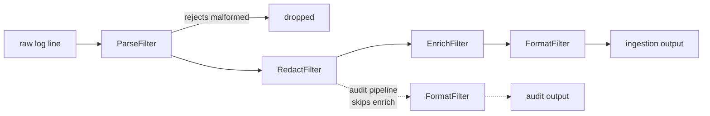

# Pipes and Filters

**Coordination** — agreeing on outcomes across services

Break down a task that performs complex processing into a series of separate elements that can be
reused.

| | |
|---|---|
| Tier | 4 — Coordination |
| Well-Architected pillars | Reliability |
| Source | [Pipes and Filters](https://learn.microsoft.com/en-us/azure/architecture/patterns/pipes-and-filters), retrieved 2026-08-16 |
| Runtime dependencies | none |

## The problem it solves

One function that does five things is impossible to reuse four of.

Log ingestion parses a line, redacts personal data, adds the host it came from, and renders output.
Written as one method it works — until an audit stream wants the same parsing and redaction without
the enrichment, and the only options are to copy the method or to thread flags through it. A year
later it takes seven boolean parameters and nobody will touch it.

Splitting it into stages that each take one entry and return one entry makes the arrangement a
separate thing from the work. A second pipeline is then a second list, not a second implementation.
The demonstration in this folder builds exactly that: two pipelines over the same log lines,
sharing three filter instances between them.

The stages also become independently testable, independently deployable where the pipe is a queue,
and independently scalable — the slow stage gets more workers without the fast ones being
duplicated alongside it.

## When to use it

* A transformation has distinct stages that are meaningful on their own.
* More than one arrangement of those stages is wanted, now or plausibly later.
* Stages have very different costs, and you want to scale them separately.
* New stages should be insertable without editing the existing ones.

## When not to use it

* **The processing is simple and will stay so.** One function is clearer than four classes and a
  composer.
* **Stages need shared mutable state.** Filters that reach into common state are not independent,
  and the reuse the pattern promises is not there.
* **Latency is critical and the pipes are remote.** Each hop costs a round trip; a pipeline of five
  services is five times the network.
* **The work does not decompose in one direction.** Branching, joining and looping are a workflow
  engine's job, not a pipeline's.

## Architecture and components

| Participant | Role |
|---|---|
| `LogEntry` | What flows along the pipe — same type in, same type out |
| `IFilter` | One stage: transform, or **reject by returning nothing** |
| `ParseFilter`, `RedactFilter`, `EnrichFilter`, `FormatFilter` | The stages, each independent |
| `Pipeline` | The arrangement, and **nothing else** |

**The pipeline holds the arrangement; the filters hold the work.** That split is what makes a second
pipeline free — no filter knows what a pipeline is, so composing them differently costs nothing.

**The filter interface is deliberately narrow**: same type in, same type out, no context, no
neighbours, no position. A filter that needed to know what ran before it could only ever be used
where that thing ran before it, and the reuse would be nominal.

**Rejection is a first-class outcome, not an error.** A malformed line leaves the stream; the batch
continues, and the stages after it never see the entry.

**What this is not.** The other coordination patterns in this tier are about a multi-step operation
across services and what happens when a step fails — the undo, the durable sequence, the silent
step, the absent coordinator. This one coordinates *processing* rather than distributed
commitments.

## Advantages and trade-offs

**What it buys.** Stages reusable in more than one arrangement, which is the whole point. Each stage
testable alone. New stages insertable without touching existing ones. Independent scaling where the
pipes are queues, so the expensive stage gets the workers. And a shape that reads as the sequence it
is.

**What it costs.** A common entry type every stage must accept, which tends to accumulate fields —
this one carries five, some empty at any given moment. Indirection: four classes and a composer
where a method would do. Latency per hop when the pipes are remote. And error handling that is
genuinely awkward — a stage that fails part-way through a distributed pipeline leaves work half
done, at which point the neighbouring patterns in this tier become relevant.

## Implementation considerations

* **Keep filters free of shared mutable state.** It is the property everything else rests on.
* **Decide what rejection means** and make it explicit. Dropping silently is right for malformed
  input and wrong for a transient failure; the two must not use the same path.
* **Make filters idempotent** where the pipes are queues, because at-least-once delivery will
  re-run them — see Idempotent Consumer.
* **Resist context objects.** A filter that needs "the pipeline's state" is a filter that is no
  longer independent, and the next arrangement will not be free.
* **Watch the entry type grow.** When most fields are empty most of the time, the pipeline is
  probably two pipelines.
* **Use durable pipes for distributed stages** so a crash between them does not lose the entry;
  Queue-Based Load Leveling is the shape for that.

## Real-world cloud scenarios

* Log and telemetry ingestion: parse, redact, enrich, route.
* Image processing: validate, resize, watermark, store.
* Document workflows: extract, classify, index, notify.
* ETL, where the same extraction feeds several different downstream shapes.

## In Azure

The implementation here is an array of interfaces and a loop.

In Azure the stages are commonly **Azure Functions** joined by **Service Bus queues** or **Event
Hubs** as the pipes — each stage scaling independently, each pipe durable across a crash. **Azure
Data Factory** and **Synapse pipelines** are the pattern as a managed product for data work;
**Stream Analytics** and **Azure Functions on Event Hubs** apply it to streams; and **Durable
Functions** function chaining is the in-process version with checkpointing between stages.

**What this model does not show.** The pipes are method calls, so nothing is durable, nothing is
queued and no entry is ever lost between stages — which is the thing real pipes exist to prevent.
Stages cannot scale independently because there is nothing to scale. There is no retry, no
dead-lettering and no back-pressure. Failure is modelled only as rejection, not as a stage that
throws part-way through a distributed pipeline. And everything is synchronous, so the slow stage
never becomes the bottleneck that motivates the pattern operationally.

## What the tests assert

The tests are about what the pipeline guarantees rather than how it is currently written, and
**reuse is asserted rather than claimed** — one fixed pipeline would demonstrate decomposition and
leave reuse as a promise.

They cover an entry passing through every stage in order, asserted through the outcome because
formatting before parsing would format an empty entry; **a second pipeline built from the same
filter instances**, producing a different result from the same input; a rejected entry leaving the
stream while the rest of the batch continues; a filter working **on its own with no pipeline at
all**, which is what independence means concretely; and a pipeline reporting the stages it is
composed of.
