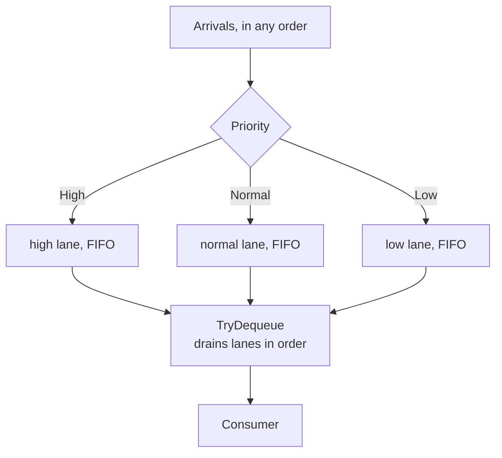

# Priority Queue

**Messaging** — decoupling senders from receivers

Prioritise requests sent to services so that those with a higher priority are processed more
quickly.

| | |
|---|---|
| Tier | 2 — Messaging |
| Well-Architected pillars | Reliability, Performance Efficiency |
| Source | [Priority Queue](https://learn.microsoft.com/en-us/azure/architecture/patterns/priority-queue), retrieved 2026-08-16 |
| Runtime dependencies | none |

## The problem it solves

A queue serves in arrival order, and arrival order is not importance.

A paid customer's outage report arrives behind five hundred free-tier password resets. A fraud alert
queues behind a nightly analytics batch. A payment retry waits behind a newsletter send. In every
case the system is working exactly as designed and delivering the wrong outcome, because the only
thing it knows about a message is when it turned up.

Adding capacity does not fix it. More consumers drain the whole backlog faster, so the urgent item
is served sooner in absolute terms and no sooner *relative to* everything unimportant ahead of it.
The queue's discipline is the problem, not its rate.

A priority queue makes importance explicit. Urgent work goes to the front, and **arrival order still
decides between equals**, so two customers on the same tier are treated identically.

## When to use it

* The work is genuinely of differing importance — tiers, severities, deadlines.
* Some requests have a service-level commitment others do not.
* Under load, you would rather delay the unimportant than delay everything evenly.
* The priority is knowable when the message is sent, not only after processing it.

## When not to use it

* **Everything is equally important.** Priorities that are all the same are overhead; priorities
  everyone sets to "high" are worse, because now nothing is prioritised and you have a field to
  maintain.
* **Low-priority work must complete within a bound.** Strict priority offers no such guarantee — the
  demonstration in this folder shows a low-priority ticket that is never served at all. Use ageing,
  or a weighted scheme.
* **Order is the contract.** If related messages must be processed in sequence, priority reordering
  breaks it. See **Sequential Convoy**.
* **The bottleneck is elsewhere.** Reordering a queue in front of a saturated database changes who
  waits, not how long.

## Architecture and components

| Participant | Role |
|---|---|
| `PriorityBacklog` | One FIFO lane per priority, drained most urgent first |
| `Priority` | `High`, `Normal`, `Low` — declared most urgent first |
| `SupportTicket` | The unit of work |

**One queue per priority, each FIFO.** That is what keeps "priority" from becoming "arbitrary".
A single list re-sorted on every insert would give the same head-of-queue answer while making
equal-priority ordering an accident of the sort's stability.

**The lanes are drained in the enum's declaration order.** Relying on the enum rather than a second
list is deliberate: two definitions of "most urgent first" would eventually disagree, and nothing
would report it.

It is called a *backlog* rather than a queue partly because the analyser reserves the `Queue`
suffix, and partly because "backlog" is the more honest word for what accumulates at the low end.

## Advantages and trade-offs

**What it buys.** Urgent work is served promptly regardless of arrival order — the demonstration's
paid-tier ticket arrives seventh and is served first. Service-level commitments become expressible.
And under overload the system degrades in a way you chose rather than one the clock chose.

**What it costs.** **Starvation**, which is not a corner case but the direct consequence of strict
priority: while high-priority work keeps arriving, low-priority work is never served. The
demonstration shows exactly that. Priority inflation, where every caller discovers that "high" is
free. Weaker ordering guarantees than a plain queue. And a per-message decision somebody must be
able to make correctly at send time.

**The honest trade** is fairness for responsiveness. You get urgent work served quickly by accepting
that unimportant work may wait indefinitely — and "indefinitely" needs saying out loud, because
"eventually" is what people assume.

## Implementation considerations

* **Decide the starvation answer before deploying.** Ageing — promoting an item after it has waited
  long enough — is the usual one, and it costs the strictness that made the pattern attractive.
  Weighted service, where the low lane gets a guaranteed share, is the other.
* **Keep the number of priorities small.** Three is usually right. Ten means nobody can say what
  four means, and everything lands on one or ten.
* **Assign priority from policy, not from the caller's opinion**, wherever the caller has an
  incentive to inflate it.
* **Monitor depth and age per priority.** A low lane whose oldest item keeps getting older is
  starvation in progress, and it is invisible in an aggregate depth graph.
* **Separate queues are usually simpler than one priority-aware queue**, and most brokers make that
  the practical option.

## Real-world cloud scenarios

* A support desk where paid tiers carry a response-time commitment.
* Payment retries ahead of marketing sends on a shared worker pool.
* Fraud or security alerts ahead of routine batch analytics.
* Interactive requests ahead of background reindexing on one compute pool.

## In Azure

The implementation here is three in-process queues drained in order. Nothing is durable and one
process does everything.

In Azure the usual shape is **separate Service Bus queues or topic subscriptions per priority**,
with more consumers assigned to the higher ones — brokers generally do not implement priority
ordering within a single queue, so the pattern is realised by *how many consumers* watch each queue
rather than by the queue's discipline. **Service Bus** message properties plus subscription rules
route messages into those lanes. **Storage queues** offer no priority at all, so it is separate
queues or nothing.

**What this model does not show.** Nothing is durable. Priority is strict with no ageing, so the
starvation the demonstration exhibits has no remedy here — deliberately, because a remedy would hide
the trade-off. There is no weighted fair queueing. Consumers are not partitioned across lanes, which
is how the pattern is actually implemented on real brokers. And there is no deadline or
service-level tracking, so "processed more quickly" is demonstrated as ordering rather than
measured as latency.

## What the tests assert

The tests are about what the backlog guarantees rather than how it is currently written.

They cover higher priority served before lower; **arrival order preserved within a priority**, which
is what stops the scheme becoming arbitrary; a late high-priority item served ahead of five earlier
low-priority ones, which is the pattern's whole claim; an empty backlog reporting nothing rather
than yielding a default; and per-priority depth, which is the number that makes starvation visible.
