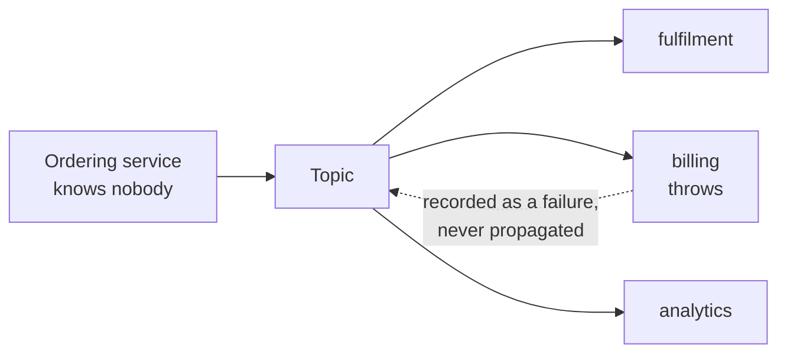

# Publisher-Subscriber

**Messaging** — decoupling senders from receivers

Enable an application to announce events to multiple consumers asynchronously, without coupling
senders to receivers.

| | |
|---|---|
| Tier | 2 — Messaging |
| Well-Architected pillars | Reliability, Security, Cost Optimization, Operational Excellence, Performance Efficiency |
| Source | [Publisher-Subscriber](https://learn.microsoft.com/en-us/azure/architecture/patterns/publisher-subscriber), retrieved 2026-08-16 |
| Runtime dependencies | none |

## The problem it solves

Something happens, and several parts of the system need to know.

An order is placed: fulfilment must pick it, billing must invoice it, analytics must record it. The
obvious implementation is for the ordering service to call all three. It works, and then it rots.

Every new listener means changing the ordering service. It now knows about three services it has no
business knowing about, and its deployment is coupled to theirs. If billing is down, the ordering
service's call fails — so either orders start failing because *invoicing* is broken, or somebody
wraps it in a `try`/`catch` that silently drops invoices. Adding a fourth listener means another
deployment of a service that has not changed in any meaningful way.

A topic inverts the dependency. The publisher announces that something happened and does not know
who is listening — the demonstration in this folder adds and removes listeners without the ordering
service changing at all. Subscribers register themselves. And a broken subscriber fails on its own
account rather than taking the publisher with it.

## When to use it

* Several independent consumers care about the same occurrence.
* The publisher should not know or care who they are.
* Consumers will be added and removed over time, ideally without redeploying the publisher.
* The consumers' work is independent of one another and of the publisher's transaction.

## When not to use it

* **The work should be done once, not N times.** That is
  [Competing Consumers](../CompetingConsumers/README.md), and using a topic instead means every
  worker does the same job.
* **The publisher needs a result.** Fan-out is one-way by design; a caller that needs an answer is
  making a request, not announcing an event.
* **Late subscribers need the history.** A topic is not a log — a subscriber that joins receives
  what happens *next*. Replay is Event Sourcing's job.
* **There is exactly one consumer, for ever.** A direct call is simpler and easier to debug.
* **Ordering across subscribers matters**, or the event must be part of the publisher's transaction.

## Architecture and components

| Participant | Role |
|---|---|
| `Topic` | Holds the subscriptions and delivers to all of them |
| `OrderPlaced` | The event — a statement of fact, in the past tense |
| `PublishResult` | How many handled it, and which did not |
| `SubscriberFailure` | One subscriber's failure, reported rather than thrown |

Three details matter.

**Publish never throws on a subscriber's behalf.** A publisher brought down by a subscriber it has
never heard of is coupling reintroduced through the back door.

**The failing subscriber sits in the middle** of both the test and the demonstration. An
implementation that let an exception escape would never reach the third subscriber, and only that
ordering catches it.

**Delivery iterates a copy** of the subscription list, so a handler that subscribes or unsubscribes
during delivery cannot corrupt the iteration.

## Advantages and trade-offs

**What it buys.** The publisher stops knowing its consumers, so adding one is a change to that
consumer alone. Failure is isolated — billing being down does not stop orders. Consumers scale and
deploy independently. And the event becomes a genuine integration point rather than a call graph.

**What it costs.** Visibility, mostly. Nobody can tell from the publisher what happens when an order
is placed; the answer is spread across every subscriber and is discoverable only at run time.
Debugging gets harder for the same reason. Delivery guarantees are weaker — this implementation
reports failures and moves on, and a real broker retries and eventually dead-letters. And the event
schema becomes a contract with consumers you cannot enumerate, which makes changing it hard.

## Implementation considerations

* **Name events in the past tense** — `OrderPlaced`, not `PlaceOrder`. An event is a fact, not an
  instruction, and the naming keeps commands from creeping in.
* **Never let a subscriber failure reach the publisher.** Record it, retry it, dead-letter it.
* **Decide what a failed delivery means.** Reported and dropped is rarely right in production; a
  real broker gives per-subscriber retry and dead-lettering, and it needs configuring.
* **Version the event schema additively.** You cannot enumerate your consumers, so you cannot
  coordinate a breaking change with them.
* **Make handlers idempotent.** At-least-once delivery applies here too.
* **Include enough in the event** that a consumer need not call back for context — but not so much
  that the event becomes a data feed. See **Claim Check** when payloads grow.

## Real-world cloud scenarios

* An order placed, with fulfilment, billing, analytics and notification all reacting.
* A file uploaded, triggering virus scanning, thumbnailing and indexing.
* A user deleted, with every service holding their data reacting to erase it.
* A deployment completed, notifying monitoring, chat and a change log.

## In Azure

The implementation here is a list of delegates called in a loop. It is synchronous, in-process and
not durable.

In Azure this is **Azure Service Bus topics and subscriptions**, where each subscriber gets its own
subscription queue with its own retry and dead-letter behaviour; **Azure Event Grid** for
event-driven routing at scale with push delivery and filtering; and **Event Hubs** where consumers
read a stream at their own pace. The `IDisposable` subscription here corresponds to creating and
deleting a subscription; in a real broker that is an administrative operation, not a method call.

**What this model does not show.** Delivery is synchronous and in-process, so nothing is
asynchronous — which is in the pattern's own name. Nothing is durable: a subscriber that is down
misses the event entirely, where a real subscription queue holds it until the subscriber returns.
There is no retry, no dead-lettering and no delivery guarantee beyond "it was attempted once". There
is no filtering, so subscribers cannot express interest in a subset. And the failure report is
returned to the publisher, which a real broker would never do — the publisher's whole point is not
knowing. Treat delivery semantics as unmeasured here.

## What the tests assert

The tests are about what the topic guarantees rather than how it is currently written.

They cover the central guarantee — every subscriber receiving every event, which is what
distinguishes this from Competing Consumers; a disposed subscription receiving nothing further; a
throwing subscriber **placed between two healthy ones** being isolated from both; a late subscriber
receiving only what happens after it joins, because a topic is not a log; a publish succeeding with
nobody listening at all, which is the decoupling stated as a test; and failures being reported
rather than propagated.
