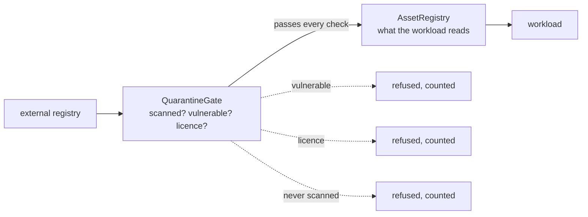

# Quarantine

**Deployment and topology** — where components run

Ensure that external assets meet a team-agreed quality level before the workload consumes them.

| | |
|---|---|
| Tier | 6 — Deployment and topology |
| Well-Architected pillars | Security, Operational Excellence |
| Source | [Quarantine](https://learn.microsoft.com/en-us/azure/architecture/patterns/quarantine), retrieved 2026-08-16 |
| Runtime dependencies | none |

## The problem it solves

Anything a build pulls from outside is code you are choosing to run.

A package, a container base image, a model, a dataset — each arrives from a registry, is added
because it solves a problem, and executes with the same privileges as everything else. Vulnerable
versions, licences that are incompatible with how the product is sold, packages typosquatting a
popular name, images with an unpatched base: all install exactly as smoothly as the good ones.

Checking afterwards tells you that something bad is **already in production**. That is worth doing
and it is monitoring, not prevention.

Quarantine puts the checks first. Assets are submitted to a gate; only what passes reaches the
registry the workload reads. The demonstration submits four packages and the workload ends up able
to use one.

## When to use it

* External dependencies enter the build or runtime — which is nearly always.
* Vulnerability, licence or provenance standards exist and must be enforced rather than hoped for.
* The consequences of a bad dependency are severe: supply-chain compromise is among the most
  effective attacks there is.
* Assets come from registries you do not control.

## When not to use it

* **Nothing external is consumed**, which is rare and usually means it is happening invisibly.
* **The checks cannot be automated** and would become a manual approval queue nobody staffs — the
  gate then blocks delivery rather than protecting it.
* **The standard is undefined.** A gate with no agreed criteria refuses arbitrarily, which is worse
  than none.
* **Speed matters more than the risk**, and that has been decided explicitly rather than by default.

## Architecture and components

| Participant | Role |
|---|---|
| `ExternalAsset` | Something from outside — **and whether it has been scanned at all** |
| `QuarantineGate` | The checks, applied **before** admission, and it counts refusals |
| `AssetVerdict` | Admitted or not, and **which check failed** |
| `AssetRegistry` | What the workload may consume — **the only thing downstream reads** |

**The registry is what makes this a gate rather than a report.** A refused asset simply is not there,
so nothing downstream has to remember to check a verdict before using something.

**Unchecked is refused, not admitted.** An asset with no scan report is unexamined, and a gate that
let it through because nothing was found has inverted its own purpose — nothing was found because
nothing looked.

**Refusals name the check they failed**, because "rejected" tells a developer nothing about whether
to find another library, request an exception, or wait for a patched version.

**What this is not.** Gatekeeper, in tier 5, validates **requests** arriving from outside, and its
subject is network reachability. This validates **assets the organisation is choosing to depend on**,
before they enter the supply chain.

## Advantages and trade-offs

**What it buys.** Bad dependencies stopped before they are anywhere, rather than found afterwards.
Licence compliance enforced rather than audited. A single enumerable answer to "what are we running?"
And a supply-chain attack that has to get past a check rather than past nobody.

**What it costs.** **Friction in the developer path**, which is where this pattern lives or dies — a
gate that takes a day to pass gets routed around. Checks that must be maintained as standards and
tooling change. False positives that need an exception process, which needs an owner. And a registry
that is now infrastructure with its own availability and storage.

## Implementation considerations

* **Automate every check**, and make the gate fast. A slow gate becomes a queue, and a queue becomes
  a workaround.
* **Fail closed on unchecked assets.** The absence of findings is not a finding.
* **Give exceptions an owner, an expiry and a record.** A permanent exception is a standard nobody
  updated, and one with no expiry is invisible after six months.
* **Re-check what you already admitted.** A package admitted last year is not clean today —
  vulnerabilities are discovered in assets that have not changed, so the registry needs periodic
  rescanning as well as entry checks.
* **Pin what was admitted**, by version and ideally by digest. Admitting `serilog` and consuming
  whatever `serilog` means tomorrow defeats the gate entirely.
* **Report by reason.** Which check refuses most tells you whether the standard, the tooling or the
  ecosystem is the problem.
* **Make the registry the only route.** A gate that developers can bypass by pulling directly from
  the public registry is documentation.

## Real-world cloud scenarios

* Internal package feeds mirroring public ones, with scanning between.
* Container base images admitted to a private registry after scanning.
* Machine-learning models and datasets checked for provenance and licence before use.
* Any regulated environment that must evidence what its software is made of.

## In Azure

The implementation here is three checks and a dictionary.

In Azure this is typically **Azure Artifacts** upstream sources, where a public feed is mirrored and
packages are saved to the internal feed only once accepted; **Microsoft Defender for Containers**
scanning images in **Azure Container Registry**, with quarantine mode holding an image until the scan
passes; and **GitHub Advanced Security** or **Dependabot** in the pipeline, where the build is the
gate. Continuous rescanning of what is already admitted is the part most often left out, and Defender
for Cloud does it if asked.

**What this model does not show.** *There is no supply chain.* The gate is a method call, so there is
no registry, no download, no digest and no pinning — the version-pinning advice above cannot be
demonstrated at all. Scanning is a boolean rather than a tool with findings, false positives and a
severity threshold. There is no exception process, which is where most of the operational weight
sits. There is no periodic rescanning, so an asset admitted here stays admitted for ever. And
nothing shows the developer friction that determines whether a real gate is respected or routed
around.

## What the tests assert

The tests are about what the gate guarantees rather than how it is currently written, and the one
that matters most asserts what the **workload** can see rather than what the gate decided.

They cover an asset passing every check being admitted and reaching the registry; assets refused for
a vulnerability and for a licence; **three refused assets leaving the registry completely empty**,
which is what separates a gate from a report; two refusals counted against one admission; each
refusal naming the specific check; and an **unscanned** asset refused — because unchecked is not
clean, and nothing was found in it only because nothing looked.
