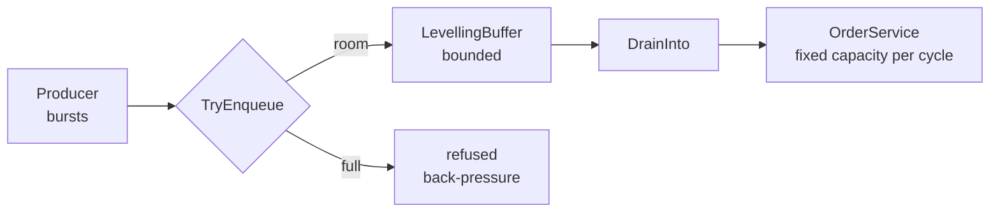

# Queue-Based Load Leveling

**Messaging** — decoupling senders from receivers

Use a queue that creates a buffer between a task and a service to smooth intermittent heavy loads.

| | |
|---|---|
| Tier | 2 — Messaging |
| Well-Architected pillars | Reliability, Cost Optimization, Performance Efficiency |
| Source | [Queue-Based Load Leveling](https://learn.microsoft.com/en-us/azure/architecture/patterns/queue-based-load-leveling), retrieved 2026-08-16 |
| Runtime dependencies | none |

## The problem it solves

Demand is spiky and capacity is not.

A ticket sale opens, a marketing email lands, a batch job starts: for a few minutes the arrival rate
is many times the average, and for the rest of the day it is far below it. A service sized for the
average is overwhelmed by the spike. A service sized for the spike is idle — and paid for — the rest
of the time.

Worse, the overwhelmed case does not degrade gently. Past its limit a service does not slow down, it
starts refusing, and the callers refused are chosen by arrival order rather than importance. The
demonstration in this folder shows it plainly: twenty orders at a service that takes three, and
seventeen customers see an error.

A queue decouples the two rates. The producer writes at whatever rate it likes; the consumer reads
at whatever rate it can sustain; and the queue holds the difference. The work is delayed rather than
lost, and the service is never asked a question it must refuse.

## When to use it

* Load is bursty and the average is much lower than the peak.
* The work can be done later — an order confirmed now and dispatched a minute later is usually fine.
* The consumer has a hard limit: a connection pool, provisioned throughput, a rate-limited API.
* Cost matters, and sizing for the peak means paying for idle capacity.

## When not to use it

* **The caller needs the answer now.** A queue turns a synchronous call into an asynchronous one, and
  the caller must be able to live with that. Where a response is required immediately, see
  **Asynchronous Request-Reply** for the shape that keeps the
  front end responsive.
* **The work expires.** Buffered work that is worthless by the time it is processed should be shed,
  not queued.
* **The backlog can never drain.** A queue absorbs a *spike*. If arrivals exceed capacity on
  average, the queue grows for ever and the only honest fix is more capacity.
* **Ordering across producers matters** and the queue does not guarantee it — see
  **Sequential Convoy**.

## Architecture and components

| Participant | Role |
|---|---|
| `LevellingBuffer` | The bounded buffer holding the difference between the two rates |
| `OrderService` | The downstream service with a hard per-cycle limit |
| `ServiceOverloadedException` | What the service does when asked for more than it can take |
| `Order` | The unit of work |

**Bounded is the load-bearing word.** An unbounded buffer does not level load — it accepts
everything, grows without limit, and converts a refusal you could have handled into an
out-of-memory failure you cannot, while hiding how far behind the consumer has fallen. A queue that
can refuse tells you the truth at the moment it stops coping.

`DrainInto` hands the service exactly what it will take this cycle and no more. That is the
levelling: the two rates become unrelated.

## Advantages and trade-offs

**What it buys.** The spike stops being a failure. The consumer runs at a steady, sustainable rate
rather than oscillating between idle and overwhelmed. Capacity is sized for the average rather than
the peak, which is usually much cheaper. And the queue depth is a genuinely useful signal — it is
the one number that says how far behind you are.

**What it costs.** Latency, always: buffered work is done later by definition. A component to
operate, monitor and pay for. Ordering guarantees that are weaker than a direct call unless the
queue provides them. And a failure mode that is easy to miss — a backlog that grows steadily looks
fine until the moment it is hours deep.

## Implementation considerations

* **Bound the queue, and decide what a full queue means.** Refuse, shed the oldest, or shed the
  lowest priority — but choose, rather than discovering the default.
* **Monitor depth and age, not just throughput.** Depth says how far behind; the age of the oldest
  message says how long a customer has waited.
* **Scale consumers to the backlog**, which is where **Competing Consumers**
  comes in — this pattern buffers the spike, that one drains it faster.
* **Handle poison messages.** One message that always fails can stall a queue for ever; a dead-letter
  path is not optional.
* **Make consumers idempotent.** At-least-once delivery means redelivery, which is
  **Idempotent Consumer**'s problem.

## Real-world cloud scenarios

* A ticketing site where an on-sale produces a hundredfold spike for ninety seconds.
* Order intake in front of a payment provider with a fixed transactions-per-second limit.
* Telemetry ingestion smoothing before a database with provisioned throughput.
* Image or document processing where uploads arrive in bursts and processing is slow.

## In Azure

The implementation here is an in-process `Queue<T>` with a capacity check. There is no broker,
nothing durable, and one process.

In Azure the queue is a managed service: **Azure Storage queues** for simple, high-volume work;
**Azure Service Bus** where sessions, dead-lettering, scheduled delivery or transactions are needed;
and **Event Hubs** for high-throughput streams. Consumers are typically **Azure Functions** with a
queue trigger, or **Container Apps** scaled on queue depth by KEDA — which is the automated form of
"scale consumers to the backlog".

**What this model does not show.** Nothing here is durable: a process restart loses the buffer,
where a real broker persists it, which is most of why you would use one. There is no visibility
timeout, no acknowledgement, no redelivery and therefore no at-least-once semantics — the whole
category of duplicate handling is absent. There is no dead-letter queue, so poison messages are not
modelled. Producer and consumer are the same process, so nothing exercises the decoupling that
matters operationally: deploying, scaling or failing them independently. And the drain is driven by
a loop in the demonstration rather than by anything that could fall behind unobserved.

## What the tests assert

The tests are about what the buffer guarantees rather than how it is currently written.

They cover accepting work up to capacity; **refusing beyond it**, which is what makes the buffer
bounded rather than a deferred out-of-memory failure; draining only what the service will take this
cycle; preserving arrival order; and the pattern's whole claim — that a burst which the service
refuses outright is served in full when it passes through the queue instead.
