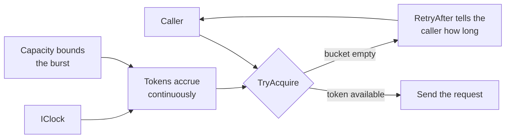

# Rate Limiting

**Resilience** — keeping a service working when its dependencies are not

Avoid or minimize throttling errors by controlling the consumption of resources.

| | |
|---|---|
| Tier | 1 — Resilience |
| Well-Architected pillars | Reliability |
| Source | [Rate Limiting](https://learn.microsoft.com/en-us/azure/architecture/patterns/rate-limiting-pattern), retrieved 2026-08-16 |
| Runtime dependencies | none |

## The problem it solves

Every service you depend on has a limit, and it will enforce it whether or not you were paying
attention.

A client that ignores the published rate discovers it the expensive way: a burst of `429`s, work
that has to be redone, and — with [Retry](../Retry/README.md) wired in underneath — retries that
arrive into the same limit and are refused again. The classic version of this is a batch job that
runs fine against a hundred records and falls apart against ten thousand, because nothing in it was
ever pacing.

The failure is avoidable, and that is what makes it worth a pattern. **The limit was published.**
Nothing was uncertain. A client that paces itself simply never provokes the response, and the whole
category of error stops existing rather than being handled.

This is the **client** end of the conversation that [Throttling](../Throttling/README.md) is the
server end of. A well-behaved client rate-limits itself so that a well-run service rarely has to
throttle it.

## When to use it

* The dependency publishes a limit — requests per second, per minute, or a cost-unit budget.
* You control the rate at which you call: a batch job, a worker, a crawler, a bulk import.
* Being refused is expensive — lost work, a partial import, a job that must restart.
* The work is yours to schedule, so waiting is genuinely available to you.

## When not to use it

* **You own the resource.** Then you want [Throttling](../Throttling/README.md), and you want the
  degradation band it has. Rate limiting your own callers from inside your own service is a throttle
  written from the wrong seat.
* **The work cannot wait.** A user is watching; holding their request back to protect a quota is
  the wrong trade. Fail fast and tell them.
* **The dependency publishes no limit**, and you have no evidence of one. You would be pacing
  against a number you invented.
* **Load arrives rather than being issued.** You cannot pace what you do not initiate — buffer it
  with Queue-Based Load Levelling instead.
* **There is one call.** A limiter around a single request is ceremony.

## Architecture and components

| Participant | Role |
|---|---|
| `TokenBucketRateLimiter` | Holds the tokens, decides whether a call may go, and says when to come back |
| `IClock` / `ManualClock` | Where the current time comes from, so refill is assertable to the millisecond |
| `GeocodingClient` | The client being paced |
| `GeocodeOutcome` | Sent with a result, or held back with a wait |

**A token bucket, not a fixed window.** A window resets on a boundary, which lets a client spend a
full allowance either side of it and achieve twice the intended rate — the flaw
[Throttling](../Throttling/README.md) documents in its own fixed window. Tokens accrue continuously,
so the long-run rate holds wherever you start looking, and the bucket's capacity is what still
permits the burst most published limits allow.

**`RetryAfter` is the point.** A limiter that only refused would be a throttle pointed at your own
caller. Returning the wait turns a refusal into an instruction, and lets the caller schedule instead
of spin.

## Advantages and trade-offs

**What it buys.** An entire class of error stops occurring rather than being handled. Load on the
dependency becomes smooth and predictable. Bursts are still allowed, up to a bound you chose. And
the client stays inside its contract without anybody having to notice.

**What it costs.** Latency, by design — the work is deliberately slower than the machine could go.
Two numbers to choose, and choosing them needs the published limit to be accurate. State per
limiter, which in a multi-instance deployment must be shared or subdivided, or your real rate is
your rate times your instance count. And a limiter that is wrong in the safe direction wastes
capacity you are paying for, silently.

**It does not remove the need for handling refusals.** The limit may change, your rate may be
shared with something you did not know about, and the dependency may throttle for reasons unrelated
to rate. Pace *and* handle.

## Implementation considerations

* **Pace, do not fail.** The value is in waiting. A limiter that throws when out of tokens has made
  the caller's life harder, not easier.
* **Share the budget across instances.** Ten workers each pacing at the full published rate produce
  ten times it. Subdivide deliberately, and remember autoscaling changes the divisor.
* **Respect the server's answer too.** When a `429` and a `Retry-After` do arrive, obey them — your
  model of the limit is evidently incomplete.
* **Weight by cost where the dependency does.** A limit in request units is not a limit in requests.
* **Leave headroom.** Pacing at exactly the published rate leaves nothing for clock skew, retries,
  or the colleague who deployed a second copy of your job.
* **Compose it outside Retry**, so a retry cannot bypass the pacing and re-provoke the limit.

## Real-world cloud scenarios

* A nightly import calling a partner API published at a fixed rate per second.
* A crawler observing a site's documented crawl budget.
* A worker writing to Cosmos DB, pacing against provisioned request units.
* A notification fan-out calling an email provider with a per-minute send cap.
* A CI job calling a source-control API that limits by token.

## In Azure

The implementation here is an in-process token bucket with a hand-advanced clock. There is no HTTP,
no shared store, and nothing sleeps.

In .NET and Azure this is normally not hand-written. It appears as
**`System.Threading.RateLimiting`** — `TokenBucketRateLimiter` is in the BCL and is the direct
production counterpart of this file; as **Polly**'s rate-limiter strategy inside the same resilience
pipeline as its retry and circuit-breaker strategies; and as the client-side throttling built into
several Azure SDKs, which pace against the service's own published budgets.

**What this model does not show.** Nothing ever waits: the clock is advanced by hand, so the caller
is told to wait and the demonstration simply asserts the wait happened. There is no asynchronous
`WaitAsync`, no queueing of pending permits, and no cancellation — all of which the BCL type has and
all of which are where the real design questions live. **Nor is this type thread-safe**, and the
BCL counterpart is — a client-side limiter is naturally shared across worker tasks, so that is the
first property to add before copying this shape into one. State is in one process, so nothing
exercises sharing a budget across instances. And no real `429` is ever received, so the interaction
between a client's model of the limit and the server's actual answer is entirely unexercised.

## What the tests assert

The tests are about what the limiter guarantees rather than how it is currently written.

They cover the burst up to capacity; refusal once the bucket is empty; refill at the configured rate,
asserted to the millisecond against a hand-advanced clock; the wait reported on refusal, which is the
behaviour that distinguishes this pattern from a throttle; and the long-run guarantee — that over a
window, taking everything on offer as fast as it is offered, the total granted never exceeds capacity
plus the window's refill.
