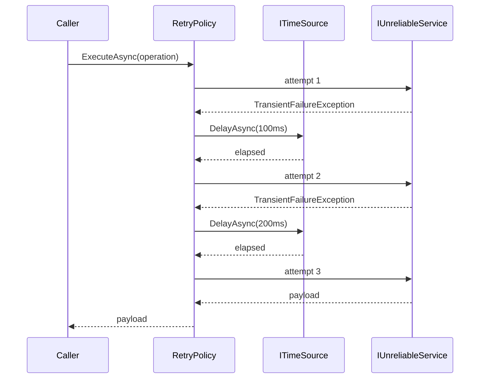

# Retry

**Resilience** — keeping a service working when its dependencies are not

Enable applications to handle anticipated temporary failures by retrying failed operations.

| | |
|---|---|
| Tier | 1 — Resilience |
| Well-Architected pillars | Reliability |
| Source | [Retry](https://learn.microsoft.com/en-us/azure/architecture/patterns/retry), retrieved 2026-08-16 |
| Runtime dependencies | none |

## The problem it solves

A call across a network fails for two quite different reasons, and they need opposite responses.

Some failures are **transient**: a connection reset, a throttling response, a node restarting behind
a load balancer, a database failing over. Nothing is wrong with the request, and the same request a
moment later will succeed. Others are **defects**: a malformed payload, a missing permission, a null
where a value was required. The same request will fail identically for ever.

Treating every failure as fatal throws away the majority of failures in a distributed system, which
are the recoverable kind. Treating every failure as retryable is worse: it turns a bug into a
timeout, hides the real error behind whatever the last attempt reported, and multiplies load on a
dependency that may already be struggling.

## When to use it

* The dependency is remote — another service, a queue, a managed database, a storage account.
* The failures you are handling are genuinely intermittent.
* The operation is **idempotent**, or the dependency de-duplicates: a retried payment must not
  charge twice.
* The caller can afford the added latency. Four attempts with growing backoff can take seconds.

## When not to use it

* **The failure is deterministic.** A 400, a 401, a 403 or a validation error will fail the same
  way every time. Retrying converts a fast clear error into a slow unclear one.
* **The operation is not idempotent and nothing de-duplicates it.** A retry that re-sends a
  transfer is worse than the failure.
* **The dependency is already saturated.** Retrying into an overloaded service is how a partial
  outage becomes a total one. Reach for Circuit Breaker instead, or as well.
* **The caller is holding a scarce resource** — a request thread, a database transaction, a lock.
  Waiting while holding it converts one slow dependency into exhaustion everywhere.
* **The call is long-running.** Retrying a thirty-second operation four times is a two-minute
  failure.

Retrying is a fixed number of attempts. When failures persist, the answer is not more attempts —
it is to stop calling, which is what Circuit Breaker does.

## Architecture and components

| Participant | Role |
|---|---|
| `RetryPolicy` | Decides whether to try again, how long to wait, and when to stop |
| `ITimeSource` | Where a delay comes from. Injected, so the schedule is assertable |
| `RecordingTimeSource` | Records delays and returns at once. Used by the tests and the demonstration |
| `RealTimeSource` | Waits for real. What production would use |
| `TransientFailureException` | The signal that a failure is worth another attempt |
| `IUnreliableService` | The remote dependency being wrapped |

`ITimeSource` is the load-bearing design decision. A policy that calls `Task.Delay` directly can
only be tested by a suite that really waits, so its delay schedule is in practice never asserted at
all — and the schedule is the part that matters.

## Advantages and trade-offs

**What it buys.** Most transient faults disappear without the caller ever knowing. Growing the
delay gives a struggling dependency room to recover instead of re-asking at the rate that caused
the trouble. Jitter stops a thousand clients that failed together from returning together.

**What it costs.** Latency on the failure path, multiplied by attempts. Load on a dependency that
may be failing *because* of load. Masked defects, when the retryable/fatal distinction is drawn
carelessly. And duplicate side effects wherever the operation is not idempotent.

**The cap is not decoration.** Uncapped exponential growth reaches minutes within a handful of
attempts, and a caller waiting minutes has usually given up already.

## Implementation considerations

* **Classify failures explicitly.** Retry a named set of conditions, not everything. Here that is
  `TransientFailureException`; against a real SDK it is a specific set of status codes.
* **Always jitter.** Synchronised retries are a self-inflicted denial of service.
* **Let the final failure propagate unwrapped.** The `when (attempt < maxAttempts)` filter is what
  achieves that — catching unconditionally and rethrowing replaces the original stack with one
  starting inside the policy, which is precisely what a debugger of the give-up path needs.
* **Inject time.** Production retry code that cannot be time-travelled cannot be tested either.
* **Budget the total, not just the count.** Four attempts with a two-second cap is a different
  promise from four attempts with a two-minute cap.
* **Pair it with Circuit Breaker.** They solve adjacent halves of the same problem.

## Real-world cloud scenarios

* A web request reading from a managed database during a failover window.
* A worker consuming from a queue while the broker rebalances partitions.
* A service calling a rate-limited third-party API and receiving a throttling response.
* A deployment health check polling an endpoint while instances are still warming up.
* A blob upload interrupted by a transient network reset.

## In Azure

The implementation here models the remote dependency in process. There is no SDK, no network, and
no cloud account, so the pattern can be read and run from a clean clone with only the .NET SDK.

In Azure this pattern is normally not hand-written. It appears as:

* **[Polly](https://www.pollydocs.org/)** resilience pipelines, which most Azure SDK clients
  integrate with;
* **built-in retry policies** in the Azure SDKs — `RetryOptions` on Service Bus, Cosmos DB and
  Storage clients, each with its own defaults for mode, count and backoff;
* **Azure API Management** retry policies at the gateway, for calls the application does not make
  itself.

**What this model does not show.** `RecordingTimeSource` returns immediately, so nothing here
exercises the behaviours that only appear when a delay is real: timeout interaction, cancellation
part-way through a wait, request threads held while waiting, thread-pool starvation under load, or
the effect of many clients retrying at once. The delay schedule printed by the demonstration is the
schedule that *would* have been followed. Treat the timing characteristics of a real deployment as
unmeasured here.

## What the tests assert

The tests are about what the policy guarantees rather than how it is currently written, so they
survive a reimplementation.

They cover the success path with no delay at all; recovery after transient failures, with the call
count and delay count that implies; exhaustion, where the attempt limit is honoured and the
original exception propagates; the delay schedule itself — exponential growth, the cap, and the
jitter window; and the classification boundary, where a failure the policy was not told to retry
propagates immediately without consuming an attempt.

Each test drives a `RecordingTimeSource`, so the suite asserts the delay schedule without waiting
for it.
