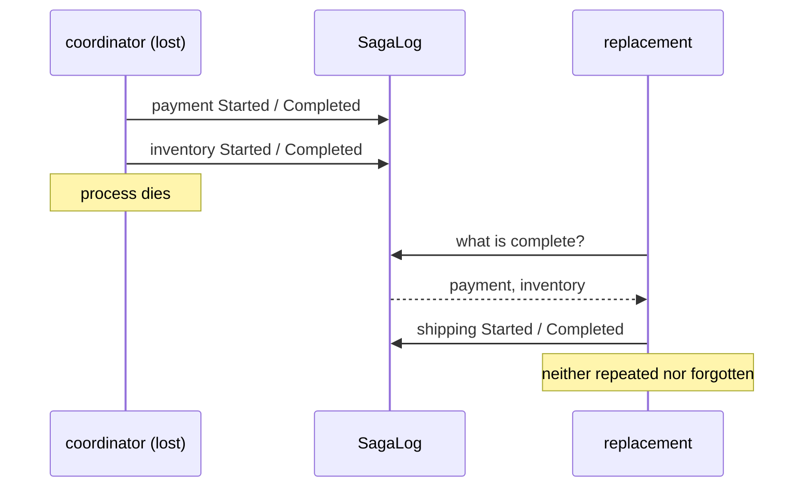

# Saga

**Coordination** — agreeing on outcomes across services

Manage data consistency across microservices in distributed transaction scenarios.

| | |
|---|---|
| Tier | 4 — Coordination |
| Well-Architected pillars | Reliability |
| Source | [Saga](https://learn.microsoft.com/en-us/azure/architecture/patterns/saga), retrieved 2026-08-16 |
| Runtime dependencies | none |

## The problem it solves

A business transaction spans three services, and something has to remember how far it got.

Taking payment, reserving stock and booking a courier are three independent commitments. Countering
each one is a solved problem — that is Compensating Transaction. What is not solved is the
coordinator's own mortality: it is a process, it can be restarted, redeployed or killed mid-run, and
when it goes it takes its call stack, its local variables and its knowledge of what it had already
done.

A replacement then faces the only question that matters: **has the card been charged?** Guess wrong
in one direction and the customer is charged twice. Guess wrong in the other and stock stays
reserved for an order nobody paid for.

A saga answers it by writing down each step's outcome **as it happens**. The sequence and its
compensations become one durable unit, and recovery is reading a log rather than reasoning about a
crash. The demonstration in this folder loses a coordinator after two steps and lets a replacement
finish from the log alone.

## When to use it

* One business operation spans services that commit independently.
* The coordinator can plausibly fail mid-operation — which, given long enough, it can.
* Steps have meaningful compensations, and a partial-completion window is acceptable.
* Repeating a step would be harmful: a second charge, a second shipment, a second email.

## When not to use it

* **The operation fits in one transaction.** Use the transaction.
* **The coordinator's failure genuinely does not matter** — a short, idempotent sequence that can
  simply be re-run from the start needs no log.
* **Steps cannot be compensated.** The saga will get stuck exactly where the compensation does not
  exist; see Compensating Transaction for what to do about the steps that have no counter.
* **Nobody will operate it.** A stuck saga needs a human eventually, and a system with no way to
  list them will not surface it.

## Architecture and components

| Participant | Role |
|---|---|
| `SagaLog` | The durable record — **appended as each step happens, never at the end** |
| `SagaEntry` | One line: a step and what became of it |
| `OrderSaga` | The named business transaction, and its compensations |
| `SagaStatus` | Started, Completed, Compensated, Failed |

**The log is the pattern.** Written after the run it records only the sagas that did not need it.
Written as it goes, it is what lets a replacement skip what is done and counter what must be
undone.

**The steps are fixed, deliberately.** A saga is a *named business transaction* — it knows that
stock is reserved after payment is taken and what each of those means — rather than a general engine
for arbitrary work. That generality is Compensating Transaction's job, and this pattern does not
import it: R-3 admits no cross-references, and sharing the mechanism would make the two
indistinguishable.

**What this is not.** Compensating Transaction is the undo mechanism, indifferent to who drives.
Scheduler Agent Supervisor is what notices a step that **never answered at all** — a saga assumes
each step eventually returns something. Choreography is this operation with nobody holding the
sequence.

## Advantages and trade-offs

**What it buys.** Recovery from coordinator failure without guessing. Steps that are never repeated,
which for a payment is the difference between an inconvenience and a refund. An operational record
of what the system did and why. And consistency across services that offer no shared transaction.

**What it costs.** **Eventual consistency**, with a real window in which the operation is half done.
Two implementations per step and a log write besides. Compensations that can themselves fail,
leaving the saga stuck and needing a person. A log that must be as durable as the operation it
describes — a saga log in memory is decoration. And a system that is materially harder to reason
about than a transaction.

## Implementation considerations

* **Append before acting, and record the outcome after.** A `Started` line written first is what
  tells a replacement that a step may have half-run.
* **Make steps idempotent anyway.** The log narrows the window; it does not close it. A crash
  between the action and its `Completed` line leaves genuine ambiguity, and idempotency is what
  makes the safe choice — retry — safe.
* **Keep the log where the coordinator is not.** Its whole value is surviving the coordinator.
* **Give the log a stable identity per saga**, so an operator can ask what happened to *this* order.
* **Decide what a stuck saga does.** Retry compensation, then escalate to a human with the log
  attached; a saga that fails silently is worse than one that never started.
* **Do not let the log become the source of truth for the business data.** It records what the saga
  did; the services still own their own state — see Event Sourcing for the pattern where the log
  *is* the data.

## Real-world cloud scenarios

* Order fulfilment across payment, inventory and shipping services.
* Account opening: identity check, account creation, card issue, welcome pack.
* Booking systems where several independent providers must all agree.
* Provisioning workflows across cloud resources that each commit separately.

## In Azure

The implementation here is a list of entries in memory.

In Azure a saga is most often **Azure Durable Functions**, whose orchestrator persists its history
automatically and replays it after a restart — the log made invisible; **Logic Apps** for the
low-code equivalent; or a hand-rolled coordinator with the log in **Cosmos DB** or **Azure SQL** and
the steps driven over **Service Bus**. The choreographed alternative, with no coordinator at all,
is a different pattern in this same tier.

**What this model does not show.** The log is in memory, so it does not actually survive anything —
the demonstration simulates a lost coordinator by discarding the object, which is the shape of the
problem rather than the problem. There is no crash between an action and its log entry, which is
the ambiguity idempotency exists to cover. Compensations never fail here, so no saga gets stuck.
There is no timeout, no retry and no escalation. And nothing is concurrent: two coordinators cannot
pick up the same saga, which in a real system is what leases and Leader Election are for.

## What the tests assert

The tests are about what the saga guarantees rather than how it is currently written, and the
recovery tests assert against a **fresh coordinator holding nothing but the log**.

They cover each step being recorded as it completes; completed steps being countered, last first,
when a later step fails; a replacement finishing the operation from the log alone; a completed step
**not being repeated**, which for a payment is the whole point; the saga reporting failure once
compensation has finished, with both compensations recorded; and an empty log reporting that there
is nothing to recover.
