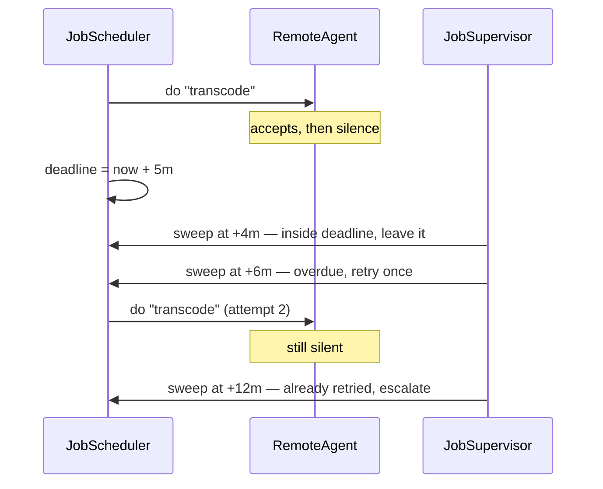

# Scheduler Agent Supervisor

**Coordination** — agreeing on outcomes across services

Coordinate a set of actions across distributed services and resources.

| | |
|---|---|
| Tier | 4 — Coordination |
| Well-Architected pillars | Reliability, Performance Efficiency |
| Source | [Scheduler Agent Supervisor](https://learn.microsoft.com/en-us/azure/architecture/patterns/scheduler-agent-supervisor), retrieved 2026-08-16 |
| Runtime dependencies | none |

## The problem it solves

A remote step accepts the work and is never heard from again.

Every other failure announces itself. A service that rejects a request returns an error; a service
that crashes closes the connection; a service that is down refuses to connect. Those are handled
where they happen. **Silence is different**: the request was accepted, no answer has arrived, and
nothing distinguishes "still transcoding" from "the machine was reclaimed twenty minutes ago".

The caller cannot tell. The service that went quiet certainly cannot tell you. And a coordinator
that simply waits has turned a stalled step into an invisible one — the job sits in *Running* for
ever, and the first anyone hears of it is a customer asking where their video went.

This pattern splits the job into three roles so that somebody is watching a clock: a **scheduler**
that starts steps and records a deadline for each, **agents** that do the remote work, and a
**supervisor** outside the request path whose only function is to compare deadlines against the
time.

## When to use it

* Steps are performed remotely and may not answer at all.
* The work is long enough that "no answer yet" is normal for a while.
* A stalled step must be retried or surfaced rather than waited on indefinitely.
* You need to know *which* step stalled, not merely that the job did not finish.

## When not to use it

* **Steps fail loudly and quickly.** Then a saga's ordinary error handling is enough, and this is
  three components where one would do.
* **The work is short.** A step measured in milliseconds does not need a deadline sweeper; a
  request timeout covers it.
* **Retrying is unsafe and the step is not idempotent.** A retry after silence may duplicate work
  that did in fact happen — see the supporting document.
* **Nobody will act on an escalation.** Escalating into a queue nobody reads is waiting with extra
  steps.

## Architecture and components

| Participant | Role |
|---|---|
| `JobScheduler` | Starts each step and **records a deadline for any that has not answered** |
| `RemoteAgent` | The remote work — and it may simply not answer |
| `JobSupervisor` | The third party with a clock, outside the request path |
| `JobStatus` | Pending, Running, Completed, Escalated |

**The scheduler does not wait.** Waiting is what makes a stalled step invisible; recording a
deadline turns it into a fact somebody else can check later.

**The supervisor must be outside the request path.** Nothing else in the system can detect silence:
the scheduler has moved on, the agent is the thing that has gone quiet, and the caller is blocked.
Detection requires a third party with a clock and no stake in the work.

**It retries once, then escalates.** Retrying for ever converts a stalled step into permanent
background load nobody is looking at — worse than a failure, because a failure at least gets
reported.

**What this is not.** [Compensating Transaction](../CompensatingTransaction/README.md) is the undo.
[Saga](../Saga/README.md) makes a sequence and its compensations durable across a coordinator
restart, and assumes each step eventually returns *something*. This pattern is about the step that
returns nothing at all.

## Advantages and trade-offs

**What it buys.** Stalled work becomes visible instead of invisible. A named step to escalate,
which is what an operator actually needs. Recovery from transient loss without human involvement,
via the one retry. And a clean separation: the scheduler holds the plan, agents do work, the
supervisor holds the clock.

**What it costs.** **A retry after silence may duplicate work that did happen** — the step must be
idempotent, or the retry must first ask whether it completed. Three components rather than one.
Deadlines that must be tuned: too short and slow work is duplicated, too long and stalls sit
undiscovered. And a supervisor that is itself a component which can fail — usually protected by
having several, of which one is elected, which is a neighbouring pattern in this tier.

## Implementation considerations

* **Set the deadline from observed durations, not from hope.** A high percentile of real completion
  times, with headroom; anything tighter duplicates work that was going to finish.
* **Make agent work idempotent**, keyed by the step's identity, so the retry after silence is safe.
  Where it cannot be, have the retry *query* rather than repeat.
* **Escalate with the step named** and everything an operator needs attached. "A job stalled" is
  not actionable.
* **Keep the supervisor's state durable**, or it forgets what it retried and retries for ever after
  its own restart.
* **Run more than one supervisor and elect a leader**, so the watcher is not a single point of
  failure — [Leader Election](../LeaderElection/README.md) is the neighbouring pattern for that.
* **Sweep on a timer, not per request.** The supervisor's independence from the request path is the
  property that makes it work.

## Real-world cloud scenarios

* Media transcoding, where a worker can be reclaimed mid-job.
* Long-running provisioning where a resource provider accepts a request and stops responding.
* Batch pipelines whose stages run on spot or pre-emptible capacity.
* Any workflow calling third-party services that occasionally accept work and never call back.

## In Azure

The implementation here is a dictionary of deadlines and a method that reads a clock.

In Azure the scheduler and supervisor are commonly **Azure Functions** — one triggered by work, one
by a timer — with step state in **Cosmos DB** or **Azure Table Storage** and the agent work
dispatched over **Service Bus**, whose lock duration and dead-letter queue implement part of this
pattern natively. **Durable Functions** subsumes much of it: its orchestrator supports durable
timers, so the "no answer by the deadline" branch is expressible directly. Where several supervisors
run for availability, a **blob lease** elects the active one.

**What this model does not show.** Everything is in one process: the agent's silence is a return
value rather than a network that never answers, and no message is ever lost, delayed or delivered
twice. The supervisor is invoked by hand rather than by a timer, and its own state is in memory, so
it cannot fail and restart — which is the case that makes durable supervisor state necessary. There
is one supervisor, so nothing shows why it wants electing. And the retry never duplicates real
work, because the agent here has no side effects.

## What the tests assert

The tests are about what the supervisor guarantees rather than how it is currently written, and the
clock is injected so a deadline can pass without anybody waiting for it.

They cover a job whose agents all answer completing outright; a silent step being **left alone
while it is merely slow**, which is what stops a supervisor duplicating work that was going to
finish; the same step retried once its deadline has passed; escalation when the retry is also
silent; a completed step never being retried however much time passes; and the escalation **naming
the step**, which is the only form in which it is useful to an operator.
