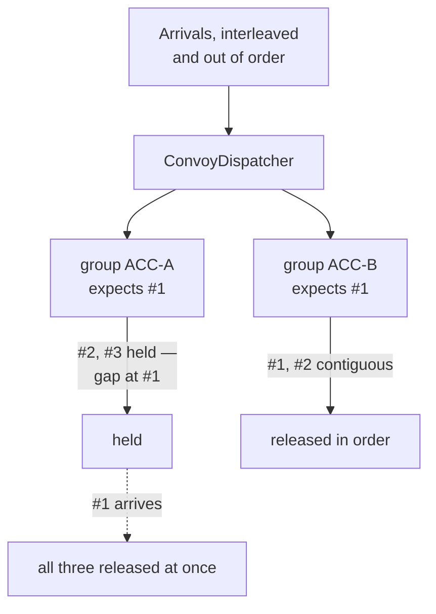

# Sequential Convoy

**Messaging** — decoupling senders from receivers

Process a set of related messages in a defined order without blocking other message groups.

| | |
|---|---|
| Tier | 2 — Messaging |
| Well-Architected pillars | Reliability |
| Source | [Sequential Convoy](https://learn.microsoft.com/en-us/azure/architecture/patterns/sequential-convoy), retrieved 2026-08-16 |
| Runtime dependencies | none |

## The problem it solves

Some messages must be processed in order, and most must not.

Ledger entries for one account are the clear case: apply a withdrawal before the deposit that funded
it and the balance is wrong, not untidy. The same holds for a document's edits, an order's state
changes, a device's readings.

The obvious fix destroys the system's throughput. One consumer on one queue gives perfect global
ordering and no parallelism whatsoever — and worse, **one slow or missing message stalls
everything**. A delayed entry for one account holds up every other account, none of which had any
ordering relationship with it.

The insight is that the ordering requirement is almost never global. Entries for account A must be
ordered with respect to *each other*, and have no relationship at all to account B's. So order per
group, and let the groups run independently — which is exactly what the demonstration shows: account
A is missing an entry and cannot move, while account B proceeds untouched.

## When to use it

* Messages have a natural grouping key — account, order, document, device, tenant.
* Order matters within a group and is irrelevant between groups.
* Messages can arrive out of order: retries, competing consumers, multiple producers.
* There are enough groups that per-group serialisation still leaves useful parallelism.

## When not to use it

* **Nothing depends on order.** The machinery is pure cost; use
  [Competing Consumers](../CompetingConsumers/README.md) and enjoy the parallelism.
* **The operations are commutative.** Two independent deposits can be applied in either order —
  and making the *work* order-independent is usually better than ordering the delivery.
* **There is one group.** Per-group ordering with a single group is global ordering with extra
  bookkeeping.
* **Groups are enormously uneven.** One group holding most of the traffic serialises most of the
  system, and the parallelism you were protecting does not exist.
* **A gap may never close.** Holding for a message that will never arrive stalls that group for
  ever. See below.

## Architecture and components

| Participant | Role |
|---|---|
| `ConvoyDispatcher` | Holds per-group expectations and releases what is contiguous |
| `ConvoyMessage` | Group, sequence and payload |

**Each group has its own expected sequence and its own held set.** That is the whole design: a gap
stops one group and cannot touch another. A single ordered structure would give the same in-group
guarantee and reintroduce the head-of-line blocking the pattern exists to remove.

**Release is a loop, not a single step.** When the missing message arrives, everything now contiguous
behind it releases at once — the demonstration's account A goes from holding two to delivering three
in one move.

## Advantages and trade-offs

**What it buys.** Correctness where order carries meaning, and parallelism everywhere else. One slow
group cannot stall the others. Throughput scales with the number of groups rather than collapsing to
one.

**What it costs.** State per group — an expectation and a buffer — which must live somewhere durable
and grows while a gap is open. Latency for held messages, which is the point but is still latency.
A producer obligation: somebody must assign correct, gapless sequence numbers, and getting that
wrong is the usual source of trouble.

**The sharpest risk is a gap that never closes.** A message lost, dead-lettered, or never sent leaves
its group blocked indefinitely, holding memory and delivering nothing. This implementation waits for
ever, deliberately, because the alternatives — skipping after a timeout, or dead-lettering the
group — are choices a system must make explicitly rather than inherit.

## Implementation considerations

* **Choose the grouping key as narrowly as correctness allows.** A coarse key serialises work that
  did not need it; the key should be the smallest thing whose ordering actually matters.
* **Decide the stuck-group policy before deploying.** Wait for ever, skip after a timeout, or
  dead-letter the group — but decide, and alert on it.
* **Sequence numbers are the producer's job**, and they must be gapless per group. A single producer
  per group makes that easy; several make it hard.
* **Bound the held buffer.** An open gap accumulates messages, and unbounded is how it becomes an
  outage.
* **Watch held count and the age of the oldest held message**, per group. That is where a stuck
  convoy shows up.
* **Prefer commutative work where you can.** An operation that does not care about order needs none
  of this.

## Real-world cloud scenarios

* Ledger or accounting entries, ordered per account.
* Document edits or CRDT-adjacent updates, ordered per document.
* Order lifecycle events — placed, paid, packed, shipped — ordered per order.
* Device telemetry where per-device sequence matters and devices are independent.
* Change-data-capture streams ordered per row key.

## In Azure

The implementation here is two dictionaries and a list, in one process, with no durability.

In Azure this is usually **not** hand-written. **Azure Service Bus sessions** implement it directly:
messages with the same `SessionId` are delivered in order to a single session-locked consumer, while
different sessions process in parallel — the grouping key becomes the session id. **Event Hubs**
partitions give the same shape, with ordering guaranteed within a partition and a partition key
choosing the group. **Azure Functions** support both with session-enabled triggers and partition-aware
processing.

**What this model does not show.** Nothing is durable, so a restart forgets every expectation and
every held message. There is no consumer at all — messages are released into a list rather than
locked to a session-holding worker, and it is the session lock that makes real convoys work under
competing consumers. There is no timeout, dead-letter or stuck-group policy: a gap here waits for
ever. The held buffer is unbounded. And the sequence numbers are supplied by the demonstration, so
the producer-side difficulty of generating them correctly is entirely absent.

## What the tests assert

The tests are about what the dispatcher guarantees rather than how it is currently written.

They cover in-order delivery for a group; a message arriving early being **held rather than
released**, because releasing it is the wrong answer and not merely an untidy one; a gap closing
releasing everything contiguous at once; **one group blocked leaving another entirely unaffected**,
which is the guarantee that distinguishes this from a single ordered queue; each group's own
order being identical whatever the interleaving of arrivals; and a **redelivered message the group
has already released being dropped** rather than held — holding it would leave the held count
reporting a healthy group as stuck for ever, since nothing could ever release it.
