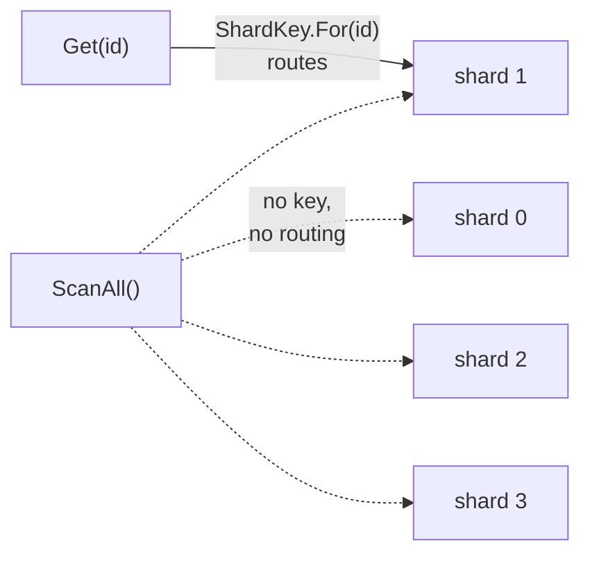

# Sharding

**Data management** — storing and reading data at scale

Divide a data store into a set of horizontal partitions or shards.

| | |
|---|---|
| Tier | 3 — Data management |
| Well-Architected pillars | Reliability, Cost Optimization |
| Source | [Sharding](https://learn.microsoft.com/en-us/azure/architecture/patterns/sharding), retrieved 2026-08-16 |
| Runtime dependencies | none |

## The problem it solves

One store, however large the machine under it, has a ceiling: storage, throughput, connections —
and the price of a machine grows faster than its capacity.

Sharding replaces the one store with several, each holding a **horizontal slice** of the data:
every record lives in exactly one shard, and a routing function on the **shard key** says which.
Capacity now grows by adding shards, on ordinary machines, and load spreads with the keys.

The price is paid in the queries. A read that carries the shard key routes to one shard and is as
fast as it ever was. A read that does not carry it has nowhere to route, and asks **every shard**.
The demonstration in this folder shows both as counts: a keyed read touching one shard of four,
and a query by a non-key field touching all four.

## When to use it

* The data, or the load on it, exceeds what one store can carry — or will.
* The data slices naturally along a key that queries actually carry: tenant, customer, account,
  device.
* Growth must be absorbed by adding shards rather than replacing hardware.
* Shards can also serve locality — each region's data held where its users are.

## When not to use it

* **One store still fits, with headroom.** Sharding is the most invasive scaling step there is;
  take the cheaper ones first — indexes, caches, read replicas, a bigger machine.
* **The store shards natively.** Cosmos DB and its kind do this routing invisibly and
  rebalance for free; hand-rolling beside it duplicates the platform badly.
* **Queries rarely carry a single routing key.** If everything joins, aggregates and searches
  across the data, every query fans out and the partition bought nothing.
* **Transactions must span records freely.** A transaction inside one shard is ordinary; across
  shards it is a distributed transaction, which is a different and worse problem.

## Architecture and components

| Participant | Role |
|---|---|
| `ShardKey` | The routing function: key to shard, deterministic and stable |
| `ShardedStore` | One logical store over the shards — **and it counts the shards a read touches** |
| `CustomerRecord` | The record; its id is the shard key, its region is deliberately not |

**`ShardedStore.ShardsTouched` is the demonstration.** In memory four dictionaries answer as fast
as one; at scale every touched shard is a network call, and the slowest sets the latency.

**The routing hash is FNV-1a, not `string.GetHashCode()`.** .NET randomises the latter per
process; a routing that moves between runs strands every record where the last run put it. Any
stable hash serves — what matters is that it never changes for the life of the data.

## Advantages and trade-offs

**What it buys.** Capacity that grows by adding shards. Load spread across machines, with no
single store as the bottleneck. Smaller failure domains — one shard down is one slice of users,
not all of them. And, where shards are placed near their users, locality.

**What it costs.** **Every query that does not carry the shard key fans out**, which the
demonstration shows as a count. Cross-shard transactions stop being ordinary. Rebalancing — when
shards fill unevenly or their number changes — means moving live data, which is an operation to
be planned rather than an implementation detail. And the routing function becomes permanent
infrastructure: every reader and writer must share it, forever.

## Implementation considerations

* **Choose the shard key for the questions the system asks.** The key decides which reads are
  cheap; every other read fans out. This is the single most consequential decision in the
  pattern, and it is nearly impossible to change once data has landed.
* **Watch for hot shards.** Hashing spreads keys, not load: one tenant with half the traffic
  makes its shard the ceiling again — see Throttling for what protects a shard that is hot
  anyway.
* **Keep the routing stable.** A hash that changes with process, version or library strands
  data. Consistent hashing or a lookup map reduces how much moves when the shard count changes.
* **Fold the fan-out behind one interface**, as `ScanAll` does here, so the expensive path is
  at least visible and countable rather than scattered through callers.
* **Plan rebalancing before it is needed** — it moves live data, and doing it without downtime
  is a project, not a task.
* **Pair a needed cross-shard lookup with an index** — a small table mapping the queried field
  to the shard key — rather than accepting the fan-out; see Index Table.

## Real-world cloud scenarios

* A multi-tenant SaaS platform, each tenant's rows sharded by tenant id.
* A user database sharded by user id, with logins routed by an email-to-id index.
* IoT telemetry sharded by device id, so one device's history lives together.
* A game backend sharding player state by player id, placed by region for latency.

## In Azure

The implementation here is four dictionaries behind one class.

In Azure the same shape appears as **Azure SQL elastic pools with the Elastic Database tools**,
whose shard map manager is `ShardKey` grown up; as **Cosmos DB's partition key**, which is this
entire pattern operated by the platform — chosen by you, routed and rebalanced by it; and as
**Azure Storage partition keys**, where the account and partition decide placement. The pattern
implemented by hand survives mostly where the store predates such platforms or spans several of
them.

**What this model does not show.** The shards share a process, so nothing exercises a shard being
slow, down or remote — the fan-out's real cost is the slowest of four network calls, seen here
only as a count of four. The shard count is fixed, so there is no rebalancing and no data
migration. There are no cross-shard transactions to get wrong. And the routing lives in one
class in one codebase, not spread across services that must agree on it for years.

## What the tests assert

The tests are about what the sharded store guarantees rather than how it is currently written,
and they assert **shards touched** rather than timings.

They cover the routing sending the same key to the same shard every time, without which the store
loses data; forty keys spreading across all four shards; a keyed read touching exactly one shard,
which is the benefit as a number; a query without the key touching all four, which is the cost as
the same number; and an absent key answered — still by one shard — with nothing.
