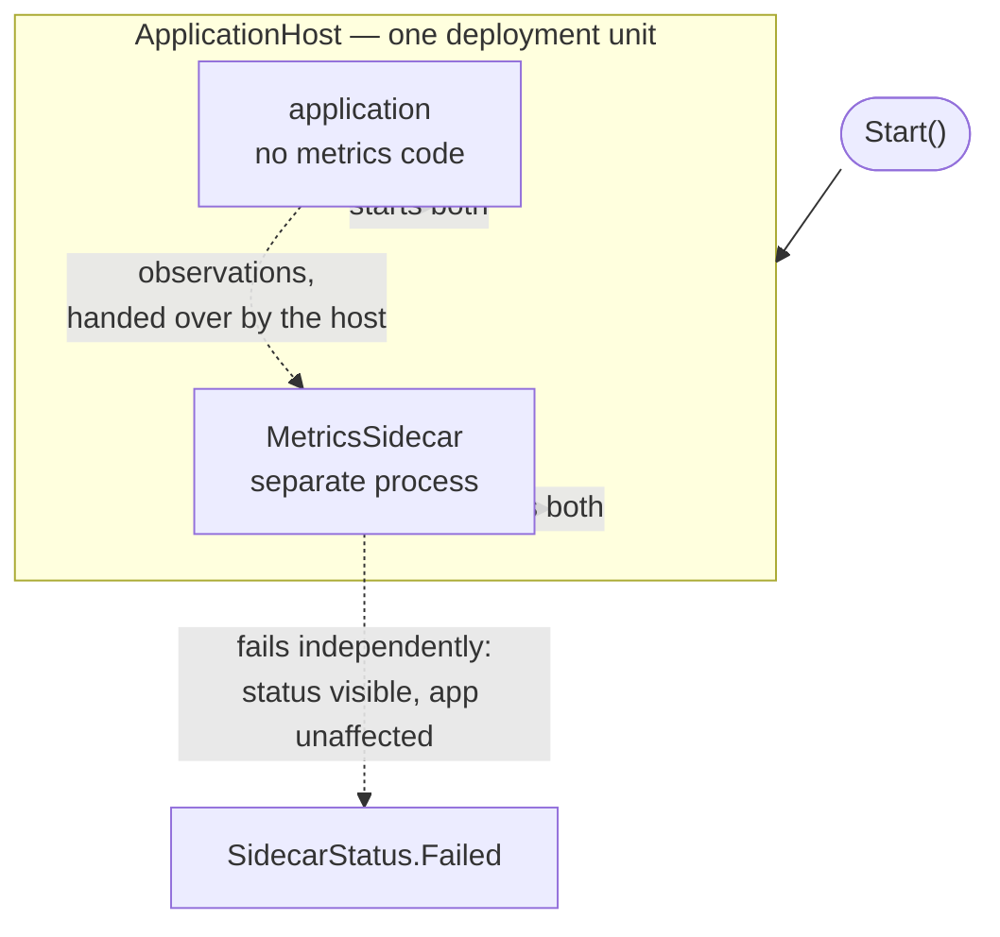

# Sidecar

**Edge and gateway** — what sits between clients and services

Deploy components into a separate process or container to provide isolation and encapsulation.

| | |
|---|---|
| Tier | 5 — Edge and gateway |
| Well-Architected pillars | Security, Operational Excellence |
| Source | [Sidecar](https://learn.microsoft.com/en-us/azure/architecture/patterns/sidecar), retrieved 2026-08-16 |
| Runtime dependencies | none |

## The problem it solves

Every application needs the same peripheral machinery, and putting it inside each one couples it to
that application's language, release cycle and blast radius.

Metrics collection, log shipping, configuration reloading, certificate rotation, health probes. None
of it is what the application does; all of it must be present. Implemented as a library, it exists
once per language, upgrades on the application's release schedule, and a bug in it is a bug in the
application's own process — a memory leak in a metrics client takes the service down with it.

A sidecar puts that machinery in a **separate process on the same host, sharing the application's
lifecycle**. It starts when the application starts and stops when it stops, so nobody deploys it
separately or remembers to run it. And because it is a separate process, its failure is not the
application's failure.

The demonstration shows both halves: a sidecar coming up and going down with its application without
being asked, and a second deployment where the sidecar cannot start and the application serves
anyway.

## When to use it

* Peripheral functionality is needed by applications in several languages.
* That functionality should be upgraded independently of the applications.
* Isolation matters — a fault or a resource leak in the helper must not take the application down.
* The helper needs to be co-located: same host, same network namespace, low latency.

## When not to use it

* **One application, one language.** A library is simpler and has no extra process.
* **Resource overhead matters.** A sidecar per instance means a process per instance — at a thousand
  pods, that is a thousand extra processes' worth of memory.
* **The helper needs to be shared.** A single central service is cheaper than one per instance when
  co-location buys nothing.
* **Communication is chatty and latency-critical.** Local is fast, and it is not free.

## Architecture and components

| Participant | Role |
|---|---|
| `ApplicationHost` | The deployment unit — **starts and stops both together** |
| `MetricsSidecar` | The helper, collecting what the application never wrote |
| `SidecarStatus` | Stopped, Running, Failed — **visible to the host** |

**Lifecycle sharing is the pattern.** A helper that must be started and stopped by hand is
composition; one that cannot outlive the application it belongs to is a topology.

**Isolation is the other half.** The sidecar fails and the application serves. Losing telemetry is
bad; losing the application because telemetry failed is very much worse, and it is the mistake that
makes teams distrust sidecars.

**Isolated is not invisible.** The host can see its sidecar's status, so a failure is reported
rather than silently absent — an application quietly running with no telemetry is its own kind of
outage.

**The application contains no metrics code.** Its own record of work has no observations in it; the
telemetry exists because something was deployed beside it rather than because it cooperated.

**What this is not.** Ambassador is one *job* this shape does — outbound calls with retry policy
attached — and is conventionally deployed exactly like this. Sidecar is the shape itself, which also
carries metrics, configuration, certificates and log shipping, none of which involves calling
anything on the application's behalf.

## Advantages and trade-offs

**What it buys.** One implementation of peripheral machinery for applications in any language.
Upgrades on the helper's schedule rather than every application's. Fault and resource isolation, so
a leak in the helper is contained. Co-location, so communication is local. And applications that
contain only what they are for.

**What it costs.** **A process per application instance**, with its own memory and CPU — at scale
that is a substantial and easily overlooked bill. A local hop where a library call would do.
Debugging that spans two processes. A helper whose upgrade is a fleet-wide event, because it is
deployed everywhere at once. And a real risk of accumulating sidecars until the peripheral machinery
outweighs the application.

## Implementation considerations

* **Never let the helper's failure become the application's.** Start it without rethrowing, and
  degrade rather than exit.
* **Surface its status**, so a silently missing sidecar is detectable. An application running with no
  telemetry looks healthy from every dashboard it is no longer feeding.
* **Bound its resources explicitly.** A sidecar with no memory limit can still take the host down —
  isolation of failure is not isolation of resources unless you ask for it.
* **Decide the start order.** Some sidecars must be up before the application accepts traffic — a
  proxy handling mutual TLS, for instance — and some must not block it. Those are different
  requirements and both need stating.
* **Version and roll out carefully.** It is deployed alongside every instance, so a bad version is a
  fleet-wide problem.
* **Count them.** Three sidecars per pod is common and each one is real overhead; the fourth should
  have to justify itself.
* **Keep the interface narrow.** A sidecar the application must configure extensively has become a
  library with extra steps.

## Real-world cloud scenarios

* A service-mesh proxy handling mutual TLS, retries and traffic policy for every pod.
* A log-shipping agent collecting from a shared volume.
* A configuration watcher that reloads settings without restarting the application.
* A metrics exporter translating application counters into the platform's format.

## In Azure

The implementation here is two classes in one process, which is precisely what a sidecar is not.

In Azure the pattern is native to **AKS**, where a pod is exactly this: containers sharing a
lifecycle, a network namespace and volumes, started and stopped together. **Azure Container Apps**
supports sidecar containers in the same revision, and its built-in **Dapr** integration is a sidecar
supplying service invocation, state and pub/sub. **Azure Monitor's** agents and **Envoy** in a
service mesh are the two most widely deployed examples.

**What this model does not show.** There is no process boundary at all — the "sidecar" is a class in
the application's own process, so nothing shows the isolation that is the pattern's main benefit, and
a real resource leak here would take the application down. There is no container, no shared volume,
no network namespace. There is no start-order dependency, no resource limit and no independent
upgrade. And there is one sidecar rather than three, so the accumulation problem never bites.

## What the tests assert

The tests are about the lifecycle guarantee rather than about what the helper happens to collect,
because lifecycle sharing is what separates a sidecar from a helper class.

They cover the sidecar **coming up because the application did**, without being started; going down
with it, so it cannot outlive its application; observations existing while the application's own
record contains no metrics at all; a sidecar that fails to start leaving the application **running
and serving**, with nothing collected; and the host being able to **see** its sidecar's status, so
isolated does not mean invisible.
