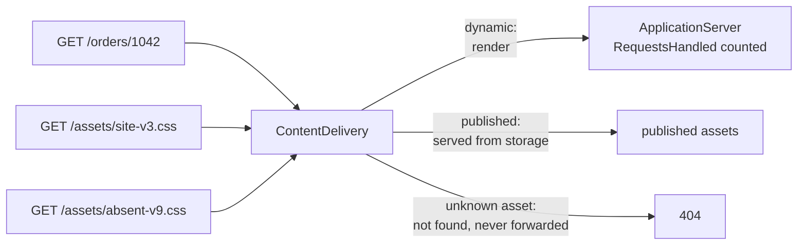

# Static Content Hosting

**Data management** — storing and reading data at scale

Deploy static content to a cloud-based storage service that can deliver them directly to the
client.

| | |
|---|---|
| Tier | 3 — Data management |
| Well-Architected pillars | Cost Optimization, Performance Efficiency |
| Source | [Static Content Hosting](https://learn.microsoft.com/en-us/azure/architecture/patterns/static-content-hosting), retrieved 2026-08-16 |
| Runtime dependencies | none |

## The problem it solves

Most of the requests a web application receives are not for anything it computes.

A page load is one document and then a stylesheet, a script bundle, a logo, a hero image, a font.
Those files are identical for every user and every request, and serving them through the
application spends a rendering process, a connection and a slice of capacity on handing back bytes
that never change. The demonstration in this folder shows the ratio: fifty page loads with four
assets each are **250 application requests** when everything is served by the application, and
**50** when the assets are not.

Storage does that job better in every respect that matters here — cost per gigabyte, throughput,
and proximity to the user when fronted by a content delivery network. The application is left
doing only the work that actually needs it.

## When to use it

* The site serves files that do not vary per request: styles, scripts, images, fonts, downloads.
* Application capacity is being spent on requests that compute nothing.
* Users are geographically spread and asset latency matters.
* Bandwidth is a material cost, and storage bandwidth is cheaper than compute bandwidth.
* The front end is a single-page application — largely static by construction.

## When not to use it

* **The content is per-user or per-request.** A personalised page is not static content, and
  caching it as though it were is how one user sees another's data.
* **Access must be authorised per request.** Storage can be secured, but per-request authorisation
  belongs to something that understands the user — see [Valet Key](../ValetKey/README.md) for the middle ground, where the
  application authorises once and issues a scoped, expiring key.
* **The asset changes constantly.** Cache invalidation then costs more than it saves; versioned
  paths assume change is occasional.
* **The site is small and traffic is low.** The application serving its own assets is one fewer
  deployment target and one fewer thing to get wrong.

## Architecture and components

| Participant | Role |
|---|---|
| `PageRequest` | One request for one path |
| `ContentDelivery` | The front: storage for assets, application for everything else |
| `ApplicationServer` | The thing that renders — **and it counts what reaches it** |

**`ApplicationServer.RequestsHandled` is the demonstration.** In memory returning a string costs
the same whoever does it, so the saving is only visible as the requests the application never saw.

**A missing asset is answered at the front, not forwarded.** Falling through to the application on
a miss converts a broken link into origin load — precisely the load this pattern removes — and it
does so under the traffic most likely to be hostile.

**A new version is a new path.** Publishing `site-v4.css` beside `site-v3.css` is what makes a
far-future cache lifetime safe: nothing already cached needs invalidating, because nothing already
cached ever changes.

## Advantages and trade-offs

**What it buys.** Application capacity spent only on work that needs the application. Lower cost —
storage bandwidth is cheaper than compute bandwidth, by a lot. Lower latency where a content
delivery network puts assets near users. Independent scaling of asset traffic. And a simpler
application, which no longer needs to be good at serving files.

**What it costs.** A second deployment target that must stay in step with the application — a
release where the markup and the assets disagree is a broken site. Cache invalidation, which
versioned paths avoid rather than solve. Cross-origin configuration when assets are served from a
different host. Access control that is coarser than the application's. And one more place where
something can be published, forgotten and left serving stale bytes.

## Implementation considerations

* **Version asset paths and cache them for a long time.** Content hashes in filenames make this
  automatic and remove invalidation as a routine operation.
* **Deploy assets before the markup that references them**, and keep the previous version live
  until nothing points at it. Otherwise a rollout is briefly broken for everyone mid-deploy.
* **Answer unknown asset paths at the front.** A miss must never become origin load.
* **Put a content delivery network in front for a geographically spread audience** — the storage
  account is one region, and the users are not.
* **Keep private content out of it.** Public storage is public; anything needing authorisation
  wants a time-limited scoped key instead, which is the Valet Key pattern.
* **Set content type and compression deliberately.** Storage will serve whatever it is told,
  including the wrong thing, indefinitely.

## Real-world cloud scenarios

* A single-page application whose entire front end is static files, calling an API for data.
* Product images and documents on an e-commerce site.
* Marketing pages, documentation sites and downloads.
* Video and large media, where serving through an application is not viable at all.

## In Azure

The implementation here is a dictionary in front of a method call.

In Azure this is **Azure Blob Storage static website hosting** or a plain container fronted by
**Azure Front Door** or **Azure CDN**; **Azure Static Web Apps** packages the whole pattern —
static hosting, a serverless API, and deployment from the repository; and **shared access
signatures** are how the private-content case is handled without making the container public.

**What this model does not show.** Nothing is actually remote: no network, no content delivery
network, no edge caching, and therefore no cache lifetime, invalidation or geography. There are no
cache headers or content types. Deployment of assets and application happens by construction
rather than as two systems that can fall out of step — which is where most of this pattern's real
operational risk lives. And there is no access control of any kind.

## What the tests assert

The tests are about what the delivery front guarantees rather than how it is currently written,
and they assert **application requests** rather than timings.

They cover a dynamic path reaching the application, which is the baseline; a published asset
served with the application untouched, which is the benefit as a number; a whole page load costing
one application request out of four; an unknown asset path answered as missing **without**
reaching the application; and two versions of the same asset live at once under distinct paths,
which is what makes far-future caching safe.
