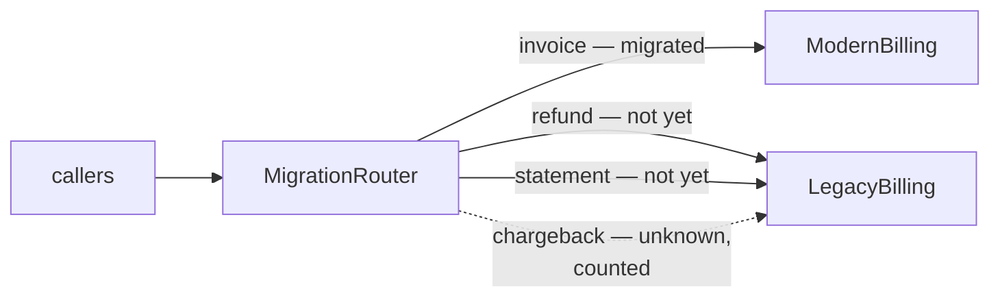

# Strangler Fig

**Edge and gateway** — what sits between clients and services

Incrementally migrate a legacy system by gradually replacing pieces of functionality with new
applications and services.

| | |
|---|---|
| Tier | 5 — Edge and gateway |
| Well-Architected pillars | Reliability, Cost Optimization, Operational Excellence |
| Source | [Strangler Fig](https://learn.microsoft.com/en-us/azure/architecture/patterns/strangler-fig), retrieved 2026-08-16 |
| Runtime dependencies | none |

## The problem it solves

The rewrite that replaces everything at once has to work on the first evening.

A legacy billing system has four capabilities and a decade of behaviour nobody has written down.
Rewriting it wholesale means building all four, testing them against a specification that does not
exist, and cutting over in one night — with every risk arriving simultaneously and a rollback that
means restoring a database. Those projects run long, and when they are cancelled at 70% complete
they have delivered nothing at all.

A strangler fig replaces the system **one feature at a time**, behind a router that decides per
feature which implementation serves it. Migrating a capability is a routing change; reverting is
the same change backwards. Value arrives continuously, the risk arrives in slices, and the project
can be paused at any point with everything still working.

The demonstration walks the whole migration — 0%, 25%, 50%, 75%, 100% — with both systems serving
real traffic through the middle.

## When to use it

* A legacy system is too large or too poorly understood to replace in one step.
* Its capabilities can be separated along a boundary a router can see.
* The business needs value before the whole replacement is finished.
* The risk of a big-bang cutover is unacceptable, which it usually is.

## When not to use it

* **The system is small.** If a rewrite is a fortnight, the routing machinery costs more than it
  saves.
* **Features cannot be separated.** A monolith whose capabilities share mutable state cannot be
  migrated a slice at a time until that state is untangled.
* **Both systems cannot run at once.** The pattern requires it, including whatever data
  synchronisation that implies.
* **Nobody will finish it.** A half-migrated system is *worse* than either whole one, and this
  pattern makes stopping halfway comfortable.

## Architecture and components

| Participant | Role |
|---|---|
| `MigrationRouter` | Decides per feature which system serves it — **and reports how far it has got** |
| `LegacyBilling` | Still serving everything that has not moved |
| `ModernBilling` | Growing one feature at a time |
| `BillingRequest` | The work, unchanged by which system does it |

**`MigratedProportion` is the demonstration.** A migration is a process rather than a state, and the
number that distinguishes one in progress from one that has stalled is the proportion that has
moved.

**An unrecognised feature falls back to the legacy system**, which is the opposite of what
Gateway Routing should do — and here it is correct. Nobody fully understands a system old enough to
need replacing, so the corners nobody enumerated must keep working. **It is counted rather than
silent**: a migration whose fallback traffic never falls is not finished, whatever the feature list
says.

**Both systems serve at once, and that is the middle of every real migration** rather than an
awkward phase to be minimised.

**What this is not.** [Anti-Corruption Layer](../AntiCorruptionLayer/README.md) is a translation
*boundary* that may stand for a decade with no migration planned; this is a *strategy* whose whole
purpose is to end. The two are commonly used together — the layer serves whatever has not moved —
and neither requires the other.

## Advantages and trade-offs

**What it buys.** Risk in slices rather than all at once. Value delivered continuously, so the
project justifies itself as it goes. Rollback that is a routing change rather than a database
restore. A migration that can pause without anything breaking. And real production traffic
validating each new implementation before the next one starts.

**What it costs.** **Two systems to run, deploy and monitor**, for as long as it takes. Data that
must be consistent across both, which is usually the hardest part and is not visible in this model.
A router on every request's path. And the pattern's own worst outcome: a migration that stalls at
60% and becomes permanent, because the pattern made stopping halfway comfortable.

## Implementation considerations

* **Migrate the boundaries first**, not the core. A feature that shares no state is a cheap first
  slice and proves the routing works.
* **Solve data before the second feature.** Two systems reading and writing the same accounts is
  where migrations actually fail — shared database, synchronisation, or a clean split, but decided
  deliberately.
* **Count the fallback traffic.** Unknown features reaching the legacy system are the map of what
  nobody wrote down, and the count should fall to zero before anyone declares completion.
* **Set an end date and defend it.** A migration with no deadline becomes two permanent systems.
* **Make reverting a single feature routine**, and practise it. It is the cheapest safety net the
  pattern offers and it rots if unused.
* **Delete the legacy code as each feature moves**, rather than at the end. Code left "just in case"
  is code somebody will edit.
* **Keep the router dumb.** Feature-to-system, and no business logic — the same discipline Gateway
  Routing needs, for the same reason.

## Real-world cloud scenarios

* Replacing a monolith with services, one capability at a time.
* Moving an on-premises system to the cloud incrementally.
* Replacing a third-party product with an in-house implementation.
* Modernising a front end page by page behind the same public URLs.

## In Azure

The implementation here is a set membership test in a router class.

In Azure the router is usually **Azure Front Door** or **Application Gateway** with path-based rules,
or **Azure API Management** where the routing needs policy; **Azure App Configuration** feature flags
are a common way to make the per-feature switch operational rather than a deployment; and where the
migration is page by page, **Front Door rules** point some paths at the new application and the rest
at the old. The data question is typically answered with **Azure SQL** replication, the **Cosmos DB**
change feed, or an event stream keeping both sides current.

**What this model does not show.** Both systems share a process and no data at all, so the hardest
part of a real strangler migration — keeping two systems consistent while both write — is entirely
absent. There is no gradual traffic shift within a feature: a feature is migrated wholly rather than
for 5% of accounts first. There is no rollback demonstrated, no feature flag, and no deployment. And
the feature list is complete apart from one deliberate unknown, where a real legacy system's list is
discovered over months.

## What the tests assert

The tests are about what the router guarantees rather than how it is currently written, and they
exercise the migration **mid-flight** rather than at either end.

They cover an unmigrated feature reaching the legacy system with the new one untouched; a migrated
feature reaching the new implementation with the legacy one untouched; **one feature moved while
three stay**, with both systems serving at once; the migrated proportion reported at 0%, 25% and
50%, with the remaining features named; every feature served by the new system once migration
completes and the legacy system handling nothing; and an unknown feature **falling back to the
legacy system and being counted**, so the unknowns are discoverable rather than invisible.
