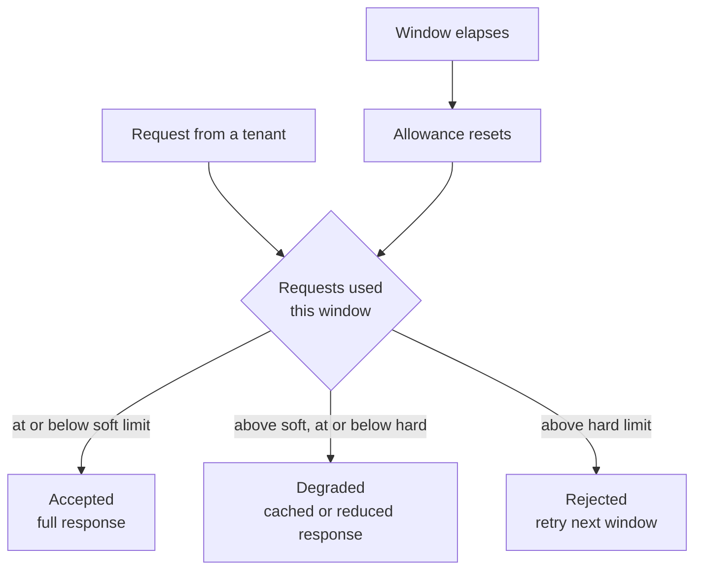

# Throttling

**Resilience** — keeping a service working when its dependencies are not

Control the consumption of resources from applications, tenants, or services.

| | |
|---|---|
| Tier | 1 — Resilience |
| Well-Architected pillars | Reliability, Security, Cost Optimization, Performance Efficiency |
| Source | [Throttling](https://learn.microsoft.com/en-us/azure/architecture/patterns/throttling), retrieved 2026-08-16 |
| Runtime dependencies | none |

## The problem it solves

A service has finite capacity, and demand does not know that.

Without a limit, capacity is allocated first-come-first-served, which sounds fair and is not. One
tenant running an expensive report in a loop consumes what every other tenant needed. A retry storm
from one badly-behaved client degrades everyone. A single customer's traffic spike becomes the whole
platform's incident — and because the load is legitimate, nothing looks like an attack and no alarm
obviously applies.

Worse, the failure is all-or-nothing. Under uncontrolled load a service does not gently slow down;
it exhausts something — connections, memory, threads — and stops serving *everybody*, including the
tenants who were behaving.

Throttling makes the allocation explicit and the degradation deliberate. Each consumer gets a
defined share, and pressure produces a controlled loss of quality rather than an uncontrolled loss
of service.

## When to use it

* The service is multi-tenant, or otherwise serves consumers who can affect one another.
* Capacity is genuinely finite and expensive to add quickly.
* Some responses have a cheaper acceptable form — cached, sampled, lower fidelity, fewer rows.
* Costs scale with consumption and need bounding per consumer.
* You need fairness guarantees you can state, and defend, to a customer.

## When not to use it

* **You are the client, not the owner.** If your problem is *provoking* somebody else's limits, the
  pattern you want is [Rate Limiting](../RateLimiting/README.md) — pace yourself so the throttling
  response never arrives. Throttling is what the other end is doing to you.
* **The work can wait.** If requests can be queued rather than served now, Queue-Based Load
  Levelling absorbs the spike without refusing anybody.
* **Capacity is elastic and cheap.** Autoscaling may be the better answer, though it is slower than
  a throttle and has a bill attached.
* **Every request is equally essential.** Throttling assumes some requests may be degraded or
  dropped; where none may be, it only chooses who suffers.
* **There is exactly one consumer.** With nobody to be fair between, a simple concurrency limit is
  simpler.

## Architecture and components

| Participant | Role |
|---|---|
| `Throttle` | Holds per-tenant usage and returns a decision |
| `ThrottleDecision` | `Accepted`, `Degraded`, `Rejected` |
| `IClock` / `ManualClock` | Where the current time comes from, so window boundaries are assertable |
| `ReportingService` | The protected resource, showing what degradation actually means |

**Two limits, not one.** The soft limit is where full service stops; the hard limit is where service
stops. Between them the request is still answered, from cache and plainly labelled as stale. A
throttle with a single limit can only accept or refuse, which discards the pattern's most useful
behaviour.

**Usage is per tenant.** A single global counter would let the loudest consumer spend everybody
else's allowance, which is the problem rather than the solution.

## Advantages and trade-offs

**What it buys.** Predictable behaviour under overload. Fairness that can be stated and enforced.
Bounded cost per consumer. Graceful degradation instead of collapse. And an incident that stays
confined to the consumer causing it.

**What it costs.** State per consumer, which has to live somewhere — and in a multi-instance
deployment that somewhere is shared, which is where this gets hard. Rejected requests that the
service could in fact have served, because a fixed window is a crude model of load. Two limits to
choose badly. And a degraded path that must actually be implemented and kept working, or the middle
band silently becomes a second rejection band.

**The fixed window has a known flaw**: a consumer can spend its entire allowance at the end of one
window and again at the start of the next, producing twice the intended rate across the boundary.
Sliding windows and token buckets fix this at the cost of more state.

## Implementation considerations

* **Tell the caller what happened.** A degraded response that looks identical to a full one teaches
  consumers that nothing is wrong. Label it, and return the standard signals — `429`, `Retry-After`
  — on rejection.
* **Share the state across instances.** Per-instance counters mean the real limit is your limit
  times your instance count, which is not the limit you documented.
* **Decide what a limit is for.** Fairness, cost control and overload protection want different
  numbers, and conflating them produces a limit that serves none of them.
* **Exempt the checks that keep you alive.** Health probes and admin operations throttled alongside
  tenant traffic will be refused exactly when you most need them.
* **Prefer degrading.** The middle band is where this pattern earns its place.

## Real-world cloud scenarios

* A SaaS reporting API where one tenant's dashboard refreshes every second.
* A public API offering free and paid tiers with different quotas.
* A write path protecting a database from a bulk import run during business hours.
* A machine-learning endpoint where each inference has a real, direct cost.

## In Azure

The implementation here is an in-process counter keyed by tenant, with a hand-advanced clock. There
is no gateway, no shared store and no HTTP.

In Azure this normally lives outside the application: **Azure API Management** rate-limit and quota
policies keyed by subscription or by any claim; **Azure Front Door** and **Application Gateway**
WAF rate limiting at the edge; the **`Microsoft.AspNetCore.RateLimiting`** middleware for in-process
control; and every managed service's own throttling — Cosmos DB request units, Service Bus, Storage
— which is what your application meets when it becomes somebody else's noisy tenant.

**What this model does not show.** State is in one process, so nothing here exercises the hard part:
in a multi-instance deployment the counter must be shared, and a distributed counter brings latency,
consistency and failure questions the single-process version does not have. The clock is advanced by
hand, so the window boundary is exact rather than racing. Nothing shows `429` responses,
`Retry-After` headers, per-operation costs, sliding windows, or the boundary-spike flaw the
Advantages section describes. Treat the distributed behaviour as unmeasured here.

## What the tests assert

The tests are about what the throttle guarantees rather than how it is currently written.

They cover full service within the soft limit; **degradation between the soft and hard limits**,
which is the behaviour that distinguishes this pattern from a rate limiter; refusal beyond the hard
limit; a fresh allowance once the window has elapsed; and independence between tenants, where one
consumer exhausting its quota leaves another's untouched.

Each test drives a `ManualClock`, so the window boundary falls where the test puts it.
