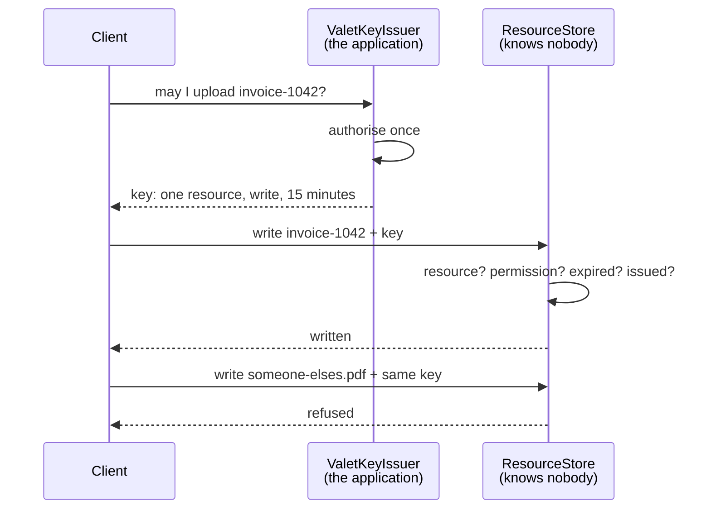

# Valet Key

**Data management** — storing and reading data at scale

Use a token that provides clients with restricted direct access to a specific resource.

| | |
|---|---|
| Tier | 3 — Data management |
| Well-Architected pillars | Cost Optimization, Performance Efficiency, Security |
| Source | [Valet Key](https://learn.microsoft.com/en-us/azure/architecture/patterns/valet-key), retrieved 2026-08-16 |
| Runtime dependencies | none |

## The problem it solves

A client needs a large file. The application knows who they are and whether they may have it; the
storage service holds the bytes and knows neither.

The obvious answer is to stream the file through the application: it authorises, then relays. That
works, and it makes the application a toll booth on every byte. A hundred concurrent uploads of a
hundred megabytes each occupy a hundred connections, a hundred buffers and a large amount of
bandwidth, for minutes at a time, doing nothing but copying — and the application must scale for
the traffic rather than for the work.

Making the container public removes the toll booth and removes the authorisation with it.

A valet key is the third option: the application **authorises once, then issues a token** that
grants exactly the access decided upon — one resource, one permission, until one instant. The
client presents it to the storage service directly and the application is out of the data path
entirely.

The name is the idea. A valet key starts the car and opens the door; it does not open the boot,
and it is useless once handed back.

## When to use it

* Clients upload or download large files, and relaying them wastes application capacity.
* The data lives in a store that can validate tokens itself.
* Access must be authorised, so a public container is not an option.
* Access should be temporary — a share link, a one-off upload, a time-boxed export.
* The application should scale with decisions rather than with bytes.

## When not to use it

* **The store cannot validate tokens.** The pattern needs a service that enforces the key; without
  one there is nothing between the client and the data.
* **Every access needs application logic** — quota checks, virus scanning, audit per read. The
  application authorised once; it will not see what happens next.
* **The transfer is small.** A key issued for a two-kilobyte read costs a round trip and buys
  nothing.
* **A leaked key would be catastrophic and revocation is impossible.** Most real implementations
  sign keys rather than register them, and a signed key cannot be withdrawn before it expires.
* **Fine-grained permissions are wanted.** Keys are naturally coarse: this blob, this verb, this
  long.

## Architecture and components

| Participant | Role |
|---|---|
| `ValetKeyIssuer` | The application — the only component that knows who the caller is |
| `ValetToken` | One resource, one `AccessRight`, one expiry |
| `ResourceStore` | Holds the data and **no idea who anyone is** |
| `AccessRight` | What the key permits: read, or write |

**All three limits are load-bearing, and each is refused separately.** A key that is scoped but
never expires is a permanent credential in a client that cannot keep it; one that expires but is
unscoped is a key to the whole container; one that is scoped and expiring but permits everything
is a write key handed out for a download. The tests refuse each independently for that reason.

**The store knows nothing about identity, deliberately.** It cannot consult a user directory, and
it does not need to: the application already decided, and the key carries the decision.

## Advantages and trade-offs

**What it buys.** The application out of the data path, so it scales with decisions rather than
with bytes. Lower cost and lower latency — the client talks to storage directly, which is closer
and cheaper. Authorisation still enforced, unlike a public container. And access that expires by
itself, with nobody remembering to withdraw it.

**What it costs.** **A key in the wild until it expires.** Once issued it is out of the
application's hands; short lifetimes are the mitigation, and signed keys typically cannot be
revoked at all. No per-access application logic — no quota, no scanning, no per-read audit.
Coarse permissions. And a hard dependency on getting the scope right at issue time, because
nothing downstream will catch a key that was too generous.

## Implementation considerations

* **Keep lifetimes short** — minutes for an upload, not days. Expiry is the only limit that
  enforces itself.
* **Scope to the narrowest resource that works.** A key to a container is a key to everything in
  it, including what is put there later.
* **Issue the least permission that works.** An upload key should not read; a download key should
  not write.
* **Log the issue, since you will not see the use.** The audit trail is the decision, not the
  access; without it, a leaked key leaves no trace of where it came from.
* **Have a revocation story, or know that you do not.** A signed key cannot be withdrawn; where
  that is unacceptable, a registry — as here — or a rotatable signing key is the answer.
* **Validate what the client did afterwards** where it matters. The application did not see the
  upload; nothing guarantees the bytes are what was expected.
* **Never issue a key from unauthenticated input.** The whole pattern rests on the decision being
  made properly, once.

## Real-world cloud scenarios

* Direct-to-storage uploads from a browser or mobile client.
* Time-limited download links for reports, invoices and exports.
* Sharing a document with an external party for a fixed window.
* Media delivery where the file is far too large to relay.

## In Azure

The implementation here is a registry of issued tokens and an expiry check.

In Azure this is a **shared access signature** — user delegation, service or account — issued by
the application over an Azure Storage blob, container or queue, with the resource, permissions and
expiry baked into the signature; **stored access policies** add the revocation this model gets
from its registry, by making the signature reference a policy that can be withdrawn; and **Azure
Front Door** and **CDN** offer signed URLs for the same idea over delivered content.

**What this model does not show.** The key is a registry lookup rather than a cryptographic
signature, which is what real implementations use — and that difference is the whole revocation
story, since a signed key cannot be withdrawn without the stored-access-policy indirection. There
is no network, so nothing shows the client actually bypassing the application. There is no
issuance audit trail. Keys are not renewed or refreshed for long-running transfers. And nothing
validates the content that was uploaded once the application had stepped away.

## What the tests assert

The tests are about what the key guarantees rather than how it is currently written, and each of
the three limits gets its own refusal.

They cover a key carrying exactly one resource, one right and one expiry; that key granting the
access it names; the same key **refused for a different resource**, which is what stops it being a
key to the container; a write refused with a read-only key; the key refused once it has expired,
which is the only limit that enforces itself; and a token the issuer never issued being refused
outright.
